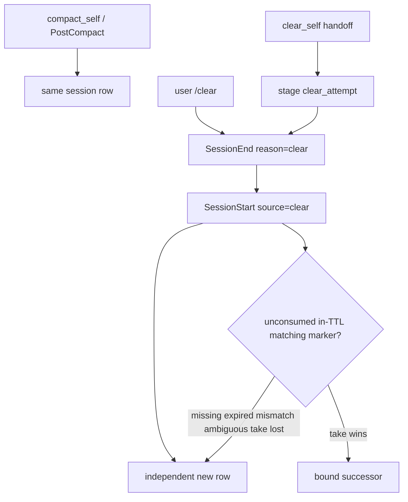
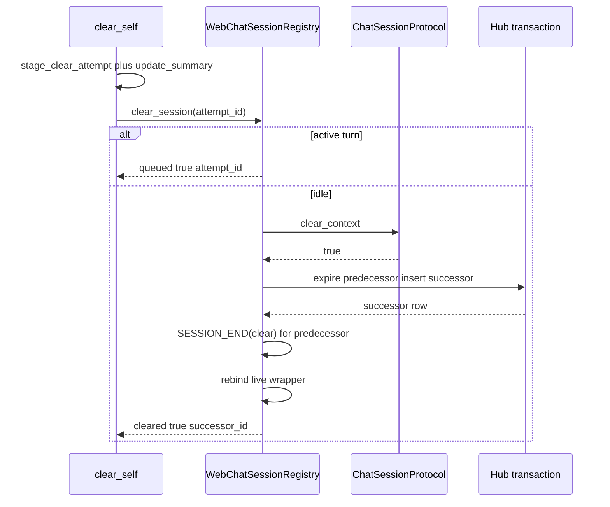

# Session Boundary Contract

Compaction keeps the same Gobby session row. A context clear expires that row
and starts a new one. `gobby-sessions:clear_self` is the only v1 path that may
bind the new row to the expired predecessor.

This page is the canonical contract. Operator lifecycle lives in
[sessions.md](../guides/sessions.md). Compact-specific injection lives in
`src/gobby/install/shared/workflows/rules/context-handoff/inject-compact-handoff.yaml`
and `inject-compact-handoff-on-prompt`.

## Default Boundary

| Event | Session row | What carries through |
| :--- | :--- | :--- |
| Compaction (`compact_self`, PreCompact/PostCompact, `SessionStart(source=compact)`) | Same row | Identity, variables, workflow instances, claims, parentage, agent-run ownership |
| User `/clear` with no prior `clear_self` | Expired, then a new independent row | Nothing: no parent, no claims, no handoff injection |
| `SessionEnd(reason='clear')` | Expired | Marker on the expired row may still be readable |
| Resume / ordinary exit | Expired | Compact revival may restore the same row when identity matches |
| Idle web-chat | Paused | Same row; not a clear |

Compaction never creates a child session. Claude and Codex reactivate the same
row with `SessionStart(source=compact)` and inject through the compact handoff
rules. Grok compaction is in-process (`PreCompact` → `PostCompact`) and injects
on the next `turn_start` instead of emitting `SessionStart(source=compact)`. A
one-shot `handoff_source` session variable classifies compact restarts when the
provider omits `source=compact`. Missing compact state degrades to startup
registration with a structured warning. Contradictory terminal identity **blocks**
compact revival.

Clear is a context-loss source for startup, memory, skill, and
progressive-discovery resets. Persona, wiki, and skill-ledger injections re-arm
on the successor because the successor is a new session.

## Deliberate Clear Exception

`clear_self(handoff=...)` crosses the clear boundary once, on purpose:

1. The caller supplies the handoff text. Empty or whitespace is
   `handoff_required`. There is no digest or summarizer fallback.
2. The tool stages a `clear_attempt` marker and writes the handoff through
   `SessionManager.update_summary` (`generation_mode="agent_authored"`). It
   never sets `handoff_ready`, so compact parent discovery cannot consume the
   attempt.
3. Terminal delivery types `/clear` into the pane through
   `_send_terminal_compaction_command`. Web chat runs prepare/clear/commit on
   the live registry.
4. `SessionEnd(reason='clear')` expires the predecessor.
5. `SessionStart(source='clear')` always registers a **new** row. Existing-row
   reuse paths are skipped, including inactive early returns, live
   pre-created-row reuse, `gobby_session_id_from_env` remap, and web-chat
   external_id reuse. The successor id is distinct even while the predecessor
   is still live.
6. If an unconsumed, in-TTL `clear_attempt` marker matches scoped identity, an
   atomic take binds that successor. The take winner gets parentage, seeded
   handoff variables, claim transfer, and first-prompt injection. Every other
   outcome is today's independent-session behavior.

A user-typed `/clear` without a prior `clear_self` remains a hard boundary.



## Attempt Record

The marker is session variable `clear_attempt` on the **predecessor** row
(`CLEAR_ATTEMPT_VARIABLE` in `src/gobby/sessions/clear_continuation.py`). It
survives `SessionEnd(clear)` because resolution matches on the marker and
scoped identity, not session status.

```json
{
  "attempt_id": "<hex uuid>",
  "created_at": "<iso-utc>",
  "terminal_context": { },
  "chat": { "model": "<id>", "mode": "normal" },
  "consumed_by": null
}
```

| Field | Rule |
| :--- | :--- |
| `attempt_id` | Fresh per `clear_self` call. Take and failure-restore compare on this id. |
| `created_at` | TTL clock. Older than `CLEAR_HANDOFF_TTL_SECONDS` (600) is unusable. |
| `terminal_context` | Terminal identity for successor match. Web chat stores `null`. |
| `chat` | Web-chat `model` and `mode` so a queued clear can run from the durable record. Terminal stores `null`. |
| `consumed_by` | `null` until a successful take or web-chat commit writes the successor id. |

The handoff body is `sessions.summary_markdown` on the predecessor, not a field
on the marker.

## Single Marker Writer

Only the `clear_self` tool body writes the marker, immediately before delivery:

- Terminal: `execute_clear_self` in
  `src/gobby/mcp_proxy/tools/sessions/_terminal_clear.py`
- Web chat: `_clear_web_chat_self` in the same module

Sender callbacks never write markers. Terminal send uses
`mark_continuation_pending=lambda: True` and rolls back with
`clear_failed_attempt` (`clear_continuation_pending`). Storage failure aborts
before `/clear` or `clear_context`.

## Failure Restore

`clear_failed_attempt` compare-clears the marker and restores the captured
prior summary fields only when `attempt_id` still matches and `consumed_by` is
still null. If the attempt changed underneath, restore is a no-op.

A failed attempt (staging, tmux send, `clear_context`, or commit) must not
leave a marker a later compact or plain `/clear` could consume.

## Successor Binding

`resolve_session_start_identity` runs `_resolve_clear_session_start` first when
`session_source == "clear"` (`src/gobby/hooks/event_handlers/_session_start/handoff.py`).
That path always returns `session=None` so the flow registers a new row.

`resolve_clear_continuation` then searches unconsumed `clear_attempt` markers
scoped to `source + project_id + machine_id`. Binding also requires either:

- the trusted predecessor hint `terminal_context.gobby_session_id`, or
- `terminal_process_contexts_match` (pid/tty/tmux-pane identity from
  `gobby.sessions.handoff_identity`)

After the new row exists, `handle_session_start` calls `take_clear_handoff_marker`:
one transaction compare-and-swaps `consumed_by` from null to the successor id
**and** writes `parent_session_id`. Parentage does not depend on later seeding.

Exactly one concurrent taker wins. Losers proceed as plain startup.

Post-take side effects run in isolated failure domains: seed failure does not
skip claim transfer; claim-transfer failure does not skip continuation
scheduling. Each logs on failure, leaves the take consumed, and still yields a
usable successor.

Clear **never blocks** session start. Compact **does** block on ambiguous
terminal identity because compact revives an existing row.

### Degrade matrix

| Condition | `degrade_reason` | Successor |
| :--- | :--- | :--- |
| No marker | unset | Independent, no injection, no claims |
| Marker older than 600s | `expired` | Independent |
| Terminal identity mismatch | `identity_mismatch` | Independent |
| Cross-project marker | `cross_project` | Independent |
| Cross-machine marker | `cross_machine` | Independent |
| Two or more matching markers | `ambiguous` | Independent |
| Lookup exception | `exception` | Independent |
| Take lost | n/a (logged `clear_handoff_take_lost`) | Independent |
| User `/clear` without `clear_self` | n/a | Independent |

## Claims

After a winning take (terminal) or after the successor row exists (web chat),
`preserve_task_claim_state` / `filter_and_reassign_claimed_tasks` transfer
claims the predecessor still owns. Storage `claim_task(..., expected_owner=predecessor_id)`
is compare-and-swap: a claim that moved to a third session is skipped, never
stolen. Ownership and the successor session-task `"claimed"` link commit
together or compensate. Per-task failures are logged and skipped; they never
abort session start.

v1 has no opt-out. Agent-run, workflow-instance, and worktree ownership are
**not** transferred (see agent-run rejection).

## Handoff Delivery

The take winner is seeded with:

- `handoff_summary_injectable` — predecessor `summary_markdown` bounded by
  `handoff_summary_inject_budget_for(source)`; oversized summaries become a
  `get_handoff_context` breadcrumb with the predecessor `#N` ref
- `clear_handoff_inject_pending` — `true`

Rule `inject-clear-handoff-on-prompt` (`event: turn_start`, priority 11) fires
when that pending variable is set, injects the marked continuation block, then
clears the variable. Work context only: no compact-style mcp_calls ledger or
skill-reload freight.

The continuation prompt (`build_clear_self_continue_prompt`) is scheduled so
an autonomous successor does not idle at an empty prompt.

## `get_handoff_context` Successor Authorization

`get_handoff_context` still requires `handoff_ready` for ordinary parent
discovery. Two exceptions read `summary_markdown` regardless of status:

1. Self-read after in-place compaction reactivates the same row.
2. A same-project caller whose `parent_session_id` is the requested session
   (`_is_bound_clear_successor` in
   `src/gobby/mcp_proxy/tools/sessions/_handoff.py`).

That second exception is how an oversized clear handoff remains retrievable
after the predecessor expires. Compact status-based discovery cannot see a
staged clear attempt because `clear_self` never sets `handoff_ready`.

## Agent-Run Rejection

`clear_self` rejects a session bound to a `LocalAgentRunManager` row with
`error_code: agent_run_unsupported` and stages nothing. SessionEnd(clear)
would finish the agent run, delete workflow instances, and release worktrees
underneath the successor. v1 is interactive terminal and web chat only.

## Web Chat: Prepare / Clear / Commit

Web chat does not use terminal identity. The chat layer knows both rows at
creation time. The attempt record still gates one-shot consumption and
failure cleanup (`terminal_context=null`, `chat.model` / `chat.mode` set).

`WebChatSessionRegistry.clear_session` is a three-step machine. Irreversible
predecessor termination happens only after backend `clear_context` succeeds.

1. **Prepare.** Staging already happened in `_clear_web_chat_self`. If the
   conversation has an active turn (or a blocking queued task), the durable
   attempt is the queue entry of record and the caller receives
   `{queued: true, attempt_id, handoff_staged: true}` — never `success` or
   `cleared`. Duplicate `clear_self` while pending returns the pending
   `attempt_id`. Restart or unregister fails the pending attempt via
   `clear_failed_attempt`.
2. **Clear.** `ChatSessionProtocol.clear_context()` must return `True`.
   Managed backends restart (stop + fresh start, model and mode preserved,
   continuation/resume identifiers reset). Codex keeps thread-archive
   specialization. Native Claude drops `resume_session_id` / `sdk_session_id`
   and starts a fresh SDK session. In-band `/clear` as a chat message is not
   the mechanism. Failure leaves the predecessor live and fails the attempt.
3. **Commit.** One hook, `ClearLifecycleHooks.commit_clear_successor`, bound
   in `WebSocketServer.__init__`. One hub transaction expires the predecessor
   (`reason='clear'`), inserts a force-new successor
   (`external_id` `web-chat-bootstrap:{uuid}` so conversation identity cannot
   be reused), writes parentage, and seeds handoff variables.
   `SESSION_END(reason='clear')` fan-out for the **predecessor** runs only
   after that commit and before the live wrapper is rebound, so the event
   carries the predecessor id. Commit failure leaves the predecessor live
   serving the already-cleared backend and fails the attempt (degrade, never
   wedge). After fan-out: rebind the live wrapper (`db_session_id`, seq,
   persist callbacks) to the successor, transfer claims, then send the
   continuation prompt. Exactly one backend process remains.

Split commit into separately invoked terminate-then-create hooks is forbidden:
a crash between them leaves a cleared backend bound to an expired row.



## Non-Goals (v1)

- No behavior change for user-typed `/clear` without `clear_self`.
- No change to compaction storage or `compact_self`.
- No agent-run, workflow-instance, or worktree ownership transfer across clear.
- No digest/summarizer fallback when `handoff` is missing.

## Implementation Map

| Concern | Source |
| :--- | :--- |
| Attempt lifecycle, take, seed, web commit TX | `src/gobby/sessions/clear_continuation.py` |
| Terminal and web `clear_self` | `src/gobby/mcp_proxy/tools/sessions/_terminal_clear.py` |
| Live web-chat lookup | `src/gobby/mcp_proxy/tools/sessions/_terminal_webchat.py` |
| SessionStart clear branch | `src/gobby/hooks/event_handlers/_session_start/handoff.py` |
| Take, seed, claims, schedule | `src/gobby/hooks/event_handlers/_session_start/flow.py` |
| Claim CAS | `src/gobby/hooks/event_handlers/_session_start/claims.py` |
| First-prompt injection | `src/gobby/install/shared/workflows/rules/context-handoff/inject-clear-handoff.yaml` |
| Bound-successor handoff read | `src/gobby/mcp_proxy/tools/sessions/_handoff.py` |
| `clear_context` protocol | `src/gobby/servers/chat_session_base.py` |
| Prepare/clear/commit | `src/gobby/servers/websocket/chat/session_registry.py` |
| Live wrapper rebind | `src/gobby/servers/websocket/chat/_clear_commit.py` |

## Memory Amendment

Project memories that previously stated the clear boundary as absolute now
point here:

- `0d223c8f-3df1-5fd7-847a-4820ff8631b5` — session-boundary contract
- `a66afaf7-b5df-59f5-a52f-34d0b19b71cd` — compaction in-place sibling

Those rows remain short recall cards. This file is the source of truth.

_Last verified: 2026-08-20_
