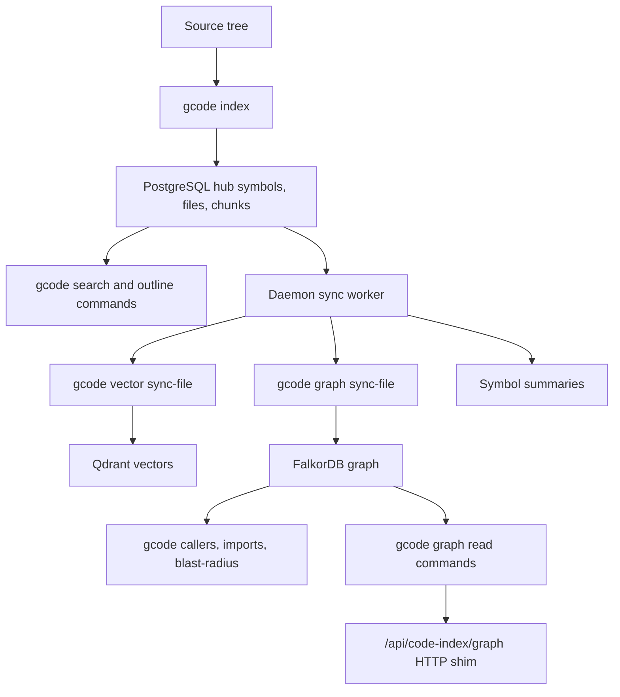

# Code Index

Gobby's code index is a native `gcode` CLI plus daemon-side HTTP and storage
surfaces. Use it to search symbols or content through distinct commands,
inspect AST outlines, retrieve exact symbol source, and trace graph
relationships without reading whole source files.

Use `gcode` for indexed navigation and project index operations. PostgreSQL
BM25 health and repair are operator commands under `gobby postgres`, described
under [PostgreSQL BM25 recovery](#postgresql-bm25-recovery).

## Quick Start

Inspect and incrementally refresh a registered project:

```bash
gcode index
gcode status
```

Use indexed navigation before opening large files:

```bash
gcode grep -F "spawn_ui_server(" src -m 50
gcode search "task validation"
gcode search-symbol "TaskValidator" --kind class
gcode search-content "code_index_available" "src/**/*.py"
gcode outline src/gobby/tasks/validation.py
gcode symbol <symbol-id>
```

Graph commands require the Gobby daemon. `callers`, `usages`, `imports`, and
`blast-radius` read graph data through top-level commands. `gcode graph` owns
projection sync, lifecycle commands, and the read API used by the daemon shim:

```bash
gcode callers validate_task
gcode imports src/gobby/tasks/validation.py
gcode blast-radius validate_task --depth 3
gcode graph sync-file --file src/gobby/runner.py
gcode graph rebuild
```

If `gcode` is missing, run `gobby install`. Gobby's daemon-side incremental
trigger logs a warning and skips code indexing when the native binary is not
installed.

## Evidence And Repository Questions

Ordinary authenticated agents can use `gobby-ask:evidence` for native JSON search,
read, graph, and commit-patch evidence without starting an Ask run. Project and
checkout come from caller context. `gcode evidence --request-json ...` supports
the same retrieval contract and resolves an omitted binding from the selected
project. Source hashes, bounds, and continuation tokens remain part of the result.

Use `gcode ask "<question>"` for a managed investigation with independent review.
Foreground completion prints cited Markdown; `--format json` returns the answer
and run metadata. `--background` returns the run ID immediately. Citations are
retrievable without local files, and retained answers describe recorded source
observations rather than proving current checkout freshness.

Default calls create no output bundles. PostgreSQL retains Ask results for seven
days after terminal completion by default. CLI-only `--output-debug-files` writes
local diagnostics; explicit export keeps its destination option. MCP never writes
output files. See the [Ask guide](ask.md) for retention, exports, and recovery.

## How It Works



`gcode index` owns parsing and writes symbols, indexed files, content chunks,
imports, and call relationships through the PostgreSQL hub. `gcode graph` owns
the code graph projection in FalkorDB, including `sync-file`, `clear`,
`rebuild`, and graph read operations. The daemon owns integrations around those
rows: background maintenance, optional vector sync, symbol autocomplete, HTTP
graph shim routes, optional symbol summaries, and session variables.

Files are indexed incrementally by content hash. Changed files are re-parsed;
unchanged files are skipped. The post-edit trigger ignores `.gobby/` internal
edits, batches repo-relative file notifications by project root with a
two-second debounce, and runs:

```bash
gcode index --project <root> --files <changed-files> --quiet --skip-if-locked --format json
```

The lightweight maintenance loop runs every
`code_index.maintenance_interval_seconds` seconds. It replays
`gcode index --project <root> --skip-if-locked` for eligible indexed projects,
requires repeated missing-root observations before purge, and fills missing
summaries when configured. System scheduling supports global prune and nightly
`gcode repair --project <root> --format json`; check installed jobs and active
configuration before assuming either is running. Repair can trigger full
indexing on an indexer-version change. The index/projection operation holds
the relevant index locks; busy daemon-triggered updates are requeued.

A separate sync worker polls pending files and delegates to `gcode vector
sync-file` and `gcode graph sync-file`. Rust owns both projections; the daemon
coordinates their queues, timeouts, and retry/backoff.

## CLI Reference

All commands accept these global options unless noted:

| Option | Description |
| :--- | :--- |
| `--project <PROJECT>` | Override project root detection |
| `--format json\|text` | Select JSON or text output; navigation commands default to compact text |
| `--quiet` | Suppress warnings |
| `--verbose` | Enable verbose output |
| `--allow-stale` | Allow stale index data by skipping read-time freshness checks |

### Index Lifecycle

| Command | Purpose |
| :--- | :--- |
| `gcode init` | Index a registered Gobby checkout; standalone `gcode.json` is rejected |
| `gcode index [PATH]` | Index a directory; defaults to the project root |
| `gcode index --files <FILES>...` | Index only specific files |
| `gcode index --full` | Force a full re-index |
| `gcode status` | Show indexed file, symbol, and timing stats |
| `gcode invalidate --force` | Clear index data so the next index is fresh |
| `gcode projects` | List indexed projects |
| `gcode repair` | Promote stranded imports, detect drift, or reindex after a version change |
| `gcode prune` | Operator global cleanup via daemon; use explicit `--project` for scoped cleanup |
| `gcode retire-files --manifest <FILE>` | Operator validation of exact inventory-bound content retirement; applying also requires a receipt |
| `gcode contract` | Emit the daemon-facing CLI contract |
| `gcode schema-identity --json` | Inspect the embedded schema identity |
| `gcode embeddings doctor` | Diagnose embedding configuration and peer drift |

### Search And Retrieval

| Command | Purpose |
| :--- | :--- |
| `gcode grep <PATTERN> [PATH...]` | Exact indexed content grep over file content chunks |
| `gcode search <QUERY>` | Hybrid symbol search: symbol BM25 plus optional semantic and graph boost |
| `gcode search-symbol <QUERY>` | Exact-first symbol/name lookup |
| `gcode search-text <QUERY>` | Full-text search over symbol names, signatures, and docstrings |
| `gcode search-content <QUERY>` | Full-text search over file content chunks |
| `gcode outline <FILE>` | AST-only hierarchical symbol outline for one parser-backed source file |
| `gcode symbol <ID>` | Fetch one symbol's source by byte offset |
| `gcode symbol-at <PATH:LINE[:COLUMN]>` | Retrieve a containing or nearest visible symbol |
| `gcode symbols <IDS>...` | Fetch bounded source for multiple symbols and report stale IDs |
| `gcode kinds` | List indexed symbol kinds |
| `gcode tree [PATH]...` | File tree with optional file, directory, or glob filters |
| `gcode repo-outline` | Directory-grouped project stats |

Ranked search commands support `--limit`, `--offset`, `--language`, and
positional path filters after the query. `gcode search` and
`gcode search-symbol` also support `--kind`. `gcode grep` supports positional
paths, `-g/--glob`, `-i`, `-F`, `-C/-A/-B`, and `-m/--max-count`.
Bare project-file paths resolve from the project root; `./` and `../` resolve
from the current directory. Multiple tree paths use OR semantics.

Choose the search lane from the query shape: `search-symbol` for a known symbol,
`grep -w` for an exact identifier occurrence, `grep -F` for an exact literal or
call site, `search-content` for repository text/docs/config, and `search` for a
fuzzy code concept. `gcode search` ranks symbols only; it never merges content
chunks into ranking or pagination. When results are empty or irrelevant, switch
lanes instead of paraphrasing the same query or paging through noise. Text
diagnostics are suppressed by `--quiet`; structured results keep actionable
redirects in the existing JSON `hint` field.

`outline` is AST-only. Markdown and other content-only files return success with
no symbols plus recovery guidance. For Markdown headings use
`gcode grep '^#{1,6} ' path/to/file.md -m 200`; use `search-content` for broader
document retrieval.

### Graph Queries

These commands require the Gobby daemon and graph support:

| Command | Purpose |
| :--- | :--- |
| `gcode callers <SYMBOL_NAME>` | Find callers of the symbol resolved from a query |
| `gcode callees <SYMBOL_NAME>` | Find outgoing calls from the resolved symbol |
| `gcode usages <SYMBOL_NAME>` | Find incoming call usages for the resolved symbol |
| `gcode imports <FILE>` | Show import graph for one file |
| `gcode path <FROM> <TO>` | Find a shortest CALLS path |
| `gcode blast-radius <TARGET>` | Trace transitive impact from a symbol query |
| `gcode graph sync-file --file <FILE>` | Sync one indexed file into the graph projection |
| `gcode graph clear` | Clear the current project's graph projection |
| `gcode graph clear --project-id <ID>` | Clear a graph projection without resolving a project root |
| `gcode graph rebuild` | Rebuild the graph projection from indexed hub rows |
| `gcode graph overview`, `file`, `neighbors` | Inspect project, file, or symbol graph context |
| `gcode graph view` | Render scoped call, import, or class-hierarchy views |
| `gcode graph report` | Generate a report with explicit degradation |
| `gcode graph cleanup-orphans` | Reconcile missing-file graph projections |
| `gcode vector sync-file`, `clear`, `rebuild`, `cleanup-orphans` | Operate only the code-symbol vector projection |

`gcode callers` and `gcode usages` support `--limit` and `--offset`. `gcode
blast-radius` supports `--depth`.

## Indexed Data

The PostgreSQL hub-backed code-index store tracks:

| Data | Notes |
| :--- | :--- |
| Projects | Root path, total files, total symbols, indexed timestamp, duration |
| Files | Path, language, content hash, symbol count, byte size, sync flags |
| Symbols | Name, qualified name, kind, language, byte offsets, line range, signature, docstring, summary |
| Imports | Source file to imported module |
| Calls | Caller/callee relationships, including unresolved and external targets |
| Content chunks | Searchable chunks for comments, strings, configs, docs, and other non-symbol text |

The code-index tables live in the runtime PostgreSQL hub; Qdrant adds semantic
search and FalkorDB adds graph traversal when configured and available. Symbol
summaries are cached in the code-index rows and invalidated when a symbol's
content hash changes.

## Languages And Content

AST symbol extraction is configured for:

| Family | Languages |
| :--- | :--- |
| Core app languages | Python, JavaScript, TypeScript, Go, Rust, Java |
| Additional runtimes | PHP, Dart, C#, C, C++, Elixir, Ruby |
| Structured config | YAML, JSON |

Additional content-only extensions are indexed for text search, including
Markdown, `.html`, `.css`, `.scss`, `.less`, `.toml`, `.cfg`, `.ini`, shell scripts,
`.sql`, `.graphql`, `.proto`, `.txt`, `.rst`, `.csv`, `.gitignore`, and
`.editorconfig`.

## Configuration

Configure indexing in `code_index`:

```yaml
code_index:
  enabled: true
  maintenance_interval_seconds: 3600
  maintenance_index_timeout_seconds: 900
  nightly_repair_enabled: true
  nightly_repair_cron: "0 2 * * *"
  nightly_repair_timezone: null
  nightly_repair_timeout_seconds: 28800
  nightly_repair_concurrency: 1
  maintenance_log_file: ~/.gobby/logs/code-index-maintenance.log
  missing_root_purge_observations: 3
  embedding_enabled: true
  graph_enabled: true
  symbol_summary:
    enabled: true
    max_concurrency: 2
    max_tokens: 100
    batch_size: 20
  sync_worker_interval_seconds: 5.0
  sync_worker_projection_timeout_seconds: 300.0
  sync_worker_batch_size: 50
  sync_worker_breaker_failure_threshold: 5
  sync_worker_breaker_backoff_seconds: 30.0
  sync_worker_breaker_max_backoff_seconds: 900.0
```

The nightly job runs `gcode repair`. Indexer-version changes trigger one full
reindex; steady-state runs promote stranded local imports and queue graph drift
for the daemon sync worker. Pending `LocalImport` inheritance rows project as
`UnresolvedCallee` endpoints until promoted. Promotion searches module-root
candidates' subtrees (`mod.rs`, `lib.rs`, `main.rs`, `__init__.py`,
`index.{js,ts,…}`) for a unique top-level definition; a pending row is
re-evaluated when its owner or candidate file reindexes or when `gcode repair`
runs — indexing the defining file alone does not re-trigger it. Rows stranded by a
resolver change are rewritten with `gcode index --full --files <owner paths>`
(the hash shortcut is skipped under `--full`, and the file's
`(file, content_hash)` rows are replaced). The gate compares the
`indexer_version` stamped on the last full run with the running `gcode` build's
Cargo version, so an extractor change shipped without a version bump never
triggers it — run `gcode index --full` by hand after such a build. The full-run
JSON carries a `full_reindex` section with the index counts and the
graph/vector projection reports, which is where a degraded projection sync
shows up.

gcode owns the built-in language and content-extension set described above.
Extend its built-in path exclusions with `indexing.extra_excludes` in the main
configuration.

## Daemon Integration

### Session Start

On session start, Gobby checks existing index stats. If the project has indexed
symbols, the session variable `code_index_available` is set to `true`. Rules can
then teach or enforce indexed navigation for that session.

### Post-Edit Incremental Indexing

`CodeIndexTrigger` receives file-change notifications from post-tool hook
handling, debounces them by root path, normalizes paths under the project root,
and uses the explicit project/files command shown above. Missing binaries,
timeouts, command failures, and busy files are logged and requeued with retry
backoff. A skipped attempt is not evidence that the changed files were indexed.

### Background Maintenance

The maintenance loop checks indexed projects on the configured interval and
uses `gcode index --project <root> --skip-if-locked` for refresh. The sync worker
delegates vector and graph sync to native commands. Summary generation runs from
maintenance when `code_index.symbol_summary.enabled` is true and the daemon has an LLM
service.

### PostgreSQL BM25 Recovery

Operators inspect BM25 verification with `gobby postgres status --json`, in the
`code_index` payload. This checks `code_symbols_search_bm25` and
`code_content_search_bm25` in the connection's active schema (normally `public`)
using `pdb.verify_index`. Read `healthy` and each index's state/error; status does
not exit nonzero solely for unhealthy BM25.

For a damaged index, run `gobby postgres repair-code-index --json` (omit `--json`
for text). It reads credentials from the bootstrap configuration, uses
`code_index.maintenance_index_timeout_seconds` (default 900 seconds), acquires
advisory lock `gobby:code-index-bm25-repair`, and issues schema-qualified
`REINDEX INDEX` only for indexes classified `damaged`. It verifies again and
exits 1 if recovery remains unhealthy. Healthy indexes are left alone; missing
indexes require normal PostgreSQL setup/migrations. Generic verification errors
are reported, not blindly reindexed. There is no command-specific DSN or project
override: this is hub maintenance, not project content rebuilding.

Daemon startup performs the same bounded repair before code-index workers
start. Failed recovery leaves the daemon running with `code_index_bm25`
degraded and maintenance/sync workers stopped. After successful operator repair,
coordinate a daemon restart with active sessions. `gcode repair` handles import
and projection drift; it does not repair PostgreSQL BM25 corruption. Preserve
query error details and follow their recovery directive instead of reporting
failed search as an empty result. Exercise repair examples only in isolated
fixtures or an explicitly authorized operator recovery window.

## HTTP Endpoints

The daemon exposes graph and invalidation routes under `/api/code-index`:

| Method | Route | Purpose |
| :--- | :--- | :--- |
| `GET` | `/api/code-index/graph` | File-level graph overview; query `project_id`, `limit` |
| `GET` | `/api/code-index/graph/file/{file_path}` | Symbols and graph context for one file; query `project_id` |
| `GET` | `/api/code-index/graph/symbol/{symbol_id}/neighbors` | Symbol neighbors; query `project_id`, `limit` |
| `GET` | `/api/code-index/graph/blast-radius` | Impact graph; query `project_id` and exactly one of `symbol_id` or `file_path`, plus `depth`, `limit` |
| `GET` | `/api/code-index/graph/path` | Shortest CALLS path; `project_id`, `symbol_a`, `symbol_b`, optional `max_depth` (default 6) |
| `GET` | `/api/code-index/graph/search` | Symbol search for graph UI; query `project_id`, `q`, `limit` |
| `POST` | `/api/code-index/graph/clear` | Clear one project's graph projection through `gcode graph clear --project-id`; query `project_id` |
| `POST` | `/api/code-index/graph/rebuild` | Rebuild one project's graph projection through `gcode graph rebuild --project <root>` |
| `POST` | `/api/code-index/prune` | Operator-only global prune; optional JSON `force`, `retention_days` |
| `POST` | `/api/code-index/invalidate` | Clear all index data for a project; JSON body `{"project_id": "..."}` |

Graph reads require `project_id`; missing values return `400`. Clear, rebuild,
and invalidate can derive it from verified agent claims and reject a conflicting
explicit project with `403`. Overview defaults to 200 files, symbol-neighbors
to 50, and UI search to 25; these differ from some CLI defaults. The graph
overview, file, symbol-neighbors, and blast-radius routes resolve the project
root from daemon storage, then call `gcode graph` with `--project <root>`.
Missing or incompatible `gcode` returns `503`; a missing project returns `404`.
Graph command, timeout, and JSON errors return `500`. Graph search stays daemon-owned because the UI uses PostgreSQL
symbol autocomplete. Blast-radius requests return `400` unless exactly one of
`symbol_id` or `file_path` is provided. Invalidation returns `{"status": "ok",
"note": "not indexed"}` when the project has no index record. Partial
invalidation returns HTTP `207`; inspect the body rather than treating every
2xx response as complete cleanup. Global prune has separate `503` unavailable,
`504` timeout, and `400` input-error handling.

## Rules

Gobby's shared code-index ruleset teaches first, then redirects:

- `require-code-index-skill` blocks the first raw code search, navigation, or
  source read in a context until the agent loads
  `gobby:references/code-index/overview.md`.
- `prefer-gcode-for-source-read` then redirects broad source reads (more than
  40 lines) to `gcode outline` followed by `gcode symbol-at`.

The loaded guidance points agents to:

```bash
gcode grep "pattern" [PATH...] -m 50
gcode grep -w "identifier" [PATH...] -m 50
gcode grep -F "literal" [PATH...] -m 50
gcode search-content "query" [PATH...]
gcode search-symbol "name" [PATH...]
gcode search "concept" [PATH...]
gcode outline path/to/file
gcode symbol-at path/to/file:line
gcode grep '^#{1,6} ' path/to/file.md -m 200
gcode symbol <id>
gcode callers <symbol_name>
gcode usages <symbol_name>
```

Both rules fail open when `gcode` cannot serve the request:

- A gcode call records its scope before it runs. A raw read of that file stays
  allowed for the turn unless the call returns output with no error. This
  covers providers that never report a failure: Droid emits no hook for a
  nonzero exit, and AGY's post-tool hook carries no output.
- A reported gcode failure opens the scope it attempted for the rest of the
  turn, even without a pre-tool hook (Codex app-server reports auto-approved
  commands only on completion).
- A typed outage error (such as `schema_mismatch`, `daemon_required`, `io`, or
  `checkout_required`) opens raw navigation of that checkout for the turn. It
  counts only when every other command in the same shell call is `git status`,
  a plain `echo`, or `head`/`tail` trimming piped output, so no other output can
  forge it.
- A standalone `gcode outline <file>` that finds no symbols opens reads of that
  file. Batched with other commands, the diagnostic could come from another
  command's output, so it does not count.

Rules are runtime state, not just template files. Check installed rule state in
the rules engine before claiming a rule is disabled.

## Typical Workflow

1. Run `gcode status` to confirm an index exists.
2. Use `gcode grep -w` for identifiers, `gcode grep -F` for exact strings and
   call sites, `gcode search-content` for ranked repository text,
   `gcode search-symbol` for known names, or `gcode search` for fuzzy symbol
   concepts. Switch lanes after empty or irrelevant results.
3. Use `gcode outline <FILE>` before opening a large parser-backed source file.
   For Markdown headings, use `gcode grep '^#{1,6} ' <FILE> -m 200` instead.
4. Use `gcode symbol <ID>` for the exact implementation when the outline points
   to a specific function, class, or method.
5. Use `gcode callers`, `gcode usages`, `gcode imports`, or
   `gcode blast-radius` when the change could affect other files.

## See Also

- [search.md](search.md) - Search surfaces and ranking
- [rules.md](rules.md) - Rule engine reference
- [configuration.md](configuration.md) - Full configuration reference
- [http-endpoints.md](http-endpoints.md) - HTTP API reference

_Last verified: 2026-09-12_
