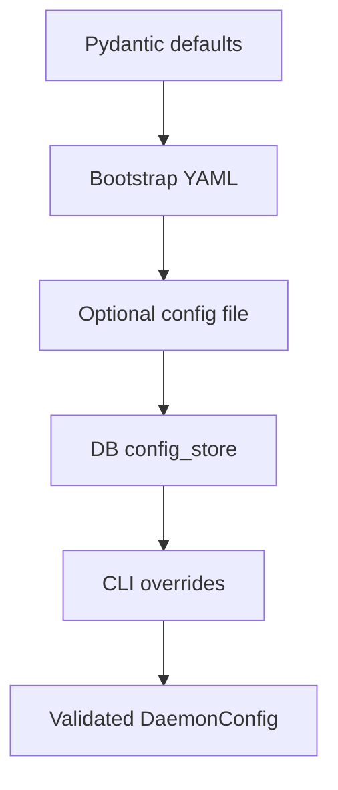

# Configuration Guide

Gobby uses a DB-backed daemon configuration for runtime settings, a small
bootstrap YAML file for pre-database startup settings, and project-local JSON
for repository verification and hook policy.



## Configuration Sources

| Source | Scope | Purpose |
| --- | --- | --- |
| `~/.gobby/bootstrap.yaml` | Machine | Startup values needed before the PostgreSQL hub is open |
| `config_store` table in the PostgreSQL hub | Machine | Runtime daemon settings and user overrides |
| `~/.gobby/mcp-servers.json` | Machine | Persistent downstream MCP server registry |
| `.gobby/project.json` | Project | Project identity, verification commands, and project hook settings |
| `~/.gobby/build.yaml` | Machine | Build lifecycle defaults |
| `<project>/.gobby/build.yaml` | Project | Build lifecycle defaults for one repository |

`~/.gobby/config.yaml` is an export/import artifact. It is useful for backup or
migration, but normal daemon startup reads `bootstrap.yaml`, `config_store`, and
Pydantic defaults.

## Runtime Configuration

`DaemonConfig` is the validated runtime model. The loader merges configuration
in this order:

1. Pydantic defaults from `src/gobby/config/`.
2. `~/.gobby/bootstrap.yaml` for startup-only fields.
3. An optional explicit config file when one is supplied.
4. DB overrides from `config_store`.
5. CLI overrides passed by daemon startup code.

When the daemon has a `ConfigStore`, DB values win over file values. Values in
`config_store` are flattened dotted keys such as
`llm_providers.claude.models`; the storage layer JSON-encodes values so numbers,
booleans, strings, and lists keep their type.

### Bootstrap

`~/.gobby/bootstrap.yaml` contains only values needed before the hub database is
available:

```yaml
hub_backend: postgres
database_url_ref: "keyring:gobby:postgres_database_url"
postgres_install_mode: docker
daemon_port: 60887
bind_host: "localhost"
websocket_port: 60888
ui_port: 60889
falkordb_password: "gobbyfalkor"
```

`database_path` is only relevant to `DEPRECATED_SQLITE_IMPORT` tooling and
operator-managed artifacts outside the current runtime. Use the deprecated
`gobby postgres migrate-from-sqlite` command to import an old `gobby-hub.db`;
PostgreSQL remains the only runtime hub after import. Startup fails when the
PostgreSQL DSN cannot be resolved instead of falling back to SQLite, so do not
use `database_path` or `gobby postgres uninstall` as a runtime recovery path.

`database_url_ref` must stay on `keyring:gobby:postgres_database_url`. The OS
keyring credential belongs to the installing user. Linux desktop sessions need
an unlocked Secret Service or KWallet backend; Linux headless/systemd services
need the same Unix user and DBus/keyring context used during install. Windows
uses Credential Manager, so a Windows service must run as the same user that
created the credential.

Changing bootstrap settings affects startup wiring. Restart the daemon after
editing this file.

### Runtime Overrides

Use the `gobby-config` MCP server or the web UI configuration routes for normal
runtime changes. The MCP server exposes:

| Tool | Purpose |
| --- | --- |
| `get_config` | Read one dotted key from the in-memory config |
| `get_config_section` | Read one section as a nested object |
| `set_config` | Validate and persist one scalar dotted key |
| `set_config_batch` | Validate and persist several scalar keys atomically |
| `delete_config` | Remove one DB override and fall back to defaults |
| `list_config_keys` | List keys stored in the database |
| `ensure_defaults` | Insert missing defaults for one section |

Example MCP calls:

```python
call_tool("gobby-config", "get_config", {"key": "memory.enabled"})
call_tool("gobby-config", "get_config_section", {"prefix": "llm_providers"})
call_tool(
    "gobby-config",
    "set_config",
    {"key": "llm_providers.default_model", "value": "sonnet"},
)
call_tool(
    "gobby-config",
    "set_config_batch",
    {
        "entries": [
            {"key": "local.url", "value": "http://localhost:1234/v1"},
            {"key": "local.model", "value": "local-model"},
        ]
    },
)
```

Use `set_config_batch` when a section has multiple required fields. For example,
`local` requires both `url` and `model`, so setting only one key does not produce
a valid `DaemonConfig`.

### HTTP Configuration API

The daemon exposes configuration routes under `/api/config`:

| Route | Purpose |
| --- | --- |
| `GET /api/config/schema` | Return the JSON Schema for `DaemonConfig` |
| `GET /api/config/values` | Return current config values with secrets masked |
| `PUT /api/config/values` | Save a partial nested update |
| `POST /api/config/values/validate` | Validate a nested update without saving |
| `POST /api/config/values/reset` | Clear DB overrides and return to defaults |
| `GET /api/config/template` | Return full current config as YAML |
| `PUT /api/config/template` | Save YAML, storing only non-default values |
| `POST /api/config/export` | Export config overrides, prompt overrides, and secret names |
| `POST /api/config/import` | Import a config bundle |

Secret values are encrypted through the secrets store. Secret-like keys are
masked in read responses, and masked values are skipped when saving unchanged UI
forms.

### Environment And Secret Expansion

Configuration strings support secret and environment references:

```yaml
api_key: $secret:OPENAI_API_KEY
fallback_key: ${OPENAI_API_KEY}
local_key: ${OPENAI_API_KEY:-development-key}
```

`$secret:NAME` resolves only from the encrypted secrets store. `${VAR}` checks
the secrets resolver first when one is available, then falls back to the process
environment. `${VAR:-default}` uses the default when the value is unset or empty.

## Core Runtime Sections

This section lists the high-signal sections most operators tune. The complete
shape is the `DaemonConfig` schema from `GET /api/config/schema`.

### Daemon And Network

```yaml
daemon_port: 60887
bind_host: localhost
daemon_health_check_interval: 10.0
test_mode: false
cors_origins:
  - http://localhost:*
  - https://localhost:*

websocket:
  enabled: true
  port: 60888
  ping_interval: 30
  ping_timeout: 10

ui:
  enabled: false
  mode: production
  port: 60889
  host: localhost
```

Ports must be between `1024` and `65535`. Timeouts and intervals must be
positive unless the field explicitly documents `0` as a special value.

### MCP Proxy

```yaml
mcp_client_proxy:
  enabled: true
  connect_timeout: 30.0
  proxy_timeout: 30
  tool_timeout: 30
  tool_timeouts: {}
  search_mode: llm
  min_similarity: 0.3
  top_k: 10
  refresh_on_server_add: true
  refresh_timeout: 300.0
```

`search_mode` accepts `llm`, `semantic`, or `hybrid`. Embedding model settings
live in `embeddings`, shared by memory, skills, code index, and semantic tool
search.

### LLM Providers

```yaml
llm_providers:
  default_model: opus
  json_strict: true
  claude:
    models: haiku,sonnet,opus
    auth_mode: subscription
  codex: null
  gemini: null
  qwen: null
```

Provider `auth_mode` accepts `subscription`, `api_key`, or `adc`. Provider
`models` is a comma-separated string. `json_strict` controls LLM JSON validation
and can be overridden per workflow with the `llm_json_strict` variable.

### Storage, Embeddings, And Memory

```yaml
databases:
  qdrant:
    url: http://localhost:6333
    api_key: null
    port: 6333
    collection_prefix: code_symbols_
  falkordb:
    host: 127.0.0.1
    port: 16379
    requirepass: null
    graph_name: gobby_kg
    graph_search: true
    graph_min_score: 0.5
    rrf_k: 60

embeddings:
  model: nomic-embed-text
  dim: 768
  api_base: null
  api_key: null

memory:
  enabled: true
  backend: local
  auto_crossref: false
  crossref_threshold: 0.3
  crossref_max_links: 5
  access_debounce_seconds: 60
```

`gobby install` accepts `--embedding-url`, `--embedding-provider`,
`--embedding-model`, and `--embedding-dim` to override the bundled provider
defaults. Custom URL inference uses the endpoint port: `11434` selects Ollama,
`1234` selects LM Studio, and any other port uses generic
`openai-compatible` routing. Pass `--embedding-provider` to override that
inference for custom endpoints.

When `--embedding-dim` is omitted alongside a custom URL or model, the
installer probes `/v1/embeddings` on the target endpoint to detect the dim. If
only the endpoint changed and the LM Studio or Ollama default model is still in
use, a failed probe falls back to that provider's default dim and the health
check verifies it. Custom models and generic `openai-compatible` endpoints must
probe successfully or pass `--embedding-dim` explicitly. The setup wizard
exposes the same override knobs interactively.

The default is `nomic-embed-text-v1.5@f16` (768-dim, ~137M params) — a safe
choice for any local hardware. For users with capable local hardware,
`Qwen3-Embedding-4B` (2560-dim, 4B params) is recommended: it is significantly
stronger on MTEB and instruction-aware. Tradeoffs: roughly 3.3× the vector
storage and a slower embed step. Example install:

```bash
gobby install --embedding-url http://localhost:1234/v1 \
              --embedding-model text-embedding-qwen3-embedding-4b
# --embedding-dim is auto-detected from the endpoint; pass 2560 to skip the probe.
```

`memory.backend` accepts `local` or `null`. Qdrant and FalkorDB connection
settings are shared infrastructure; memory-specific behavior lives under
`memory`.

### Sessions

```yaml
context_injection:
  enabled: true
  default_source: summary_markdown
  max_file_size: 51200
  max_content_size: 51200
  max_transcript_messages: 100

session_summary:
  enabled: true
  provider: claude
  model: sonnet

digest:
  enabled: true
  provider: claude
  model: haiku
  timeout: 30

message_tracking:
  enabled: true
  poll_interval: 5.0
  debounce_delay: 1.0
  max_message_length: 10000
  broadcast_enabled: true

session_lifecycle:
  active_session_pause_minutes: 30
  stale_session_timeout_hours: 24
  expire_check_interval_minutes: 60
  transcript_processing_interval_minutes: 5
  transcript_processing_batch_size: 10
  transcript_archive_dir: ~/.gobby/session_transcripts
```

### Tasks And Workflows

```yaml
gobby-tasks:
  enabled: true
  show_result_on_create: false
  expansion:
    enabled: true
    provider: claude
    model: opus
    default_strategy: auto
    timeout: 300.0
    research_timeout: 60.0
  validation:
    enabled: true
    provider: claude
    model: sonnet
    max_retries: 3
    max_iterations: 10
    run_build_first: true
    build_command: null

workflow:
  enabled: true
  timeout: 0.0
  debug_echo_context: false
```

Task lifecycle automation is stage-manifest based. Docs leaf work can run inside
a parent epic's isolation context. Agent process termination is separate from
task lifecycle completion; agent runs still release resources through
`gobby-agents:end_agent_run`.

Rule authors should target semantic workflow events such as `turn_start`,
`turn_end`, `before_tool`, and `after_tool`. Provider runtime events are adapter
details below that authoring API. See [rules.md](./rules.md) for the complete
rule model.

### Code Index

```yaml
code_index:
  enabled: true
  auto_index_on_commit: true
  maintenance_interval_seconds: 300
  max_file_size_bytes: 1000000
  embedding_enabled: true
  graph_enabled: true
  qdrant_collection_prefix: code_symbols_
  summary_enabled: true
  summary_provider: claude
  summary_model: haiku
```

`databases.qdrant.collection_prefix` must match
`code_index.qdrant_collection_prefix`; `DaemonConfig` rejects mismatches.

### Hooks And Webhooks

```yaml
hook_extensions:
  websocket:
    enabled: true
    broadcast_events:
      - session-start
      - session-end
      - pre-tool-use
      - post-tool-use
    include_payload: true
  webhooks:
    enabled: true
    endpoints: []
    default_timeout: 10.0
    async_dispatch: true
```

Webhook endpoints support custom headers, retries, and blocking behavior through
the `can_block` flag.

### Tool Approval And Chat

```yaml
tool_approval:
  enabled: false
  default_policy: auto
  policies: []

chat:
  provider: claude
  model: opus
  default_mode: plan
```

Tool approval policies use glob-style `server_pattern` and `tool_pattern`
entries with policy values `auto`, `approve_once`, or `always_ask`.

## MCP Server Registry

Downstream MCP servers are stored in `~/.gobby/mcp-servers.json` and synchronized into
daemon state by the MCP manager. The file has a top-level `servers` array:

```json
{
  "servers": [
    {
      "name": "filesystem",
      "enabled": true,
      "transport": "stdio",
      "command": "npx",
      "args": ["@anthropic-ai/filesystem-mcp"],
      "env": null,
      "project_id": "global"
    },
    {
      "name": "api-server",
      "enabled": true,
      "transport": "http",
      "url": "https://api.example.com/mcp",
      "headers": {
        "Authorization": "Bearer ${API_TOKEN}"
      },
      "requires_oauth": false,
      "project_id": "global"
    }
  ]
}
```

Supported transports are `stdio`, `http`, `websocket`, and `sse`. `stdio`
servers use `command`, `args`, and `env`. Network transports use `url` and
optional `headers`.

## Project Configuration

`.gobby/project.json` binds a repository to a Gobby project and stores
repository-local verification and hook settings:

```json
{
  "id": "550e8400-e29b-41d4-a716-446655440000",
  "name": "my-project",
  "created_at": "2026-01-15T10:30:00Z",
  "verification": {
    "unit_tests": "uv run pytest tests/ -v",
    "type_check": "uv run mypy src/ --no-incremental --strict",
    "lint": "uv run ruff check src/",
    "format": "uv run ruff format --check src/",
    "integration": null,
    "security": null,
    "code_review": null,
    "custom": {
      "frontend_tests": "cd web && npm test"
    }
  },
  "hooks": {
    "pre-commit": {
      "run": ["lint", "format"],
      "fail_fast": true,
      "timeout": 120,
      "enabled": true
    },
    "pre-push": {
      "run": ["type_check", "unit_tests"],
      "fail_fast": false,
      "timeout": 1800,
      "enabled": true
    }
  }
}
```

Verification commands are project-owned and should use the repository's normal
toolchain. For Python projects in this repo, use `uv run` commands. Gobby hooks
read this file through the project context utilities; task expansion also uses
the verification section when generating validation criteria.

## Build Defaults

Build defaults are loaded from `~/.gobby/build.yaml`, then
`<project>/.gobby/build.yaml`, then CLI/MCP/HTTP request flags:

```yaml
default_skip_stages: []
default_isolation: worktree
stage_caps:
  development:
    max_work_attempts: 3
    max_review_rounds: 3
default_target_branch: null
clones_dir: ~/.gobby/clones
cleanup_clones_on_merge: true
max_active_agents: 10
dispatch_interval_seconds: 60
```

`default_isolation` accepts `none`, `worktree`, or `clone`.
`default_skip_stages` accepts lifecycle stage names such as `research`,
`development`, `holistic_qa`, `pr`, and `merge`. Runtime flags on
`uv run gobby build` and the `gobby-tasks-ops:build_task` tool override these
file defaults for the requested build.

### Packaging Diagnostics

`GOBBY_SKIP_UI_BUILD=1` skips rebuilding web assets during `uv build` and uses
the already staged `src/gobby/ui/web/dist/` files. This is useful for packaging
diagnostics when the UI assets are known current. It is unsafe for release
builds unless those staged assets were freshly built and verified.

## Validation Rules

All config updates are validated with Pydantic before they are accepted. Common
constraints include:

| Type | Constraint |
| --- | --- |
| Port | `1024` through `65535` |
| Positive timeout | Greater than `0` |
| Non-negative workflow timeout | `0` or greater |
| Weight or threshold | `0.0` through `1.0` |
| MCP search mode | `llm`, `semantic`, or `hybrid` |
| Provider auth mode | `subscription`, `api_key`, or `adc` |
| Memory backend | `local` or `null` |
| Build isolation | `none`, `worktree`, or `clone` |

## Troubleshooting

### Daemon Uses The Wrong Port

Check `~/.gobby/bootstrap.yaml` first. The HTTP, WebSocket, and UI ports are
bootstrap values because the daemon needs them before the database is fully
loaded.

### Runtime Setting Does Not Stick

List DB overrides with `gobby-config:list_config_keys`. If a key is absent, the
daemon is using the Pydantic default. If a key is present but behavior did not
change, restart the daemon; the HTTP config save route reports
`requires_restart: true` for config updates.

### Secret Is Masked Or Missing

Masked secret values are intentionally skipped on save. Re-enter the secret
value through the web UI or call `set_config` with `is_secret=true` for a
secret-like key.

### MCP Server Does Not Connect

Check `~/.gobby/mcp-servers.json` for the server entry, transport-specific fields, and
`enabled: true`. For generated or imported servers, refresh the MCP registry
after changing server definitions.

## See Also

- [cli-commands.md](./cli-commands.md) - CLI command reference
- [dispatch.md](./dispatch.md) - Build lifecycle and dispatcher behavior
- [memory.md](./memory.md) - Memory configuration and operations
- [rules.md](./rules.md) - Rule engine configuration
- [search.md](./search.md) - Search and embedding behavior
- [webhooks-and-plugins.md](./webhooks-and-plugins.md) - Extension development

_Last verified: 2026-05-23_
