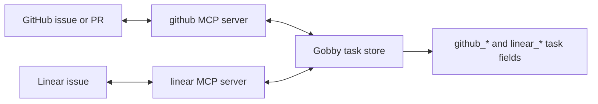

# Integrations Guide

Gobby's task integrations connect local tasks to GitHub issues, GitHub pull
requests, and Linear issues. GitHub and Linear operations run through configured
external MCP servers, while Gobby stores the linkage fields on local project and
task records.

## Integration Surface

| Integration | Main use | Required external capability |
|-------------|----------|------------------------------|
| GitHub | Import issues, sync linked issue title/body, create task PRs, close linked issues after merge | MCP server named `github`; some MCP task tools use the `gh` CLI |
| Linear | Import issues, create Linear issues from tasks, push/pull project-scoped updates, periodic sync | MCP server named `linear`; GraphQL fallback may use configured Linear API credentials |



## Prerequisites

Run integration commands from a Gobby project directory. If a command reports
that no project context is available, initialize or select the project first.

External MCP servers are project/user configuration, not task data. Discover the
live server state before troubleshooting integration commands:

```bash
gobby mcp-proxy list-servers
gobby mcp-proxy list-tools --server github
gobby mcp-proxy list-tools --server linear
```

Use `gobby mcp-proxy add-server` or `gobby mcp-proxy import-server` to add
missing servers. See [mcp-tools.md](./mcp-tools.md) for the proxy model and
progressive discovery workflow.

## GitHub

GitHub project commands live under `gobby github`. Repository identifiers use
`owner/repo` format.

### Link a repository

```bash
gobby github link owner/repo
gobby github status
```

`gobby github link` stores the default GitHub repo on the local Gobby project.
`gobby github status` reports the linked repo, whether the `github` MCP server is
available, and how many local tasks are linked to GitHub issues.

Remove the default repo with:

```bash
gobby github unlink
```

### Import issues

```bash
gobby github import [REPO] [--labels LABELS] [--state open|closed|all] [--json]
```

If `REPO` is omitted, Gobby uses the repo from `gobby github link`. `--labels`
accepts a comma-separated list. Imported issues are deduplicated by
`github_repo` plus `github_issue_number`; re-importing updates the existing task
instead of creating another one.

Example:

```bash
gobby github import owner/repo --labels bug,priority-high --state open
```

### Sync a linked task to its issue

```bash
gobby github sync TASK_ID [--json]
```

GitHub sync updates the linked issue's title and body from the local task. The
task must already have `github_issue_number`, and either the task or project must
provide `github_repo`.

### Create a pull request for a task

```bash
gobby github pr TASK_ID --head BRANCH [--base main] [--draft] [--json]
```

`--head` is required. When GitHub returns a PR number, Gobby records it on the
task as `github_pr_number`.

Example:

```bash
gobby github pr #123 --head task-123-fix-login --base main --draft
```

### GitHub MCP tools

The task integration tools are exposed through `gobby-tasks-ops`.

| Tool | Signature | Notes |
|------|-----------|-------|
| `import_github_issues` | `repo`, optional `labels`, `state="open"`, optional `parent_task_id` | Uses the `gh` CLI and deduplicates imported tasks. |
| `link_task_to_github_issue` | `task_id`, `repo`, `issue_number` | Sets GitHub linkage fields on an existing task. |
| `close_linked_github_issue` | `task_id`, optional `merge_sha` | Comments, labels, and closes the linked issue after a merge. |

Example:

```python
call_tool(
    "gobby-tasks-ops",
    "import_github_issues",
    {
        "repo": "owner/repo",
        "labels": ["bug", "priority-high"],
        "state": "open",
        "parent_task_id": "#120",
    },
)
```

Sync, PR creation, and project GitHub status are CLI workflows in the current
Gobby surface.

## Linear

Linear project commands live under `gobby linear`. Linear sync uses a team
binding and, for project-scoped sync, a Linear project binding.

### Inspect available teams

```bash
gobby linear teams [--json]
```

This lists teams available to the configured Linear auth. Use the team ID or key
in setup and import commands.

### Link or set up Linear

For a simple team binding:

```bash
gobby linear link TEAM_ID
gobby linear status
```

For project-scoped sync, use setup:

```bash
gobby linear setup --bootstrap [--team-id TEAM_ID] [--project-id PROJECT_ID] [--project-name NAME]
```

`--bootstrap` creates or reuses a Linear project by name. `--project-id` binds an
existing Linear project. Setup can also import issues, create missing Linear
issues for active Gobby tasks, and enable periodic sync:

```bash
gobby linear setup --bootstrap --import --create-missing --auto-sync --interval 300
```

Remove the Linear binding with:

```bash
gobby linear unlink
```

### Import issues

```bash
gobby linear import [TEAM_ID] [--state STATE] [--labels LABELS] [--json]
```

If `TEAM_ID` is omitted, Gobby uses the linked team. When a project binding
exists, imports are scoped to that Linear project. Imported issues are
deduplicated by `linear_issue_id`; titles that begin with `#123:` can also
reconnect to the matching Gobby sequence number.

### Sync one task

```bash
gobby linear sync TASK_ID [--json]
```

The task must already be linked to a Linear issue. Sync pushes title,
description, priority, and mapped state from Gobby to Linear.

### Sync the project

```bash
gobby linear sync-all [TEAM_ID] [--json]
gobby linear sync-all [TEAM_ID] --forward [--json]
```

Default `sync-all` pulls newer Linear updates into linked tasks, pushes dirty
linked tasks back to Linear, then updates the project's Linear sync cursor.
`--forward` is for initial setup from Gobby into Linear: it creates Linear
issues for active unlinked tasks, pushes active linked tasks, and avoids pulling
closed local history.

Periodic sync is managed with:

```bash
gobby linear auto-sync [--interval 300]
gobby linear auto-sync --disable
```

### Create a Linear issue from a task

```bash
gobby linear create TASK_ID [--team TEAM_ID] [--json]
```

Created issue titles are prefixed with the Gobby reference, for example
`#123: Fix login flow`. Gobby stores the returned Linear issue ID on the task.

### State mapping

| Gobby state | Linear state |
|-------------|--------------|
| `ready` | `Todo` |
| `in_progress` | `In Progress` |
| `needs_review` | `In Review` |
| `review_approved` | `Done` |
| `closed` | `Done` |
| `escalated` | `Canceled` |

When pulling from Linear, `Backlog` and `Triage` map to `ready`, `In Review`
maps to `in_progress`, and `Done` or `Canceled` map to closed task semantics.

## Troubleshooting

| Issue | Check |
|-------|-------|
| `github` or `linear` is unavailable | Run `gobby mcp-proxy list-servers`; the server must be configured and connected or lazily connectable. |
| GitHub repo format is rejected | Use `owner/repo`, not a full `https://github.com/...` URL. |
| `gobby github import` cannot find a repo | Pass `REPO` explicitly or run `gobby github link owner/repo`. |
| `gobby github pr` errors about a missing branch | Pass `--head BRANCH`; it is required. |
| GitHub task MCP import fails | Confirm the `gh` CLI is installed and authenticated; `gobby-tasks-ops:import_github_issues` uses it directly. |
| Linear import or sync cannot find a team | Run `gobby linear teams`, then `gobby linear setup --bootstrap --team-id TEAM_ID` or pass `TEAM_ID` to the command. |
| Linear `sync-all` touches too much history on first setup | Use `gobby linear sync-all --forward` for active forward-only setup. |

## See Also

- [tasks.md](./tasks.md) - task management
- [cli-commands.md](./cli-commands.md) - CLI command index
- [mcp-tools.md](./mcp-tools.md) - MCP tool reference
- [github-issue-triage.md](./github-issue-triage.md) - GitHub triage automation

_Last verified: 2026-05-07_
