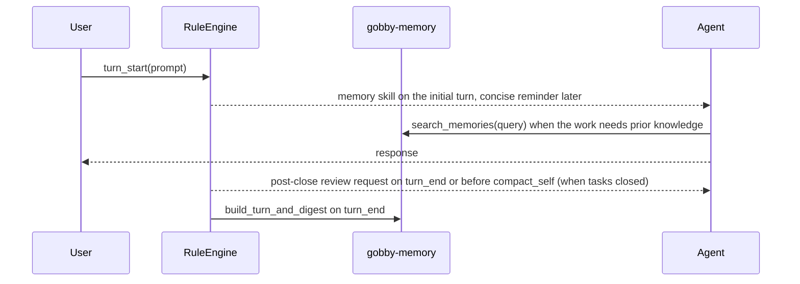

# Memory System Guide

Gobby's memory system stores durable project facts, user preferences, and
working conventions in the local hub database so future sessions can recall
them. It is separate from tasks, session transcripts, and native provider memory
files.

## Quick Start

```bash
# Store a user-authored memory. Without --project this creates an unscoped memory.
gobby memory create "Use focused pytest files for task validation" --type preference

# Store a memory for a specific Gobby project.
gobby memory create "This project uses uv for Python commands" --type fact --project gobby

# Recall memories with semantic or FTS-backed search.
gobby memory recall "validation commands" --limit 5

# List and inspect memories.
gobby memory list --type preference
gobby memory show MEMORY_ID_OR_PREFIX
```

```python
# MCP tools are project-scoped by the current session context.
call_tool(server_name="gobby-memory", tool_name="create_memory", arguments={
    "content": "User prefers task-linked commits.",
    "memory_type": "preference",
    "tags": ["workflow", "commits"],
    "session_id": "#4767"
})

call_tool(server_name="gobby-memory", tool_name="search_memories", arguments={
    "query": "commit workflow",
    "limit": 5,
    "tags_any": ["workflow", "commits"]
})
```

For a known memory tool without a current-context lease, fetch its schema directly:

```python
get_tool_schema(server_name="gobby-memory", tool_name="search_memories")
call_tool(server_name="gobby-memory", tool_name="search_memories", arguments={...})
```

## What Belongs in Memory

Use memories for durable context that future agents need and cannot cheaply
derive from code or git history.

| Store as memory | Use another system |
| --- | --- |
| User preferences and workflow conventions | Bugs, failures, and work to do: create a Gobby task |
| Design rationale that is not obvious in code | Current implementation state: read the code |
| External references that are hard to rediscover | Recent changes: use git log or linked commits |
| Stable cross-session facts about a project | One-turn instructions or temporary task notes |

Good memories are specific and time-resilient:

- "The project treats Markdown guide line count as documentation scope, not the source-file monolith rule."
- "Use `GOBBY_TEST_PROTECT=1` for pytest in this repo so tests cannot touch the production daemon state."
- "The memory backup file is a JSONL backup/export path, not the memory source of truth."

Avoid storing secrets, API keys, passwords, transient debug notes, duplicate
facts, or facts that are already obvious from source files.

## Concepts

### Memory Types

The storage model accepts these common types:

| Type | Use for |
| --- | --- |
| `fact` | Objective project or environment facts |
| `preference` | User preferences and durable workflow choices |
| `pattern` | Repeated conventions or design patterns |
| `context` | Broader project context that should be injected as prose |

The MCP and CLI accept a string `memory_type`, so additional values may be
stored; search results carry the type so an agent can weigh a preference
differently from a fact.

### Scope

Scope differs by surface:

| Surface | Scope behavior |
| --- | --- |
| MCP `gobby-memory` tools | Use the current project context from the MCP proxy. |
| HTTP `/api/memories` routes | Accept explicit `project_id` query/body fields where supported. |
| CLI `gobby memory ...` | Use `--project` when you want project-scoped create, list, recall, show, delete, or stats behavior. |
| CLI without `--project` | Creates unscoped memories or lists/searches without a project filter, depending on command. |

### Tags

Tags support boolean filters on both CLI and MCP surfaces:

| Filter | Meaning |
| --- | --- |
| `tags_all` / `--tags-all` | Memory must have every listed tag. |
| `tags_any` / `--tags-any` | Memory must have at least one listed tag. |
| `tags_none` / `--tags-none` | Memory must have none of the listed tags. |

Use tags for stable concepts such as `workflow`, `testing`, `security`,
`architecture`, `preference`, and `external-reference`.

## CLI Reference

### Create, Recall, List

```bash
gobby memory create "CONTENT" [--type TYPE] [--project REF]
gobby memory recall [QUERY] [--project REF] [--limit N] \
  [--tags-all TAGS] [--tags-any TAGS] [--tags-none TAGS]
gobby memory list [--type TYPE] [--project REF] [--limit N] \
  [--tags-all TAGS] [--tags-any TAGS] [--tags-none TAGS]
```

`TAGS` is a comma-separated list.

### Inspect and Update

```bash
gobby memory show MEMORY_ID_OR_PREFIX [--project REF]
gobby memory update MEMORY_ID_OR_PREFIX [--content "NEW CONTENT"] [--tags "tag1,tag2"] [--project REF]
gobby memory delete MEMORY_ID_OR_PREFIX [--project REF]
gobby memory stats [--project REF]
```

Memory references can be full UUIDs or unambiguous prefixes.

### Markdown Export

```bash
gobby memory export [--project REF] [--output FILE] [--no-metadata] [--no-stats]
```

This writes a human-readable Markdown report. It is separate from the JSONL
backup path.

### Backup and Restore

```bash
gobby memory backup [--output PATH] [--quiet]
gobby memory restore [--input PATH] [--quiet]
```

The default JSONL path is
`~/.gobby/backups/<project-uuid>/memories.jsonl`. Backup is a machine-local
filesystem export for disaster recovery or migration. The PostgreSQL hub
remains the source of truth.

### Maintenance

```bash
gobby memory dedupe [--dry-run]
gobby memory fix-null-project [--dry-run]
gobby memory reindex-embeddings
gobby memory reconcile [--dry-run]
gobby memory rebuild-crossrefs [--project REF]
gobby memory clear-graph [--project REF] [--yes]
gobby memory rebuild-graph [--project REF] [--wait] [--timeout SECONDS]
gobby memory invalidate [--project REF] [--yes]
```

Daemon-backed commands require the Gobby daemon because they call HTTP routes
for vector, graph, and index maintenance.

## MCP Tools

Access memory tools through the `gobby-memory` server. Use `get_tool_schema`
for the authoritative signature before calling a tool.

| Tool | Purpose |
| --- | --- |
| `create_memory` | Store a memory. Requires `content` and `rationale`; accepts optional `memory_type`, `tags`, `supersedes`, and `session_id`. Returns the five nearest existing memories (`similar_existing`, undecayed score) and auto-supersedes any at raw cosine >= 0.9. |
| `search_memories` | Hybrid search with `query`, `limit`, `min_score` (undecayed axis), and tag filters. Hits carry `rationale`, `similarity`, `raw_semantic_score`, `undecayed_similarity`, provenance, and `collapsed_duplicates`; `diagnostics` reports candidates and the score range. |
| `list_memories` | List project-scoped memories with optional `memory_type`, `limit`, and tag filters. |
| `get_memory` | Read one memory by ID. |
| `update_memory` | Update `content`, `tags`, `rationale`, or `memory_type` for one memory. A content change requires a fresh `rationale`; content and rationale edits re-embed the vector. |
| `delete_memory` | Hard-delete one memory by ID (unrecoverable). Prefer `create_memory(..., supersedes=[id])` when a replacement exists. |
| `get_related_memories` | Return cross-reference neighbors for one memory. |
| `memory_stats` | Return counts and summary stats. |
| `search_knowledge_graph` | Search extracted FalkorDB memory entities. |
| `rebuild_crossrefs` | Rebuild memory-to-memory cross-reference edges. |
| `rebuild_knowledge_graph` | Extract entities and relationships into FalkorDB. |
| `reindex_embeddings` | Regenerate embedding vectors for stored memories. |
| `review_task_memories` | Search memories related to a task after it closes and record that closure's memory review. |
| `restore_memories` | Restore the project memory backup into the hub database without deleting absent or newer rows. |
| `backup_memories` | Back up current live project memories to the machine-local project backup path. |
| `memory_dream` | Review stale memories, apply a validated plan, and snapshot mutations. |
| `memory_dream_status` | Return status and summary for a memory dream run. |
| `memory_dream_revert` | Revert a memory dream run from its snapshots. |
| `build_turn_and_digest` | System lifecycle tool for turn records and session digest updates. |

When a memory call exceeds the inline MCP result budget, the proxy returns an
offload envelope containing a `result_id`. Page the raw result with
`gobby-results:get_tool_result`, or search its stored chunks with
`gobby-results:search_tool_result`. The envelope is a successful result; do not
repeat the original memory call merely to make its output smaller.

### Common Calls

```python
call_tool(server_name="gobby-memory", tool_name="list_memories", arguments={
    "memory_type": "preference",
    "limit": 20,
    "tags_none": ["stale"]
})
```

```python
call_tool(server_name="gobby-memory", tool_name="update_memory", arguments={
    "memory_id": "mm-abc123",
    "content": "Use task-linked commits for Gobby work.",
    "rationale": "Closing a leaf requires a linked commit; sessions re-derive this every week.",
    "tags": ["workflow", "commits"]
})
```

```python
call_tool(server_name="gobby-memory", tool_name="memory_dream", arguments={
    "dry_run": True,
    "memory_type": "fact"
})
# Returns the run ID immediately; poll memory_dream_status for progress.
```

## HTTP Routes

The daemon exposes standard memory routes under `/api/memories`. Memory dream
routes are top-level daemon routes under `/memory/dream`; they are not prefixed
with `/api/memories`.

| Method and route | Purpose |
| --- | --- |
| `GET /api/memories` | List memories with `project_id`, `memory_type`, `limit`, and `offset`. |
| `POST /api/memories` | Create a memory from `content`, `memory_type`, `project_id`, `source_type`, `source_session_id`, and `tags`. |
| `GET /api/memories/search` | Search memories with required query parameter `q`, plus `project_id` and `limit`. |
| `GET /api/memories/stats` | Return memory counts, optionally scoped by `project_id`. |
| `POST /memory/dream` | Start an asynchronous memory dream run; returns the run ID immediately (202 admitted, 200 coalesced, 409 conflicting active run). |
| `GET /memory/dream/{run_id}` | Return dream run status, durable checkpoint, and summary. |
| `POST /memory/dream/{run_id}/revert` | Revert a dream run from snapshots. |
| `GET /api/memories/{memory_id}` | Read one memory, optionally scoped by `project_id`. |
| `PUT /api/memories/{memory_id}` | Update memory `content` and/or `tags`. |
| `DELETE /api/memories/{memory_id}` | Delete one memory. |
| `GET /api/memories/graph` | Return recent memories and cross-reference edges for graph views. |
| `GET /api/memories/graph/entities` | Search extracted knowledge-graph entities. |
| `GET /api/memories/graph/entities/{entity_key}/neighbors` | Return entity neighbors. |
| `POST /api/memories/crossrefs/rebuild` | Rebuild memory cross-references. |
| `POST /api/memories/graph/clear` | Clear the FalkorDB memory graph projection. |
| `POST /api/memories/graph/rebuild` | Rebuild the knowledge graph, optionally in the background. |
| `GET /api/memories/graph/rebuild/status` | Inspect background rebuild status. |
| `POST /api/memories/embeddings/reindex` | Regenerate embedding vectors. |
| `POST /api/memories/reconcile` | Reconcile Qdrant and FalkorDB with the hub database. |
| `POST /api/memories/invalidate` | Clear secondary indices and start a background rebuild. |

## Architecture

The PostgreSQL hub is the source of truth. Runtime connection details come from
the `database_url` in `~/.gobby/bootstrap.yaml`.

```mermaid
flowchart LR
    Agent[Agent or CLI] --> MCP[gobby-memory MCP]
    Agent --> CLI[gobby memory CLI]
    MCP --> Manager[MemoryManager]
    CLI --> Manager
    HTTP[/api/memories] --> Manager
    Manager --> Hub[(PostgreSQL hub)]
    Manager --> BM25[pg_search BM25]
    Manager --> Qdrant[Qdrant vectors]
    Manager --> FalkorDB[FalkorDB knowledge graph]
    Manager --> JSONL[~/.gobby/backups/project-uuid/memories.jsonl]
```

`MemoryManager` coordinates storage, keyword search, vector search,
cross-references, image ingestion, cleanup, and the optional knowledge graph.
`StorageAdapter` provides the async backend interface over the hub storage layer.

### Search

Search uses the best available local infrastructure:

1. With Qdrant and embeddings configured, the query is embedded and matched
   against memory vectors.
2. If FalkorDB graph search is available, graph matches join vector and keyword
   results through reciprocal-rank fusion.
3. pg_search BM25 keyword search participates when semantic search is available
   and is the fallback when vectors are unavailable.
4. Result metadata can include `similarity`, `search_via`, `ranking_score`,
   `raw_semantic_score`, `temporal_decay_factor`, and `ranking_mode`.

`search_memories` supports an explicit `min_score` threshold. Agents search on
demand; no rule injects memories automatically. The tool returns
`memories`, `recall_request_id`, `project_id`, and `diagnostics`; each hit
includes its content, rationale, type, provenance, ranking fields, and duplicate
fold information. Live-corpus raw cosine score bands are p10 `0.62`, p50
`0.69`, and p90 `0.75`. Compare hits within the returned set and judge their
content and rationale instead of treating one score as a universal relevance
boundary. `min_score` filters the reported `undecayed_similarity` axis;
`similarity` includes temporal decay.

### Knowledge Graph

The knowledge graph extracts entities and relationships from memories into
FalkorDB. It is optional and depends on an LLM service, embeddings, a vector
store, and FalkorDB. Use it for relationship exploration, graph visualization, and
entity-oriented recall. Hub memories remain authoritative.

## Configuration

Memory-specific settings live under `memory:`. Shared vector and graph
connection settings live under `databases:` and shared embedding settings live
under `embeddings:`.

```yaml
memory:
  enabled: true
  backend: local
  auto_crossref: false
  crossref_threshold: 0.3
  crossref_max_links: 5
  access_debounce_seconds: 60
  temporal_decay_half_life_days: 30.0
  code_link_min_score: 0.82
  kg:
    profile: feature_low
    candidates: []
  dream:
    enabled: true
    schedule_cron: "0 2 * * *"
    prompt_path: memory/dream
    max_tokens: 8192
    planner_batch_size: 25
    max_runtime_seconds: 14400
    work_unit_timeout_seconds: 1500.0
    evidence_channel_timeout_seconds: 30.0
    evidence_retry_attempts: 3
    evidence_phase_timeout_seconds: 210.0
    min_action_confidence: 0.72
    min_delete_confidence: 0.85
    include_global_memories: true
    reconcile_after_apply: true

embeddings:
  model: nomic-embed-text
  dim: 768
  api_base: null
  api_key: null

databases:
  qdrant:
    url: http://localhost:6333
    port: 6333
    collection_prefix: code_symbols_
  falkordb:
    host: 127.0.0.1
    port: 16379
    password: ${GOBBY_FALKORDB_PASSWORD:-}
    graph_name: gobby_kg
    graph_search: true
    graph_min_score: 0.5
    rrf_k: 60

memory_backup:
  enabled: true
```

Knowledge-graph extraction is enabled by FalkorDB being configured
(`databases.falkordb.password`); `memory.kg` only selects the LLM profile and
candidates for extraction — there is no `kg.enabled` flag.

`memory_backup` configures the backup manager. With `backup_path` omitted, the
manager uses `~/.gobby/backups/<project-uuid>/memories.jsonl`; setting
`backup_path` selects an explicit override. Treat the file as a backup and
migration artifact, not a live bidirectional source of truth.

Automatic prompt recall configuration has been removed. Legacy
`memory_recall` and `memory.min_recall_score` settings fail configuration
validation; agents choose a per-call `search_memories(min_score=...)` threshold
when a task needs one.

## Lifecycle Rules

Memory lifecycle automation is installed as rules against semantic workflow
events.



Current bundled memory rules:

| Rule | Event | Behavior |
| --- | --- | --- |
| `load-memory-guidance-on-initial-turn` | `turn_start` | Loads the `memory` skill until the first turn-end check passes. |
| `check-memory-guidance-on-initial-stop` | `turn_end` | Blocks the first turn end once until the `memory` skill is loaded or its fetch failed. |
| `remind-memory-guidance-on-later-turns` | `turn_start` | Injects a concise memory reminder once per later parent turn. |
| `queue-task-memory-review-after-close` | `after_tool` | Queues completed worked leaves closed through `close_task` for one review. |
| `review-closed-task-memories-before-compact` | `before_tool` | Blocks `gobby-sessions:compact_self` once per queued closure set with the same request, so a compaction right after `close_task` cannot defer the review past the closing context (the manual-compact bypass skips the `turn_end` gate); silent once every queued closure is reviewed. |
| `review-closed-task-memories-on-stop` | `turn_end` | Blocks once per queued closure set with a `review_task_memories` request; silent once every queued closure is reviewed. |
| `digest-on-response` | `turn_end` | Builds a turn record and appends to the session digest in the background. |
| `digest-catch-up-on-turn-start` | `turn_start` | Drains one bounded batch of undigested turns after an outage or interrupted digest. |
| `digest-on-plan-turn-end` | `after_tool` | Builds a digest when plan mode ends through supported plan tools. |
| `guard-plan-memory-writes` | `before_tool` | Blocks the first plan-time `create_memory` or `update_memory` call until the agent confirms that the write is a durable preference or finalized decision rather than plan evidence. |
| `reset-memory-tracking-on-start` | `session_start` | Clears injected review-lesson tracking after clear, compact, or selected resume events. |
| `increment-parent-turn-seq` | `turn_start` | Increments the parent session turn sequence counter. |
| `search-memories-on-claim` | `after_tool` | Nudges one subject search after a successful `claim_task` or claimed `create_task`, before editing starts. |

Author new lifecycle rules against semantic events such as `turn_start` and
`turn_end`. Raw provider/runtime hook names are transport details.

## Retrieval Is Agent-Driven

Agents search on demand; no rule injects memories automatically. Call
`search_memories` after claiming unfamiliar work and whenever prior project
knowledge could change the implementation. Judge each hit by its `similarity`,
`type`, `rationale`, and content; search results are evidence, not
authority.

Rule-delivered review lessons are deduplicated for one context epoch through
`injected_memory_ids`. Clear, compact, and selected resume events start a new
context epoch by resetting that variable, allowing relevant guidance to appear
again without suppressing it for the whole session.

## Backup Format

`~/.gobby/backups/<project-uuid>/memories.jsonl` stores one JSON object per line.
Backup writes exactly the current live scoped rows in deterministic order.
Restore validates the complete file before writing, upserts by memory ID and
updated timestamp, and preserves database-only and newer database rows.

```jsonl
{"id":"8de06cb8-99b8-4fc4-a16c-5af217132b81","type":"fact","content":"Use uv for local development","tags":["tooling"],"source":"agent","created_at":"2026-07-20T12:00:00Z","updated_at":"2026-07-20T12:00:00Z"}
{"id":"70d53c95-4316-4f79-a2c2-6e1e25781063","type":"preference","content":"Prefer focused validation over full suite runs","tags":["testing"],"source":"user","created_at":"2026-07-20T12:05:00Z","updated_at":"2026-07-20T12:05:00Z"}
```

Use `gobby memory backup` or MCP `backup_memories` to write the file. Use
`gobby memory restore` or MCP `restore_memories` to restore it explicitly.

## Maintenance Checklist

- Search before creating a memory to avoid duplicates.
- Delete stale memories when you discover them.
- Use `gobby memory dream --dry-run` or MCP `memory_dream` with `dry_run=true`
  for a report-only hygiene pass.
- Rebuild cross-references after large imports or cleanup.
- Reindex embeddings after changing embedding providers or models.
- Rebuild or clear the knowledge graph when entity extraction changes.
- Reconcile stores when Qdrant or FalkorDB may contain orphaned records.

## Troubleshooting

### A search returns nothing useful

Check that memory is enabled and the relevant memories are in the current
project scope, then widen the search:

```python
call_tool(server_name="gobby-memory", tool_name="search_memories", arguments={
    "query": "the missing context",
    "limit": 10,
    "min_score": 0.0
})
```

### Search quality is poor

Run a tag-filtered search to confirm the memory exists, then verify embeddings
and Qdrant are available. Without embeddings, Gobby falls back to keyword
search.

```bash
gobby memory recall "query words" --tags-any "architecture,workflow"
gobby memory reindex-embeddings
```

### Backup file is missing

Run an explicit backup:

```bash
gobby memory backup
```

If the file exists but restored memories do not appear, check project scope and
run `gobby memory restore` to read the current project's default backup.

### Graph views are empty

The knowledge graph is optional. Verify FalkorDB, embeddings, and an LLM provider
are configured, then rebuild:

```bash
gobby memory rebuild-graph --wait
```

## File Locations

| Path | Description |
| --- | --- |
| `~/.gobby/bootstrap.yaml` `database_url` | Runtime PostgreSQL hub DSN. |
| `~/.gobby/bootstrap.yaml` | Bootstrap settings, including Postgres install metadata. |
| `~/.gobby/backups/<project-uuid>/memories.jsonl` | Machine-local JSONL memory backup/export file. |
| `src/gobby/memory/` | Memory manager, search, graph, indexing, and maintenance code. |
| `src/gobby/mcp_proxy/tools/memory.py` | `gobby-memory` MCP tool definitions. |
| `src/gobby/cli/memory/` | CLI command package (crud, dream, export, graph, indices, maintenance). |
| `src/gobby/servers/routes/memory.py` | HTTP memory routes. |
| `src/gobby/install/shared/workflows/rules/memory-lifecycle/` | Bundled memory lifecycle rules. |

## Related Documentation

- [Tasks](./tasks.md) - Track actionable work instead of storing it as memory.
- [Sessions](./sessions.md) - Session transcripts, summaries, and handoffs.
- [MCP Tools](./mcp-tools.md) - Progressive discovery and internal MCP tool usage.
- [Workflow Rules](./workflow-rules.md) - Semantic lifecycle events and rule effects.

_Last verified: 2026-05-23_
