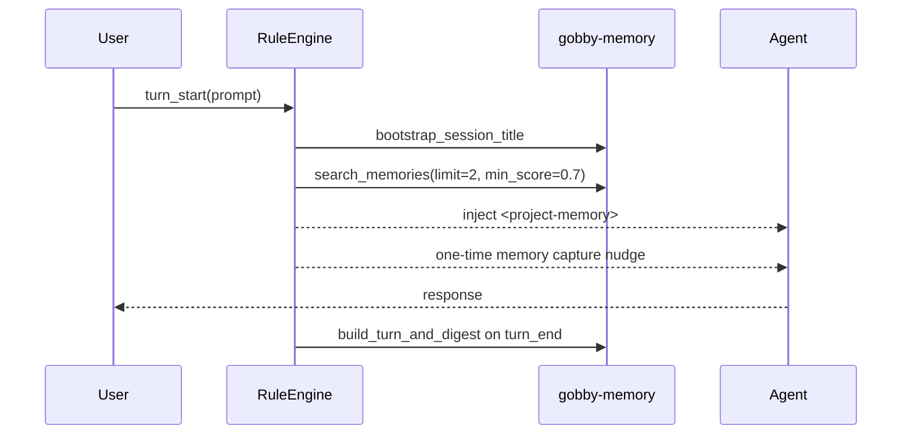

# Memory System Guide

Gobby's memory system stores durable project facts, user preferences, and
working conventions in the local hub database so future sessions can recall
them. It is separate from tasks, session transcripts, and native provider memory
files.

## Quick Start

```bash
# Store a user-authored memory. Without --project this creates an unscoped memory.
gobby memory create "Use focused pytest files for task validation" --type preference

# Store a memory for a specific Gobby project.
gobby memory create "This project uses uv for Python commands" --type fact --project gobby

# Recall memories with semantic or FTS-backed search.
gobby memory recall "validation commands" --limit 5

# List and inspect memories.
gobby memory list --type preference
gobby memory show MEMORY_ID_OR_PREFIX
```

```python
# MCP tools are project-scoped by the current session context.
call_tool(server_name="gobby-memory", tool_name="create_memory", arguments={
    "content": "User prefers task-linked commits.",
    "memory_type": "preference",
    "tags": ["workflow", "commits"],
    "session_id": "#4767"
})

call_tool(server_name="gobby-memory", tool_name="search_memories", arguments={
    "query": "commit workflow",
    "limit": 5,
    "tags_any": ["workflow", "commits"]
})
```

Use progressive discovery before relying on an MCP signature:

```python
list_mcp_servers()
list_tools(server_name="gobby-memory")
get_tool_schema(server_name="gobby-memory", tool_name="search_memories")
call_tool(server_name="gobby-memory", tool_name="search_memories", arguments={...})
```

## What Belongs in Memory

Use memories for durable context that future agents need and cannot cheaply
derive from code or git history.

| Store as memory | Use another system |
| --- | --- |
| User preferences and workflow conventions | Bugs, failures, and work to do: create a Gobby task |
| Design rationale that is not obvious in code | Current implementation state: read the code |
| External references that are hard to rediscover | Recent changes: use git log or linked commits |
| Stable cross-session facts about a project | One-turn instructions or temporary task notes |

Good memories are specific and time-resilient:

- "The project treats Markdown guide line count as documentation scope, not the source-file monolith rule."
- "Use `GOBBY_TEST_PROTECT=1` for pytest in this repo so tests cannot touch the production daemon state."
- "The memory backup file is a JSONL backup/export path, not the memory source of truth."

Avoid storing secrets, API keys, passwords, transient debug notes, duplicate
facts, or facts that are already obvious from source files.

## Concepts

### Memory Types

The storage model accepts these common types:

| Type | Use for |
| --- | --- |
| `fact` | Objective project or environment facts |
| `preference` | User preferences and durable workflow choices |
| `pattern` | Repeated conventions or design patterns |
| `context` | Broader project context that should be injected as prose |

The MCP and CLI accept a string `memory_type`, so additional values may be
stored, but the formatter groups the four types above into the cleanest
`<project-memory>` output.

### Scope

Scope differs by surface:

| Surface | Scope behavior |
| --- | --- |
| MCP `gobby-memory` tools | Use the current project context from the MCP proxy. |
| HTTP `/api/memories` routes | Accept explicit `project_id` query/body fields where supported. |
| CLI `gobby memory ...` | Use `--project` when you want project-scoped create, list, recall, show, delete, or stats behavior. |
| CLI without `--project` | Creates unscoped memories or lists/searches without a project filter, depending on command. |

### Tags

Tags support boolean filters on both CLI and MCP surfaces:

| Filter | Meaning |
| --- | --- |
| `tags_all` / `--tags-all` | Memory must have every listed tag. |
| `tags_any` / `--tags-any` | Memory must have at least one listed tag. |
| `tags_none` / `--tags-none` | Memory must have none of the listed tags. |

Use tags for stable concepts such as `workflow`, `testing`, `security`,
`architecture`, `preference`, and `external-reference`.

## CLI Reference

### Create, Recall, List

```bash
gobby memory create "CONTENT" [--type TYPE] [--project REF]
gobby memory recall [QUERY] [--project REF] [--limit N] \
  [--tags-all TAGS] [--tags-any TAGS] [--tags-none TAGS]
gobby memory list [--type TYPE] [--project REF] [--limit N] \
  [--tags-all TAGS] [--tags-any TAGS] [--tags-none TAGS]
```

`TAGS` is a comma-separated list.

### Inspect and Update

```bash
gobby memory show MEMORY_ID_OR_PREFIX [--project REF]
gobby memory update MEMORY_ID_OR_PREFIX [--content "NEW CONTENT"] [--tags "tag1,tag2"] [--project REF]
gobby memory delete MEMORY_ID_OR_PREFIX [--project REF]
gobby memory stats [--project REF]
```

Memory references can be full UUIDs or unambiguous prefixes.

### Markdown Export

```bash
gobby memory export [--project REF] [--output FILE] [--no-metadata] [--no-stats]
```

This writes a human-readable Markdown report. It is separate from the JSONL
backup path.

### Backup and Restore

```bash
gobby memory backup [--output PATH] [--quiet]
gobby memory restore [--input PATH] [--quiet]
```

The default JSONL path is `.gobby/memories.jsonl`. Backup is a filesystem
export for disaster recovery or migration. SQLite remains the source of truth.

### Maintenance

```bash
gobby memory dedupe [--dry-run]
gobby memory fix-null-project [--dry-run]
gobby memory reindex-embeddings
gobby memory reconcile [--dry-run]
gobby memory rebuild-crossrefs [--project REF]
gobby memory clear-graph [--project REF] [--yes]
gobby memory rebuild-graph [--project REF] [--wait] [--timeout SECONDS]
gobby memory invalidate [--project REF] [--yes]
```

Daemon-backed commands require the Gobby daemon because they call HTTP routes
for vector, graph, and index maintenance.

## MCP Tools

Access memory tools through the `gobby-memory` server. Use `get_tool_schema`
for the authoritative signature before calling a tool.

| Tool | Purpose |
| --- | --- |
| `create_memory` | Store a memory. Accepts `content`, optional `memory_type`, `tags`, and `session_id`. Returns similar memories to help catch duplicates. |
| `search_memories` | Search project-scoped memories with `query`, `limit`, `min_score`, and tag filters. |
| `list_memories` | List project-scoped memories with optional `memory_type`, `limit`, and tag filters. |
| `get_memory` | Read one memory by ID. |
| `update_memory` | Update content or tags for one memory. |
| `delete_memory` | Delete one memory by ID. |
| `get_related_memories` | Return cross-reference neighbors for one memory. |
| `memory_stats` | Return counts and summary stats. |
| `remember_with_image` | Store an image-derived memory using the configured LLM service. |
| `remember_screenshot` | Store a base64 screenshot-derived memory. |
| `search_knowledge_graph` | Search extracted Neo4j memory entities. |
| `rebuild_crossrefs` | Rebuild memory-to-memory cross-reference edges. |
| `rebuild_knowledge_graph` | Extract entities and relationships into Neo4j. |
| `reindex_embeddings` | Regenerate embedding vectors for stored memories. |
| `sync_import` | Import `.gobby/memories.jsonl` into SQLite. |
| `sync_export` | Export project memories from SQLite to `.gobby/memories.jsonl`. |
| `audit_memories` | Report stale, duplicate, code-derivable, and orphaned memory candidates. |
| `cleanup_memories` | Delete or dry-run cleanup of problematic memories. |
| `bootstrap_session_title` | System lifecycle tool for heuristic session titles. |
| `build_turn_and_digest` | System lifecycle tool for turn records and session digest updates. |

### Common Calls

```python
call_tool(server_name="gobby-memory", tool_name="list_memories", arguments={
    "memory_type": "preference",
    "limit": 20,
    "tags_none": ["stale"]
})
```

```python
call_tool(server_name="gobby-memory", tool_name="update_memory", arguments={
    "memory_id": "mm-abc123",
    "content": "Use task-linked commits for Gobby work.",
    "tags": ["workflow", "commits"]
})
```

```python
call_tool(server_name="gobby-memory", tool_name="audit_memories", arguments={
    "categories": ["stale", "duplicates"]
})
```

`audit_memories` does not take `dry_run`; it is always report-only. Use
`cleanup_memories` with `dry_run=true` when you want cleanup diagnostics through
the cleanup tool.

```python
call_tool(server_name="gobby-memory", tool_name="cleanup_memories", arguments={
    "dry_run": True,
    "categories": ["stale", "duplicates", "code_derivable", "orphaned"]
})
```

## HTTP Routes

The daemon exposes memory routes under `/api/memories`.

| Method and route | Purpose |
| --- | --- |
| `GET /api/memories` | List memories with `project_id`, `memory_type`, `limit`, and `offset`. |
| `POST /api/memories` | Create a memory from `content`, `memory_type`, `project_id`, `source_type`, `source_session_id`, and `tags`. |
| `GET /api/memories/search` | Search memories with required query parameter `q`, plus `project_id` and `limit`. |
| `GET /api/memories/stats` | Return memory counts, optionally scoped by `project_id`. |
| `GET /api/memories/{memory_id}` | Read one memory, optionally scoped by `project_id`. |
| `PUT /api/memories/{memory_id}` | Update memory `content` and/or `tags`. |
| `DELETE /api/memories/{memory_id}` | Delete one memory. |
| `GET /api/memories/graph` | Return recent memories and cross-reference edges for graph views. |
| `GET /api/memories/graph/entities` | Search extracted knowledge-graph entities. |
| `GET /api/memories/graph/entities/{entity_key}/neighbors` | Return entity neighbors. |
| `POST /api/memories/crossrefs/rebuild` | Rebuild memory cross-references. |
| `POST /api/memories/graph/clear` | Clear the Neo4j memory graph projection. |
| `POST /api/memories/graph/rebuild` | Rebuild the knowledge graph, optionally in the background. |
| `GET /api/memories/graph/rebuild/status` | Inspect background rebuild status. |
| `POST /api/memories/embeddings/reindex` | Regenerate embedding vectors. |
| `POST /api/memories/reconcile` | Reconcile Qdrant and Neo4j with SQLite. |
| `POST /api/memories/invalidate` | Clear secondary indices and start a background rebuild. |

## Architecture

SQLite in `~/.gobby/gobby-hub.db` is the source of truth. The default path can
move when `GOBBY_HOME` or bootstrap `database_path` is configured.

```mermaid
flowchart LR
    Agent[Agent or CLI] --> MCP[gobby-memory MCP]
    Agent --> CLI[gobby memory CLI]
    MCP --> Manager[MemoryManager]
    CLI --> Manager
    HTTP[/api/memories] --> Manager
    Manager --> SQLite[(SQLite hub DB)]
    Manager --> FTS[SQLite FTS5]
    Manager --> Qdrant[Qdrant vectors]
    Manager --> Neo4j[Neo4j knowledge graph]
    Manager --> JSONL[.gobby/memories.jsonl backup]
```

`MemoryManager` coordinates storage, FTS search, vector search, cross-references,
image ingestion, cleanup, and the optional knowledge graph. `StorageAdapter`
provides the async backend interface over the local SQLite storage layer.

### Search

Search uses the best available local infrastructure:

1. With Qdrant and embeddings configured, the query is embedded and matched
   against memory vectors.
2. If Neo4j graph search is available, graph matches join vector and FTS results
   through reciprocal-rank fusion.
3. FTS5 keyword search participates when semantic search is available and is the
   fallback when vectors are unavailable.
4. Result metadata can include `similarity`, `search_via`, `ranking_score`,
   `raw_semantic_score`, `temporal_decay_factor`, and `ranking_mode`.

`search_memories` supports an explicit `min_score` threshold. The automatic
memory-recall rule currently uses `limit: 2` and `min_score: 0.7`.

### Knowledge Graph

The knowledge graph extracts entities and relationships from memories into
Neo4j. It is optional and depends on an LLM service, embeddings, a vector store,
and Neo4j. Use it for relationship exploration, graph visualization, and
entity-oriented recall. SQLite memories remain authoritative.

## Configuration

Memory-specific settings live under `memory:`. Shared vector and graph
connection settings live under `databases:` and shared embedding settings live
under `embeddings:`.

```yaml
memory:
  enabled: true
  backend: local
  auto_crossref: false
  crossref_threshold: 0.3
  crossref_max_links: 5
  access_debounce_seconds: 60
  temporal_decay_half_life_days: 30.0
  min_recall_score: 0.6
  code_link_min_score: 0.82
  kg:
    enabled: true
    model: haiku
  stale_audit:
    enabled: true
    model: haiku
    prompt_path: memory/stale_audit
    max_tokens: 4096

embeddings:
  model: nomic-embed-text
  dim: 768
  api_base: null
  api_key: null

databases:
  qdrant:
    url: http://localhost:6333
    port: 6333
    collection_prefix: code_symbols_
  neo4j:
    url: http://localhost:8474
    auth: ${NEO4J_AUTH:-}
    database: neo4j
    graph_search: true
    graph_min_score: 0.5
    rrf_k: 60

memory_sync:
  enabled: true
  export_debounce: 5.0
  export_path: .gobby/memories.jsonl
```

`memory_sync` is retained as the configuration key, but the implementation is a
backup/export manager. Treat `.gobby/memories.jsonl` as a backup and migration
artifact, not a live bidirectional source of truth.

## Lifecycle Rules

Memory lifecycle automation is installed as rules against semantic workflow
events.



Current bundled memory rules:

| Rule | Event | Behavior |
| --- | --- | --- |
| `bootstrap-session-title-on-prompt` | `turn_start` | Sets a heuristic title before the first completed turn. |
| `memory-recall-on-prompt` | `turn_start` | Searches relevant memories and injects a `<project-memory>` block. |
| `memory-capture-nudge` | `turn_start` | Reminds the agent once per session to save durable facts or preferences. |
| `digest-on-response` | `turn_end` | Builds a turn record and appends to the session digest in the background. |
| `digest-on-plan-turn-end` | `after_tool` | Builds a digest when plan mode ends through supported plan tools. |
| `require-memory-review-before-status` | `before_tool` | Blocks close/review transitions after edits until memory review is complete. |
| `clear-memory-review-on-create` | `before_tool` | Marks memory review complete when `create_memory` is called. |
| `reset-memory-tracking-on-start` | `session_start` | Clears injected-memory tracking after clear, compact, or selected resume events. |

Author new lifecycle rules against semantic events such as `turn_start` and
`turn_end`. Raw provider/runtime hook names are transport details.

## Automatic Injection

When the prompt is long enough, `memory-recall-on-prompt` calls
`search_memories` through the MCP proxy and injects the result:

```markdown
<project-memory>
- Use task-linked commits for Gobby work. (score: 0.8123, via: semantic)
- Markdown guide line count is not subject to the source-file monolith rule.
</project-memory>
```

Injected memory IDs are tracked in the `injected_memory_ids` session variable so
the same memory is not repeatedly injected in one session. Context reset rules
clear that tracking after compaction or selected resumes.

## Backup Format

`.gobby/memories.jsonl` stores one JSON object per line. The backup manager
deduplicates by memory ID and updated timestamp during import/export.

```jsonl
{"id":"mm-abc123","memory_type":"fact","content":"Use uv for local development","tags":["tooling"],"project_id":"..."}
{"id":"mm-def456","memory_type":"preference","content":"Prefer focused validation over full suite runs","tags":["testing"]}
```

Use `gobby memory backup` or MCP `sync_export` to write the file. Use
`gobby memory restore` or MCP `sync_import` to import it.

## Maintenance Checklist

- Search before creating a memory to avoid duplicates.
- Delete stale memories when you discover them.
- Use `audit_memories` for a report-only hygiene pass.
- Use `cleanup_memories` with `dry_run=true` before deletion.
- Rebuild cross-references after large imports or cleanup.
- Reindex embeddings after changing embedding providers or models.
- Rebuild or clear the knowledge graph when entity extraction changes.
- Reconcile stores when Qdrant or Neo4j may contain orphaned records.

## Troubleshooting

### Memories are not injected

Check that memory is enabled, the prompt has enough content to trigger recall,
and the relevant memories are in the current project scope. Then search manually:

```python
call_tool(server_name="gobby-memory", tool_name="search_memories", arguments={
    "query": "the missing context",
    "limit": 10,
    "min_score": 0.0
})
```

### Search quality is poor

Run a tag-filtered search to confirm the memory exists, then verify embeddings
and Qdrant are available. Without embeddings, Gobby falls back to FTS5 keyword
search.

```bash
gobby memory recall "query words" --tags-any "architecture,workflow"
gobby memory reindex-embeddings
```

### Backup file is missing

Run an explicit backup:

```bash
gobby memory backup
```

If the file exists but restored memories do not appear, check project scope and
run `gobby memory restore --input .gobby/memories.jsonl`.

### Graph views are empty

The knowledge graph is optional. Verify Neo4j, embeddings, and an LLM provider
are configured, then rebuild:

```bash
gobby memory rebuild-graph --wait
```

## File Locations

| Path | Description |
| --- | --- |
| `~/.gobby/gobby-hub.db` | Default SQLite hub database. |
| `~/.gobby/bootstrap.yaml` | Bootstrap settings, including `database_path`. |
| `.gobby/memories.jsonl` | JSONL memory backup/export file. |
| `.gobby/resources/` | Screenshot/image resources created by multimodal memory tools. |
| `src/gobby/memory/` | Memory manager, search, graph, indexing, cleanup, and ingestion code. |
| `src/gobby/mcp_proxy/tools/memory.py` | `gobby-memory` MCP tool definitions. |
| `src/gobby/cli/memory.py` | CLI command implementation. |
| `src/gobby/servers/routes/memory.py` | HTTP memory routes. |
| `src/gobby/install/shared/workflows/rules/memory-lifecycle/` | Bundled memory lifecycle rules. |

## Related Documentation

- [Tasks](./tasks.md) - Track actionable work instead of storing it as memory.
- [Sessions](./sessions.md) - Session transcripts, summaries, and handoffs.
- [MCP Tools](./mcp-tools.md) - Progressive discovery and internal MCP tool usage.
- [Workflow Rules](./workflow-rules.md) - Semantic lifecycle events and rule effects.

_Last verified: 2026-05-07_
