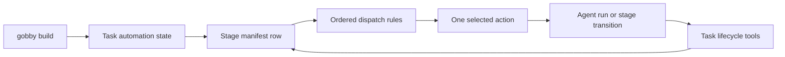

# Orchestration

Gobby orchestration is the runtime coordination layer around stage-manifest
dispatch. It turns built tasks into agent work, keeps isolation and review state
attached to those tasks, and relies on lifecycle events rather than ad hoc queues.

For the rule chain itself, read [Dispatch](./dispatch.md). This guide explains
how dispatch, tasks, agents, isolation, and review fit together during automated
task development.

## Current Model

`gobby build` is the opt-in boundary. Backlog tasks are inert until build state
is written onto a plan, epic, or leaf task. After that, the dispatcher heartbeat
scans opted-in tasks, reads the first manifest row whose state is not `done`, and
lets ordered rules choose a single action for that heartbeat.

The dispatcher does not prompt models or repair artifacts inline. Prompting and
implementation happen inside the agent selected for the current stage.

## Active Surfaces

| Surface | Current role |
| --- | --- |
| `gobby build [INPUT|ACTION] [REF]` | CLI entry point for starting or controlling build automation |
| `gobby-tasks-ops:build_task` | MCP entry point for starting lifecycle automation; requires `input_ref` |
| `POST /api/build` | HTTP entry point for the same shared build service |
| `src/gobby/dispatch/dispatcher.py` | Heartbeat scanner, mutex handling, and action executor |
| `src/gobby/dispatch/rules.py` | Ordered deterministic rules that map task state to actions |
| `gobby-tasks` | Task lifecycle, dependencies, claims, close, review state, and escalation |
| `gobby-tasks-ops` | Build, stage, artifact, expansion-run, review, and affected-file helpers |
| `gobby-agents` | Agent runs, runtime inspection, persona application, messaging, and commands |
| `gobby-worktrees` / `gobby-clones` | Isolation setup and cleanup for built work |
| `gobby-merge` | Merge-boundary and conflict-resolution tools |

The CLI, MCP, and HTTP build surfaces all resolve to the same build service and
return the same build-result shape. Build control actions such as `stop`,
`resume`, `clean`, and `restart` are exposed under `gobby build`.

## Build State

Build profiles and flags are convenience input. Dispatch reads the resolved task
fields and manifest rows:

| Field | Meaning |
| --- | --- |
| `allow_automation` | Opt-in gate; tasks without it are invisible to dispatcher scans |
| `yolo` | Fallback mode for deterministic recovery where a fallback exists |
| `isolation` | Execution isolation: `none`, `worktree`, or `clone` |
| Stage manifest rows | Ordered lifecycle stages in `task_stage_states` |
| `assigned_agent` | Leaf-stage agent chosen by expansion or build input |
| `additional_skills` | Extra skills loaded into the dispatched worker |

The current stage is the first manifest row whose state is not `done`. Blocked
and escalated are projections around that row: they change queue visibility and
human handoff behavior, but they do not replace the manifest state.

## Dispatch Actions

A heartbeat executes at most one side-effecting action for a task. Common
actions include:

- starting a ready stage
- spawning the configured stage agent
- starting an expansion run
- creating worktree or clone isolation
- advancing a reviewed or completed stage
- appending an audit marker
- escalating when policy requires human intervention

Per-task leases in `task_dispatch_mutex` prevent duplicate side effects. The
dispatcher acquires a lease before action execution, releases it after the
action, and sweeps expired leases on startup.

## Agent Work

Dispatched workers operate through MCP lifecycle tools, not direct database
edits. A typical leaf agent:

1. Claims the assigned task through `gobby-tasks`.
2. Loads any task-required skills.
3. Edits and verifies the work in the task's isolation context when one exists.
4. Commits changes before lifecycle handoff.
5. Calls `close_task` when no review gate exists, or `submit_for_review` when
   the current stage requires review.
6. Calls `end_agent_run` to terminate the agent run.

Ending a chat turn is separate from ending the agent run. Agent definitions make
that separation explicit so task ownership and runtime resources are released in
the expected order.

## Stage Reviews

Review gates are stored on manifest rows. When a stage has a review policy, the
worker submits that stage for review rather than closing the task directly. The
reviewer then approves or rejects the same manifest row, and the next heartbeat
continues from the updated stage state.

This keeps review state attached to the task lifecycle instead of hiding it in a
pipeline run. Pipelines still exist for deterministic multi-step automation and
approval gates, but task automation uses stage manifests as its primary state.

## Runtime Tables

| Table | Purpose |
| --- | --- |
| `task_stage_states` | Ordered manifest rows for each built task |
| `task_dispatch_mutex` | Short-lived per-task leases for side-effecting dispatch |
| `task_artifacts` | Sparse pointers such as plan paths, isolation IDs, expansion runs, PR URL, and target branch |
| `task_lifecycle_events` | Append-only transition audit for task and stage changes |

Write related artifact fields atomically. Worktree and clone fields are pairs,
so path and ID values must be written or cleared together.

## Lifecycle Events

Rules are authored against semantic workflow events such as `turn_start`,
`turn_end`, `before_tool`, and `after_tool`. Raw provider/runtime hooks such as
`before_agent`, `after_agent`, and `stop` are normalized into that event model
for compatibility across supported CLIs.

Task dispatch is adjacent to this event system. Hook rules enforce local
session behavior, while dispatch rules route task state on heartbeat ticks.

## Agent Slot Cap

The dispatcher enforces the configured `max_active_agents` cap, which defaults
to 10. When all slots are occupied, no persistent queue is needed. The next
heartbeat scans the same task state and tries again.

## Related Guides

- [Dispatch](./dispatch.md) for manifest rows, readiness projection, and rule
  actions
- [Workflows Overview](./workflows-overview.md) for rules, agents, pipelines,
  and runtime state
- [Pipelines](./pipelines.md) for deterministic sequence execution and approval
  gates
- [Agents](./agents.md) for agent definitions, persona application, and runtime
  tools
- [MCP Tools](./mcp-tools.md) for current server and tool signatures

_Last verified: 2026-05-04_
