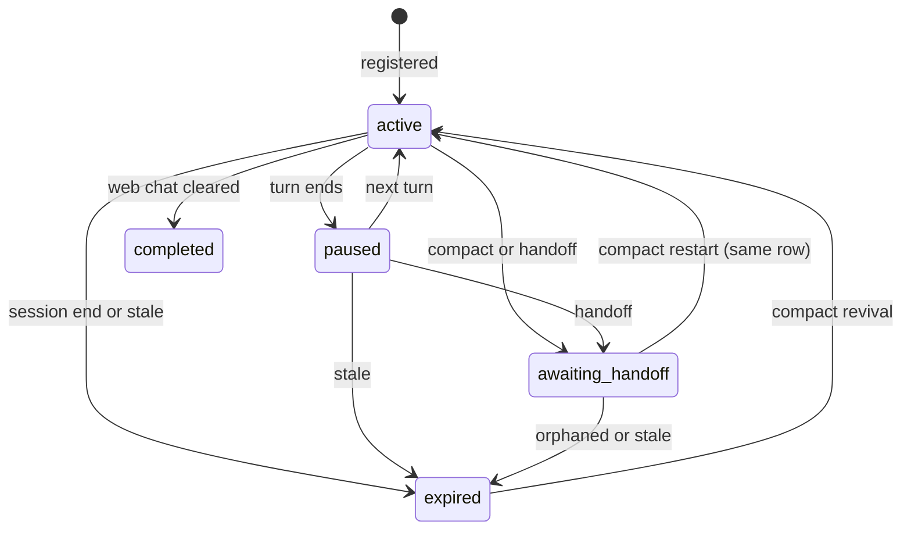
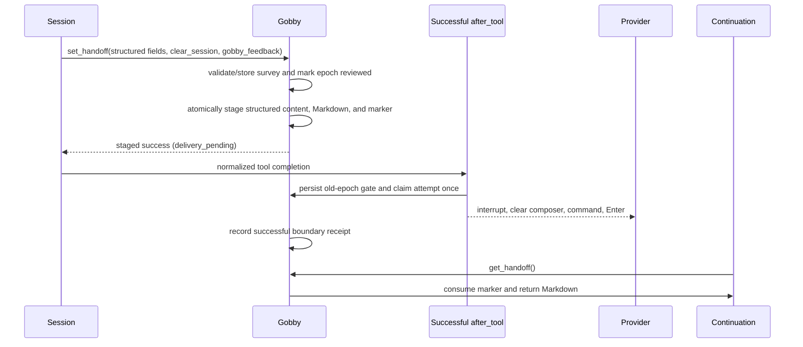

# Session Management Guide

Gobby sessions are durable records of CLI and web-chat work. They connect
transcripts, tasks, commits, handoff summaries, token usage, terminal state, and
agent-run metadata across daemon restarts and context compactions.

## Quick Start

```bash
# List recent sessions
gobby sessions list

# Show one session
gobby sessions show #42

# Read a transcript
gobby sessions messages #42 --limit 25

# Create a handoff summary for the current active session
gobby sessions summarize --output db "Paused before review"
```

```python
# MCP examples assume progressive discovery has already loaded the server,
# tool list, and schema.

# Get your current session when injected context did not include it.
call_tool("gobby-sessions", "get_current_session", {
    "external_id": "<cli-session-id>",
    "source": "codex"
})

# Read the latest handoff-ready context.
call_tool("gobby-sessions", "get_handoff", {})
```

## Mental Model



| Status | Meaning |
| :--- | :--- |
| `active` | A session is registered and currently expected to receive activity. |
| `paused` | A turn finished or the session went idle, but the session may resume. |
| `awaiting_handoff` | Summary context is available for a successor session. |
| `completed` | A web-chat lifecycle ended cleanly. |
| `expired` | The session ended, went stale, or was soft-deleted. |

Session records are keyed by external CLI identity, machine, source, project,
and session type. Registration is idempotent for that key, so daemon restarts
reuse the existing row instead of creating duplicates.

## What A Session Stores

| Field group | Examples |
| :--- | :--- |
| Identity | Internal UUID, project-scoped `#N`, external CLI ID, machine ID, source |
| Runtime | Status, source, session type, terminal context, parent session, agent depth |
| Work trace | Transcript path, rendered message counts, task links, commit window |
| Handoff | `summary_markdown`, digest fields, compact continuation context |
| Usage | Input, output, cache-write, cache-read token counts, model |
| Safety | Dirty-file baseline, edit marker, sandbox flags, approved tools |

`agent_depth` separates human sessions from spawned agent sessions. Depth `0`
sessions are user-facing; depth `1+` sessions are subagents and are cheaper to
summarize during lifecycle processing.

## Session Sources

| Source | Typical origin |
| :--- | :--- |
| `claude` | Claude Code hooks |
| `codex` | Codex hook adapter or web-chat Codex backend |
| `qwen` | Qwen CLI hooks |
| `droid` | Droid CLI hooks |
| `grok` | Grok CLI hooks |
| `agy` | AGY CLI hooks or web-chat AGY backend |
| `pipeline` | Pipeline automation |
| `system` | Bootstrapped root session for cron and pipeline work without a caller |

The public `get_current_session` helper accepts `claude`, `grok`,
`qwen`, `codex`, `droid`, and `agy`. Pipeline and system sessions are created
by internal automation.

## CLI Commands

This section covers the day-to-day subset; `gobby sessions renumber` and
`gobby sessions backfill-context-windows` also exist for maintenance.

### `gobby sessions list`

List sessions with optional filters.

```bash
gobby sessions list [OPTIONS]
```

| Option | Description |
| :--- | :--- |
| `-p, --project TEXT` | Filter by project name or UUID. |
| `-s, --status TEXT` | Filter by status such as `active`, `completed`, or `awaiting_handoff`. |
| `--source TEXT` | Filter by `claude`, `grok`, `qwen`, `agy`, `codex`, or `droid`. |
| `-n, --limit INTEGER` | Maximum rows to show. |
| `--json` | Emit JSON. |

### `gobby sessions show`

Show one session by `#N`, UUID, or prefix.

```bash
gobby sessions show SESSION_ID [--json]
```

### `gobby sessions messages`

Render transcript messages from the live JSONL transcript or gzip archive
fallback.

```bash
gobby sessions messages SESSION_ID [OPTIONS]
```

| Option | Description |
| :--- | :--- |
| `-n, --limit INTEGER` | Maximum messages to show. |
| `-r, --role TEXT` | Filter by role: `user`, `assistant`, or `tool`. |
| `-o, --offset INTEGER` | Skip the first N messages. |
| `--json` | Emit JSON. |

### `gobby sessions stats`

Show aggregate counts by status and source.

```bash
gobby sessions stats [--project TEXT]
```

### `gobby sessions summarize`

Create a handoff summary for a session. If `--session-id` is omitted, Gobby uses
the current project's most recent active session.

```bash
gobby sessions summarize [OPTIONS] [NOTES]
```

| Option | Description |
| :--- | :--- |
| `-s, --session-id TEXT` | Session to summarize. |
| `--output db\|file\|all` | Save to DB, file, or both. Default: `all`. |
| `--path TEXT` | Directory for file output. Default: `.gobby/session_summaries/`. |

The command extracts active task, modified files, git status, recent commits,
initial goal, recent activity, and a summary. It uses an LLM summary when
available and falls back to code-derived context.

### `gobby sessions restore`

Restore transcript files from gzip archives.

```bash
gobby sessions restore SESSION_REF [--path TEXT] [--json]
gobby sessions restore --all [--json]
```

Use this when a CLI deleted its original transcript file but you need the file
back on disk for resume or inspection.

### `gobby sessions delete`

Delete a session after confirmation.

```bash
gobby sessions delete SESSION_ID
gobby sessions delete SESSION_ID --yes
```

## MCP Tools

Use the `gobby-sessions` server for session CRUD, transcripts, handoffs,
registration, usage, terminal capture, and archive restoration. Fetch schemas
with `get_tool_schema` before writing examples or automating calls.

| Tool | Purpose |
| :--- | :--- |
| `get_current_session` | Resolve your own internal session ID from external CLI ID and source. |
| `get_session` | Read one session by `#N`, UUID, or prefix. |
| `list_sessions` | Browse sessions with project, status, source, and limit filters. |
| `session_stats` | Count sessions by status and source. |
| `get_usage_breakdown` | Aggregate token usage by source and model. |
| `get_session_messages` | Read rendered transcript messages. |
| `search_session_messages` | Search rendered transcript messages by substring. |
| `set_handoff` | Set or generate handoff context for the current session. |
| `get_handoff` | Retrieve handoff context directly or from the latest same-project `awaiting_handoff` session. |
| `get_handoff` | Wait for a session's `summary_markdown` to become available. |
| `register_session` | Register hookless clients such as SDK-driven agents. |
| `get_session_commits` | List commits made during a session timeframe. |
| `mark_loop_complete` | Mark an autonomous loop complete to prevent session chaining. |
| `capture_baseline_dirty_files` | Store the current dirty-file baseline for edit detection. |
| `restore_session_transcript` | Restore one transcript from archive. |
| `get_transcript_status` | Check archive availability and transcript file stats. |
| `send_keys` | Send keystrokes to a session-backed tmux terminal. |
| `capture_output` | Capture recent tmux output. |
| `set_handoff` | Trigger the current CLI's compaction command. |

### Finding Your Own Session

Use `get_current_session` when injected context did not already provide a
session reference.

```python
call_tool("gobby-sessions", "get_current_session", {
    "external_id": "<external-id-from-context-or-GOBBY_SESSION_ID>",
    "source": "codex"
})
```

Do not use `list_sessions(status="active", limit=1)` for self-identification.
Multiple terminals and agents can be active at the same time.

### Reading Session Data

```python
call_tool("gobby-sessions", "get_session", {
    "session_id": "#42"
})

call_tool("gobby-sessions", "get_session_messages", {
    "session_id": "#42",
    "limit": 50,
    "offset": 0,
    "full_content": False
})

call_tool("gobby-sessions", "get_session_commits", {
    "session_id": "#42",
    "max_commits": 25
})
```

### Creating And Reading Handoffs

`set_handoff` operates on the current session context. It requires a nonblank
current state and at least one nonblank next step. Optional entries reject blanks;
references are deduplicated in their original order. Feedback can be captured through
the dedicated `gobby-sessions:feedback` tool or the `gobby_feedback` field on
`set_handoff`. Both paths use the same validation and storage contract.

Observation labels are enums: `kind` is `friction`, `bug`, `noise`, `surprise`,
`missing-affordance`, `useful`, or `other`; `frequency` is `once`, `repeated`, or
`always`; optional `disposition` is `worked-around`, `filed-task`, `fixed`,
`escalated`, or `noted`. Use `other` only when no listed kind fits — it requires
`kind_other_label`, which is rejected when it restates a listed kind. Recurring
labels are candidates for promotion into the enum by the nightly review loop.
Each observation's `source` must name a Gobby surface as
`gobby-<server>:<tool>`; `<surface>:<name>` where surface is `rule`, `hook`,
`skill`, `workflow`, `agent`, `pipeline`, `prompt`, `cli`, `binary`, `daemon`,
`ui`, `docs`, or `config`; or a repository path starting with `src/gobby/`,
`crates/`, `web/src/`, or `docs/`.

For an actionable Gobby defect, dispositions map to the Found Work ladder:
`fixed` includes the `#N` task this session claimed and closed or still has claimed
in progress; `escalated` includes the active owner session reference after
`send_message`; `filed-task` is rung 3 only and includes the `#N` task this session
created with `needs-decision` or `clean-window`, whose description explains why
rungs 1 and 2 do not apply. Unlabeled or unclaimed filings and every other defect
disposition are shirked found work. Intake rejects invalid claims, the stop gate
blocks unclaimed filings, and the nightly digest flags them.

```python
call_tool("gobby-sessions", "feedback", {
    "observations": [],
})
```

```python
call_tool("gobby-sessions", "set_handoff", {
    "current_state": "The storage migration and MCP schemas are complete.",
    "next_steps": ["Run the web-chat smoke test", "Commit and close the task"],
    "what_was_accomplished": ["Stored the normalized handoff payload"],
    "key_decisions": ["Continuation recovery is pull-only"],
    "problems_encountered": ["Delivery state was previously implicit"],
    "what_didnt_work": ["Treating mutable Markdown as proof of delivery"],
    "references": ["#21140"],
    "clear_session": False,
    "gobby_feedback": []
})
```

When the session-feedback survey applies and this epoch has no response,
`set_handoff` requires `gobby_feedback`; `[]` records a completed survey with
nothing to report. Validation and persistence happen before handoff staging, so
a staging retry does not duplicate feedback. The retired before-tool survey gate
is no longer part of this path.

Context pressure is configured under `context_handoff`. Windows below
`small_window_tokens` use the ratio thresholds; larger and unknown windows use
the absolute thresholds. Warnings repeat every turn start and every
`warn_every_tool_calls` calls. At the block threshold, only `set_handoff`,
`feedback`, `get_handoff`, `review_task_memories`, `end_agent_run`, and MCP schema
discovery remain callable. Plan mode, pipelines, and web-chat sessions skip this
enforcement. A non-retryable inability to compact downgrades the epoch to warning
pressure; background delivery failures stay gated for a `set_handoff` retry.

```python
call_tool("gobby-sessions", "get_handoff", {})
```

Use `clear_session=false` for planning, review, and ongoing task work; it compacts in
place so the same session continues. Use `clear_session=true` only after closing the
current task, when moving to another task or epic child. The clear path creates a
successor, preserves task claims, and binds that successor to the predecessor. The
continuation prompt calls `get_handoff`, which consumes only the pending marker created
by `set_handoff`. A second call is empty. Manual provider compact and `/clear`
operations create no marker, so they also return an empty handoff. Persisted
`handoff_markdown` remains visible in the UI after consumption. While that marker is
pending, turn-start meta skill loads wait so the pull runs before `memory`,
`loading-skills`, and `brevity` reloads.

For terminal sessions, the tool result reports `handoff_staged=true` and
`delivery_pending=true` before Gobby touches provider input. The proxy strips the
tool's top-level `success` key from the nested result, so the tool-completion hook and
the context-pressure observer key on those two fields and never on a nested `success`.
The successful normalized tool-completion event then arms the old-epoch tool gate and
schedules one deduplicated background delivery. The hook trusts the tool result for the
session type; hook metadata carries none. A delivery-pending completion the hook cannot
dispatch (wrong CLI source, gate not armed) fails the still-idle attempt the same way a
crashed delivery does, so the retry rule offers `set_handoff` again instead of leaving
the session wedged behind the armed gate; an attempt that is already dispatched,
superseded, or consumed only logs
`Terminal handoff delivery skipped for session <id> attempt <id>: <reason>` at WARNING.
Delivery failure restores the previous handoff and clear status, removes the attempt
markers, and asks the agent to retry `set_handoff`. Web-chat boundaries remain
synchronous.

### Hookless Registration

Clients that do not fire session-start hooks can register explicitly.

```python
call_tool("gobby-sessions", "register_session", {
    "external_id": "<sdk-run-id>",
    "source": "codex",
    "title": "SDK driven analysis",
    "agent_depth": 0
})
```

`machine_id` and `project_id` are auto-resolved when omitted.

### Terminal Tools

Terminal tools are for session-backed tmux contexts.

```python
call_tool("gobby-sessions", "capture_output", {
    "session_id": "#42",
    "lines": 80
})

call_tool("gobby-sessions", "send_keys", {
    "session_id": "#42",
    "keys": "status\n",
    "literal": True
})
```

Use `capture_output` before raw tmux fallback when inspecting prompts,
permission dialogs, or stalled terminals.

## Handoff Flow



Provider dispatch failure restores the previous handoff, deletes only undelivered
content from that attempt, and clears its marker. A delivered clear handoff can become
the archival `summary_markdown` without an LLM call; every other case retains the
full-transcript fallback.

### Compaction Is In-Place

CLI context compaction preserves
its external session ID across a compact, so the compact restart reactivates
the **same** session row. Identity,
session variables, workflow instances, claimed tasks, parent linkage, and
agent-run ownership all carry through unchanged because no transfer happens.

A one-shot compact marker (the `handoff_source` session variable, set by the
pre-compact rule) classifies the restart. It is consumed on successful
reactivation, so a later normal restart of the same session is never
misclassified as a compact. If the row expired while compacting (for example a
laptop slept mid-compact), the restart revives the same row; if the row is
missing entirely, the start degrades to a normal `startup` registration with a
structured warning in the daemon log.

Claude and Codex emit `SessionStart(source=compact)` after compact. Grok reports
the same context loss through `post_compact`. Both paths reset context-epoch tracking
and preserve the pending `set_handoff` marker for explicit retrieval.

### Handoff Boundaries

The continuation model receives authored `handoff_markdown` only after calling
`get_handoff`. The full source transcript and archival summary remain separately
stored records.

Provider-owned runtime state remains with the source tool. This includes prompt
caches, native conversation state, and provider-private or encrypted
reasoning/thinking artifacts. The successor reconstructs working context from
the handoff summary and persisted project state.

## Lifecycle Events

Rule authors should target semantic workflow events:

| Semantic event | Raw runtime events that may feed it | Common use |
| :--- | :--- | :--- |
| `turn_start` | `before_agent`, provider-specific prompt-start events | Context injection and per-turn setup |
| `turn_end` | `after_agent`, `stop`, provider-specific turn-complete events | Stop gates, digest capture, cleanup |

Raw `before_agent`, `after_agent`, and `stop` events are provider/runtime
details. They are useful for adapter work, but they are not the main authoring
API for portable workflow rules.

Agent termination is a separate lifecycle path. A spawned agent that has
finished successfully must call `gobby-agents:end_agent_run`; relying on a raw
stop or turn-end event does not release the agent run.

## Troubleshooting

### Session Not Found

1. Check daemon health with `gobby status`.
2. Confirm the project. Project-scoped `#N` references resolve inside the
   current project.
3. For self-lookup, use `get_current_session` with the external CLI ID and
   source.
4. For old sessions, try UUID or prefix if the project-scoped number is
   ambiguous.

### Messages Are Missing

1. Use `gobby sessions show SESSION_ID --json` and inspect `transcript_path`.
2. Run `gobby sessions restore SESSION_ID` if the transcript archive exists but
   the original file was deleted.
3. Use `get_transcript_status` through MCP to check archive availability.

### Handoff Is Empty

1. Confirm the session has `summary_markdown`.
2. Create or update handoff context with `gobby sessions summarize` or
   `set_handoff`.
3. Confirm the target status is `awaiting_handoff`. A session may always read its
   own summary regardless of status (post-compact self-reads).
4. Pass `session_id` to `get_handoff` when multiple handoff-ready
   sessions exist.

### Hooks Are Not Updating Sessions

1. Verify hooks are installed with `gobby install`.
2. Check the CLI source in `gobby sessions list --source SOURCE`.
3. Review daemon logs under `~/.gobby/logs/`.
4. For hookless clients, use `register_session`.

## Data Storage

| Path | Description |
| :--- | :--- |
| `~/.gobby/bootstrap.yaml` `database_url` | Runtime PostgreSQL hub DSN for sessions and related tables. |
| `~/.gobby/logs/` | Daemon logs. |
| `.gobby/session_summaries/` | Default file output for CLI-created handoff summaries. |

## See Also

- [tasks.md](./tasks.md) - Task management
- [agents.md](./agents.md) - Agent spawning and agent-run termination
- [memory.md](./memory.md) - Persistent memory and shadow-relevance judging
- [mcp-tools.md](./mcp-tools.md) - MCP tool reference
- [rules.md](./rules.md) - Semantic workflow events
- [hook-schemas.md](./hook-schemas.md) - Raw hook mappings

_Last verified: 2026-09-04_
