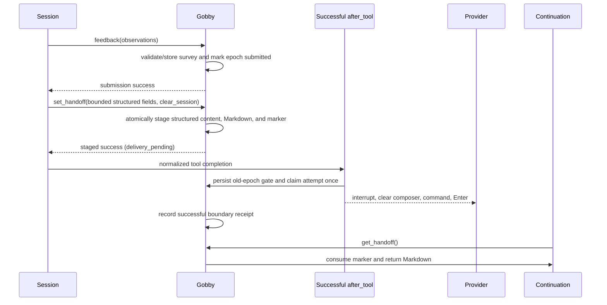

# Session Management Guide

Gobby sessions are durable records of CLI and web-chat work. They connect
transcripts, tasks, commits, handoff summaries, token usage, terminal state, and
agent-run metadata across daemon restarts and context compactions.

## Quick Start

```bash
# List recent sessions
gobby sessions list

# Show one session
gobby sessions show "#42"

# Read a transcript
gobby sessions messages "#42" --limit 25

# Operator: create an archival summary (does not stage a handoff)
gobby sessions summarize --output db "Paused before review"
```

```python
# Fetch a known unleased tool schema before calling. List tools only when
# the tool name is unknown; discover servers only when the server is unknown.

# Get your current session when injected context did not include it.
call_tool("gobby-sessions", "get_current_session", {
    "external_id": "<cli-session-id>",
    "source": "codex"
})

# Consume the current pending compact/clear handoff, when one exists.
call_tool("gobby-sessions", "get_handoff", {})
```

## Mental Model

| State | Meaning |
| :--- | :--- |
| `active`, `paused` | Working or between turns. |
| `interrupted`, `awaiting_input`, `awaiting_approval` | Protected interaction states; automatic wake waits for safe provider evidence. |
| `awaiting_handoff` | A context boundary is pending; inspect its marker and delivery result. |
| `completed`, `cancelled`, `closed` | Lifecycle outcomes accepted by the status model. |
| `expired`, `deleted` | Terminal storage states; ordinary status updates cannot revive them. |

The [handoff sequence](#handoff-flow) shows the boundary protocol. Status alone
never proves that a recoverable handoff exists. Expired terminal revival belongs
to ownership reconciliation, with its bounded revival horizon, rather than an
arbitrary status edit.

Current-session lookup uses external CLI identity, source, and project. Machine
ownership remains separate metadata; do not substitute a remote machine’s local
paths. Registration reuses canonical identity rather than creating a duplicate.

## What A Session Stores

| Field group | Examples |
| :--- | :--- |
| Identity | Internal UUID, project-scoped `#N`, external CLI ID, machine ID, source |
| Runtime | Status, source, session type, terminal context, parent session, agent depth |
| Work trace | Transcript path, rendered message counts, task links, commit window |
| Handoff | Authored `handoff_markdown`, delivery receipts, separate archival `summary_markdown` |
| Usage | Input, output, cache-write, cache-read token counts, model, latest trustworthy reasoning effort |
| Safety | Dirty-file baseline, edit marker, sandbox flags, approved tools |

`agent_depth` separates human sessions from spawned agent sessions. Depth `0`
sessions are user-facing; depth `1+` sessions are subagents. Depth is not proof
that a run or its assigned task has completed.

## Session Sources

| Source | Typical origin |
| :--- | :--- |
| `claude` | Claude Code hooks |
| `codex` | Codex hook adapter or web-chat Codex backend |
| `qwen` | Qwen CLI hooks |
| `droid` | Droid CLI hooks |
| `grok` | Grok CLI hooks |
| `agy` | AGY CLI hooks or web-chat AGY backend |
| `pipeline` | Pipeline automation |
| `system` | Bootstrapped root session for cron and pipeline work without a caller |

The public `get_current_session` helper accepts `claude`, `grok`,
`qwen`, `codex`, `droid`, and `agy`. Pipeline and system sessions are created
by internal automation.

## Titles, Reasoning Effort, And Reading Direction

New eligible sessions start with the provisional title `project#session_ref`. The
first persisted user prompt promotes that to `project#session_ref: <summary>`, using
up to four meaningful words and a 60-character suffix. Title precedence is manual,
then the latest active task, then the saved heuristic, then the provisional title.
The first heuristic is saved even while a manual or task title is visible, so it can
reappear when that higher-priority title no longer applies. Clearing a session carries
only a manual title to its successor; automatic titles are generated again.

Full and brief `/api/sessions` records expose nullable `reasoning_effort`, representing
the latest trustworthy effective effort or, when no effective value is known, the
requested/configured effort. `heuristic_title` remains internal, while the public
`title_source` may be `heuristic`.

The web UI persists `ui_settings.readingDirection` as `auto`, `ltr`, or `rtl`. `auto`
uses the browser locale and falls back to LTR. The resolved direction is applied to the
document, while mixed-direction session and activity titles use bidi isolation so their
prefixes and text remain readable.

## CLI Commands

These are operator interfaces; agents use the MCP tools below. This section
covers the day-to-day subset; `gobby sessions renumber` and
`gobby sessions backfill-context-windows` also exist for maintenance.

### `gobby sessions list`

List sessions with optional filters.

```bash
gobby sessions list [OPTIONS]
```

| Option | Description |
| :--- | :--- |
| `-p, --project TEXT` | Filter by project name or UUID. |
| `-s, --status TEXT` | Filter by status such as `active`, `completed`, or `awaiting_handoff`. |
| `--source TEXT` | Filter by `claude`, `grok`, `qwen`, `agy`, `codex`, or `droid`. |
| `-n, --limit INTEGER` | Maximum rows to show. |
| `--json` | Emit JSON. |

### `gobby sessions show`

Show one session by `#N`, UUID, or prefix.

```bash
gobby sessions show SESSION_ID [--json]
```

### `gobby sessions messages`

Render transcript messages from the live JSONL transcript or gzip archive
fallback.

```bash
gobby sessions messages SESSION_ID [OPTIONS]
```

| Option | Description |
| :--- | :--- |
| `-n, --limit INTEGER` | Maximum messages to show. |
| `-r, --role TEXT` | Filter by role: `user`, `assistant`, or `tool`. |
| `-o, --offset INTEGER` | Skip the first N messages. |
| `--json` | Emit JSON. |

### `gobby sessions stats`

Show aggregate counts by status and source.

```bash
gobby sessions stats [--project TEXT]
```

### `gobby sessions summarize`

Create a transcript-based archival summary for a session. This does not stage a
handoff marker, compact the provider, or make `get_handoff()` return content.
If `--session-id` is omitted, Gobby uses
the current project's most recent active session.

```bash
gobby sessions summarize [OPTIONS] [NOTES]
```

| Option | Description |
| :--- | :--- |
| `-s, --session-id TEXT` | Session to summarize. |
| `--output db\|file\|all` | Save to DB, file, or both. Default: `all`. |
| `--path TEXT` | Directory for file output. Default: `.gobby/session_summaries/`. |

The command extracts active task, modified files, git status, recent commits,
initial goal, recent activity, and a summary. It uses an LLM summary when
available and falls back to code-derived context.

### `gobby sessions restore`

Restore transcript files from gzip archives.

```bash
gobby sessions restore SESSION_REF [--path TEXT] [--json]
gobby sessions restore --all [--json]
```

Use this when a CLI deleted its original transcript file but you need the file
back on disk for resume or inspection.

### `gobby sessions terminate-terminal`

Explicitly terminate a daemon-tracked terminal by terminal ID or root-session
reference. This operation can kill an externally owned terminal and marks the
tracked terminal row exited before returning.

```bash
gobby sessions terminate-terminal TERMINAL_OR_SESSION [--json]
```

Workspace `close_pane`, `close_tab`, and `close_workspace` operations retain
their narrower ownership rule and release externally owned terminals without
killing them.

### `gobby sessions delete`

Delete a session after confirmation.

```bash
gobby sessions delete SESSION_ID
gobby sessions delete SESSION_ID --yes
```

## MCP Tools

Use the `gobby-sessions` server for session CRUD, transcripts, handoffs,
registration, usage, terminal capture and termination, and archive restoration.
Session deletion and bulk maintenance are operator/client surfaces, not MCP CRUD
tools. Fetch schemas with `get_tool_schema` before writing examples or automating
calls.

| Tool | Purpose |
| :--- | :--- |
| `get_current_session` | Resolve your own internal session ID from external CLI ID and source. |
| `get_session` | Read one session by `#N`, UUID, or prefix. |
| `list_sessions` | Browse sessions with project, status, source, and limit filters. |
| `session_stats` | Count sessions by status and source. |
| `get_usage_breakdown` | Aggregate token usage by source and model. |
| `get_session_messages` | Read rendered transcript messages. |
| `search_session_messages` | Search rendered transcript messages by substring. |
| `set_handoff` | Stage an authored handoff and dispatch the current session's compact or clear boundary. |
| `get_handoff` | Consume the current session's pending handoff; with `agent_run_id`, read the child run's final handoff. |
| `feedback` | Submit the current epoch survey without marking it human-reviewed. |
| `set_title` | Set the caller’s sticky manual title. |
| `register_session` | Register hookless clients such as SDK-driven agents. |
| `get_session_commits` | List commits made during a session timeframe. |
| `mark_loop_complete` | Set `stop_reason="completed"`; installed workflows determine its effect. This does not end an agent run or close a task. |
| `capture_baseline_dirty_files` | Store the current dirty-file baseline for edit detection. |
| `restore_session_transcript` | Restore one transcript from archive. |
| `get_transcript_status` | Check archive availability and transcript file stats. |
| `send_keys` | Send authorized terminal input through the managed runtime or tmux. |
| `capture_output` | Capture a diagnostic runtime/tmux snapshot, with transcript-tail fallback. |
| `terminate_terminal` | Explicitly terminate an authorized daemon-tracked terminal or root-session terminal and mark its row exited synchronously. |

### Finding Your Own Session

Use `get_current_session` when injected context did not already provide a
session reference.

```python
call_tool("gobby-sessions", "get_current_session", {
    "external_id": "<external-id-from-context-or-GOBBY_SESSION_ID>",
    "source": "codex"
})
```

Do not use `list_sessions(status="active", limit=1)` for self-identification.
Multiple terminals and agents can be active at the same time.

### Reading Session Data

```python
call_tool("gobby-sessions", "get_session", {
    "session_id": "#42"
})

call_tool("gobby-sessions", "get_session_messages", {
    "session_id": "#42",
    "limit": 50,
    "offset": 0
})

call_tool("gobby-sessions", "get_session_commits", {
    "session_id": "#42",
    "max_commits": 25
})
```

`get_session_messages` returns chronological windows. Page with `offset` and
`limit`; `truncated=false` describes full bodies, not an exhaustive transcript.
The accepted `full_content` argument is unused: bodies are always full. Search
also returns full bodies and scans a bounded set of sessions when no session is
specified. Use explicit session reads when complete evidence matters.

### Creating And Reading Handoffs

`set_handoff` operates on the current session context. It requires a nonblank
current state and at least one nonblank next step. Optional entries reject blanks;
references are deduplicated in their original order. Rendered handoff content is
limited to 10,000 JSON-escaped characters including formatting. Oversized content
is rejected before staging. The shared budget is `len(json.dumps(rendered_markdown))`,
including headings, list formatting, escaping, and enclosing quotes. Aim below
approximately 5,000 encoded characters for ordinary handoffs to leave headroom.
Use readable sentences; remove low-value detail instead of inventing shorthand.
Leave optional fields empty when unneeded. Submit required feedback through
`gobby-sessions:feedback` first, then call `set_handoff` last.

Daemon stop and restart refuse while a live session has an unresolved handoff,
including one delivered but not yet consumed by `get_handoff`. An expired clear
predecessor remains protected while its live successor has not read the handoff.
Abandoned markers on expired or deleted sessions do not block shutdown, and
neither does a stale one: a marker that last moved more than thirty minutes ago
(the awaiting-handoff sweep window) is logged as a warning and skipped, because
nothing automatic will consume it and `get_handoff` still reads it after the
restart.
`gobby stop --wait` and `gobby restart --wait` wait up to ten minutes for handoffs;
`--force` bypasses this protection without consuming or discarding handoff content.
Once a non-forced shutdown passes the check, new handoffs cannot stage until it
finishes or is cancelled. A blocked restart names the sessions and attempts to finish.

Load `gobby:references/sessions/handoffs.md` before authoring `set_handoff` or
cooperative `end_agent_run` content. A before-tool block teaches this requirement;
the existing model-aware context-pressure warnings also request the reference.
A completed reference load suppresses further requests until the next context reset.
Handoffs contain current continuation state plus fresh reflections from the ending
epoch. `current_state`, `next_steps`, `key_decisions`, and `blockers` retain current
work, immediate actions, active constraints, and relevant validation. Reference older
decisions in their owning task, design document, or Gobby memory.

`what_was_accomplished` records this epoch's meaningful outcomes.
`problems_encountered` and `what_didnt_work` record fresh friction observations,
including resolved friction: attempt, obstacle, and consequence or workaround.
No general lesson is required. Never copy earlier reflections into a new handoff;
doing so inflates apparent recurrence for future daily synthesis. Record a new
occurrence only when friction actually recurs. Unresolved blockers may carry forward
without their history. Existing memory guidance still applies; observations do not
require a memory write. `notes` holds other necessary live context and `references`
locates sources.

`found_work` lists findings this epoch placed on the found-work ladder as
`{finding, disposition, ref}` entries. `fixed` refs the `#N` task this session or a
spawned descendant claimed or closed; `escalated` refs the active owner session after
`send_message`; `filed-task` refs the `#N` rung-3 task this session created with
`needs-decision`, `needs-planning`, or `clean-window`. Intake rejects any other
disposition, a missing disposition, or a missing ref. Entries render under Notes, and
`get_handoff` arms the reading session's found-work gate when an entry is not marked
`fixed`, so the deferral is held to the ladder at the next stop.

Prune cumulative history and superseded detail first. If necessary live detail still
cannot fit, create or update a session-scoped Markdown working-context file and add
its project-relative path to `references` before submitting. Keep immediate orientation
and next actions inline. Refresh the file's current state; never append epoch histories
or move discarded history and reflections into it. Prepare the file while writes are
permitted, before hard context-pressure gates block them. Surface preservation conflicts
before compaction; never bypass permissions or truncate necessary context.

Apply the [handoff content policy](../contracts/session-boundary.md#handoff-content-and-incidental-history)
to every section: retain continuation state and fresh epoch observations. Omit
superseded intermediate test counts and historical run labels unless they explain
an active blocker, next action, or fresh friction observation. Reference existing
task/session records and transcripts when historical evidence is needed.

Use these bounded review cases from #21887:

- **Superseded test counts:** given earlier 311-pass/29-fail and later
  375-pass/3-fail runs followed by a relevant 378-pass final result, retain the final
  result and its evidence reference. Leave intermediate counts and their chronology
  in the source evidence; do not reproduce them in What Didn't Work or other sections.
- **Stale coordination wait:** historical run `40f8462f` represented a
  restart-coordination wait. Do not label it an acceptance run. When implementer
  acceptance is still required, keep that separate action in Next Steps; omit the
  stale wait unless it affects continuation.
- **Active failure:** keep the failing command, useful diagnostics, paths, impact,
  and evidence reference needed to resolve an active blocker. Removing incidental
  history must not hide unfinished work or imply that validation passed.
- **Resolved friction:** record "The schema lookup required a feedback submission;
  source inspection let me finish diagnosis" once in the epoch where it occurred.
  Omit it from later reflections unless it actually recurs. Keep an unresolved
  test-service outage in Blockers, and reference an older active design decision
  by its task or document rather than copying its rationale.

The separate feedback survey's observation labels are enums: `kind` is `friction`, `bug`, `noise`, `surprise`,
`missing-affordance`, `useful`, or `other`; `frequency` is `once`, `repeated`, or
`always`; optional `disposition` is `worked-around`, `filed-task`, `fixed`,
`escalated`, or `noted`. Use `other` only when no listed kind fits — it requires
`kind_other_label`, which is rejected when it restates a listed kind. Recurring
labels are candidates for promotion into the enum by the nightly review loop.
Each observation's `source` must name a Gobby surface as
`gobby-<server>:<tool>`; `<surface>:<name>` where surface is `rule`, `hook`,
`skill`, `workflow`, `agent`, `pipeline`, `prompt`, `cli`, `binary`, `daemon`,
`ui`, `docs`, or `config`; or a repository path starting with `src/gobby/`,
`crates/`, `web/src/`, or `docs/`.

For an actionable Gobby defect, dispositions map to the Found Work ladder:
`fixed` includes the `#N` task this session claimed and closed or still has claimed
in progress; `escalated` includes the active owner session reference after
`send_message`; `filed-task` is rung 3 only and includes the `#N` task this session
created with `needs-decision`, `needs-planning`, or `clean-window`, whose description explains why
rungs 1 and 2 do not apply. Unlabeled or unclaimed filings and every other defect
disposition are shirked found work. Intake rejects invalid claims, the stop gate
blocks unclaimed filings, and the nightly digest flags them.

```python
call_tool("gobby-sessions", "feedback", {
    "observations": [],
})
```

```python
call_tool("gobby-sessions", "set_handoff", {
    "current_state": "The storage migration and MCP schemas are complete.",
    "next_steps": ["Run the web-chat smoke test", "Commit and close the task"],
    "what_was_accomplished": ["Stored the normalized handoff payload"],
    "key_decisions": ["Continuation recovery is pull-only"],
    "problems_encountered": ["Delivery state was previously implicit"],
    "what_didnt_work": ["Treating mutable Markdown as proof of delivery"],
    "references": ["#21140"],
    "found_work": [
        {"finding": "The clear dialog's Cancel button did nothing",
         "disposition": "fixed", "ref": "#21140"}
    ],
    "clear_session": False
})
```

When the session-feedback survey applies and this epoch has no response,
call `feedback(observations=[])` if there is nothing to report, or submit up to
three observations. Successful submission satisfies the epoch gate without marking
feedback human-reviewed. Then call `set_handoff`; staging retries do not require
resubmission.

Context pressure is configured under `context_handoff`. Windows below
`small_window_tokens` use the ratio thresholds; standard windows below
`extended_window_tokens` and unknown windows use `warn_tokens` and `block_tokens`;
windows at or above `extended_window_tokens` use the extended thresholds. Warnings
repeat every turn start and every
`warn_every_tool_calls` calls. At the block threshold, only `set_handoff`,
`feedback`, `get_handoff`, and the configured prerequisite/coordination allowlist
remain callable, including required schema discovery. Coordination does not clear
the pressure gate. Plan mode and pipelines skip this enforcement. A
non-retryable inability to compact downgrades the epoch to warning pressure;
background delivery failures stay gated for a `set_handoff` retry.

```python
call_tool("gobby-sessions", "get_handoff", {})
```

Use `clear_session=false` for planning, review, and ongoing task work; it compacts in
place so the same session continues. Use `clear_session=true` only after closing the
current task, when moving to another task or epic child. The clear path creates a
successor, preserves task claims, and binds that successor to the predecessor. The
continuation prompt calls `get_handoff`, which consumes only the pending marker created
by `set_handoff`. A second call is empty. Manual provider compact and `/clear`
operations create no marker, so they also return an empty handoff. Persisted
`handoff_markdown` remains visible in the UI after consumption. While that marker is
pending, turn-start meta skill loads wait so the pull runs before
`gobby:references/skills/loading.md`, `gobby:references/memory/overview.md`,
`brevity`, and `restraint` reloads.

For terminal sessions, the tool result reports `handoff_staged=true` and
`delivery_pending=true` before Gobby touches provider input. The proxy strips the
tool's top-level `success` key from the nested result, so the tool-completion hook and
the context-pressure observer key on those two fields and never on a nested `success`.
The successful normalized tool-completion event then arms the old-epoch tool gate and
schedules one deduplicated background delivery. The hook trusts the tool result for the
session type; hook metadata carries none. A delivery-pending completion the hook cannot
dispatch (wrong CLI source, gate not armed) fails the still-idle attempt the same way a
crashed delivery does, so the retry rule offers `set_handoff` again instead of leaving
the session wedged behind the armed gate; an attempt that is already dispatched,
superseded, or consumed only logs
`Terminal handoff delivery skipped for session <id> attempt <id>: <reason>` at WARNING.
Delivery failure restores the previous handoff and clear status, removes the attempt
markers, and asks the agent to retry `set_handoff`. Web-chat boundaries remain
synchronous.

### Hookless Registration

Clients that do not fire session-start hooks can register explicitly.

```python
call_tool("gobby-sessions", "register_session", {
    "external_id": "<sdk-run-id>",
    "source": "codex",
    "title": "SDK driven analysis",
    "agent_depth": 0
})
```

`machine_id` and `project_id` are auto-resolved when omitted.

### Terminal Tools

Terminal tools prefer the managed terminal runtime and fall back to tmux.
Capture can fall back to transcript-tail evidence; inspect `via` and truncation
metadata before treating it as a live screen. `send_keys` requires caller context,
rejects autonomous agent-run callers, and permits only self, same-project, or
ancestor/descendant targets. Use `gobby-agents:send_message` for messages.
`terminate_terminal` applies the same actor scope and is the explicit operation
that may kill an external terminal; workspace close operations still release
external terminals without killing them.
A literal trailing newline requests one Enter. `/fast` is operator-only; an
indeterminate write requires inspecting state before retrying.

```python
call_tool("gobby-sessions", "capture_output", {
    "session_id": "#42",
    "lines": 80
})

call_tool("gobby-sessions", "send_keys", {
    "session_id": "#42",
    "keys": "status\n",
    "literal": True
})

call_tool("gobby-sessions", "terminate_terminal", {
    "reference": "#42"
})
```

Use `capture_output` before raw tmux fallback when inspecting prompts,
permission dialogs, or stalled terminals.

## Handoff Flow



Provider dispatch failure restores the previous handoff, deletes only undelivered
content from that attempt, and clears its marker. A delivered clear handoff can become
the archival `summary_markdown` without an LLM call; every other case retains the
full-transcript fallback.

### Compaction Is In-Place

CLI context compaction preserves
its external session ID across a compact, so the compact restart reactivates
the **same** session row. Identity,
session variables, workflow instances, claimed tasks, parent linkage, and
agent-run ownership all carry through unchanged because no transfer happens.

A one-shot compact marker (the `handoff_source` session variable, set by the
pre-compact rule) classifies the restart. It is consumed on successful
reactivation, so a later normal restart of the same session is never
misclassified as a compact. If the row expired while compacting (for example a
laptop slept mid-compact), the restart revives the same row; if the row is
missing entirely, the start degrades to a normal `startup` registration with a
structured warning in the daemon log.

Claude and Codex emit `SessionStart(source=compact)` after compact. Grok never
emits that event; Grok `PostCompact` evaluates the `session_start(compact)` rules
instead. Both paths reset context-epoch tracking and preserve the pending
`set_handoff` marker for explicit retrieval.

### Event-Driven Waits

Use `gobby-agents:wait_for_agent(run_id=...)` for completion: handle an already
completed result, or yield after notification registration. Do not poll or
re-register. `wait_for_output` is a bounded run-terminal regex wait; inspect
match, timeout, terminal, and pane-loss outcomes. It is not a durable subscription.
No session-service wait tool exists. Use the applicable service’s `wait_for_*`
primitive for other dependencies and reserve repeated snapshots for bounded
diagnostics. Cross-session messaging uses `send_message`; explicit `wake=true`
requests immediate processing, subject to protected interaction states and to an
operator draft in the target's composer (`skipped: "composer_occupied"`, delivered on
the next turn instead).

### Handoff Boundaries

The continuation model receives authored `handoff_markdown` only after calling
`get_handoff`. The full source transcript and archival summary remain separately
stored records.

Provider-owned runtime state remains with the source tool. This includes prompt
caches, native conversation state, and provider-private or encrypted
reasoning/thinking artifacts. The successor reconstructs working context from
the handoff summary and persisted project state.

## Lifecycle Events

Rule authors should target semantic workflow events:

| Semantic event | Raw runtime events that may feed it | Common use |
| :--- | :--- | :--- |
| `turn_start` | `before_agent`, provider-specific prompt-start events | Context injection and per-turn setup |
| `turn_end` | `after_agent`, `stop`, provider-specific turn-complete events | Stop gates and lifecycle cleanup |

Raw `before_agent`, `after_agent`, and `stop` events are provider/runtime
details. They are useful for adapter work, but they are not the main authoring
API for portable workflow rules.

Agent termination is a separate lifecycle path. A spawned agent that has
finished successfully must call `gobby-agents:end_agent_run`; relying on a raw
stop or turn-end event does not release the agent run.

## Troubleshooting

### Session Not Found

1. Check daemon health with `gobby status`.
2. Confirm the project. Project-scoped `#N` references resolve inside the
   current project.
3. For self-lookup, use `get_current_session` with the external CLI ID and
   source.
4. For old sessions, try UUID or prefix if the project-scoped number is
   ambiguous.

### Messages Are Missing

1. Use `gobby sessions show SESSION_ID --json` and inspect `transcript_path`.
2. Run `gobby sessions restore SESSION_ID` if the transcript archive exists but
   the original file was deleted.
3. Use `get_transcript_status` through MCP to check archive availability.

### Handoff Is Empty

1. An empty no-argument read is expected after consumption, manual provider
   compact/clear, or when no valid pending marker exists.
2. Only `set_handoff` stages continuation content. `sessions summarize` writes
   archival summaries and cannot create or repair that marker.
3. Never pass `session_id` to `get_handoff` or select a different session's summary.
   Inspect persisted `handoff_markdown` through session reads for historical
   evidence; it remains after consumption.
4. A parent or its bound clear successor can separately read a child's final
   delivered handoff with `agent_run_id`. That read is idempotent; a crash may
   leave no authored content. Access outside the parent relationship is denied.

### Hooks Are Not Updating Sessions

1. Verify hooks are installed with `gobby install`.
2. Check the CLI source in `gobby sessions list --source SOURCE`.
3. Review daemon logs under `~/.gobby/logs/`.
4. For hookless clients, use `register_session`.

## Data Storage

| Path | Description |
| :--- | :--- |
| `~/.gobby/bootstrap.yaml` `database_url` | Runtime PostgreSQL hub DSN for sessions and related tables. |
| `~/.gobby/logs/` | Daemon logs. |
| `.gobby/session_summaries/` | Default file output for CLI-created archival summaries. |

## See Also

- [tasks.md](./tasks.md) - Task management
- [agents.md](./agents.md) - Agent spawning and agent-run termination
- [memory.md](./memory.md) - Persistent memory and shadow-relevance judging
- [mcp-tools.md](./mcp-tools.md) - MCP tool reference
- [rules.md](./rules.md) - Semantic workflow events
- [hook-schemas.md](./hook-schemas.md) - Raw hook mappings

_Last verified: 2026-09-13_
