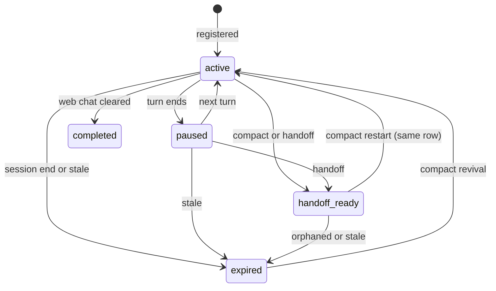
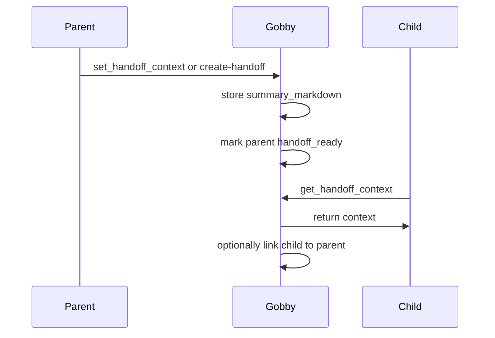

# Session Management Guide

Gobby sessions are durable records of CLI and web-chat work. They connect
transcripts, tasks, commits, handoff summaries, token usage, terminal state, and
agent-run metadata across daemon restarts and context compactions.

## Quick Start

```bash
# List recent sessions
gobby sessions list

# Show one session
gobby sessions show #42

# Read a transcript
gobby sessions messages #42 --limit 25

# Create a handoff summary for the current active session
gobby sessions create-handoff --output db "Paused before review"
```

```python
# MCP examples assume progressive discovery has already loaded the server,
# tool list, and schema.

# Get your current session when injected context did not include it.
call_tool("gobby-sessions", "get_current_session", {
    "external_id": "<cli-session-id>",
    "source": "codex"
})

# Read the latest handoff-ready context.
call_tool("gobby-sessions", "get_handoff_context", {})
```

## Mental Model



| Status | Meaning |
| :--- | :--- |
| `active` | A session is registered and currently expected to receive activity. |
| `paused` | A turn finished or the session went idle, but the session may resume. |
| `handoff_ready` | Summary context is available for a successor session. |
| `completed` | A web-chat lifecycle ended cleanly. |
| `expired` | The session ended, went stale, or was soft-deleted. |

Session records are keyed by external CLI identity, machine, source, project,
and session type. Registration is idempotent for that key, so daemon restarts
reuse the existing row instead of creating duplicates.

## What A Session Stores

| Field group | Examples |
| :--- | :--- |
| Identity | Internal UUID, project-scoped `#N`, external CLI ID, machine ID, source |
| Runtime | Status, source, session type, terminal context, parent session, agent depth |
| Work trace | Transcript path, rendered message counts, task links, commit window |
| Handoff | `summary_markdown`, digest fields, compact continuation context |
| Usage | Input, output, cache-write, cache-read token counts, model |
| Safety | Dirty-file baseline, edit marker, sandbox flags, approved tools |

`agent_depth` separates human sessions from spawned agent sessions. Depth `0`
sessions are user-facing; depth `1+` sessions are subagents and are cheaper to
summarize during lifecycle processing.

## Session Sources

| Source | Typical origin |
| :--- | :--- |
| `claude` | Claude Code hooks |
| `codex` | Codex hook adapter or web-chat Codex backend |
| `qwen` | Qwen CLI hooks |
| `droid` | Droid CLI hooks |
| `grok` | Grok CLI hooks |
| `agy` | AGY CLI hooks |
| `pipeline` | Pipeline automation |
| `system` | Bootstrapped root session for cron and pipeline work without a caller |

The public `get_current_session` helper accepts `claude`, `grok`,
`qwen`, `codex`, `droid`, and `agy`. Pipeline and system sessions are created
by internal automation.

## CLI Commands

This section covers the day-to-day subset; `gobby sessions renumber` and
`gobby sessions backfill-context-windows` also exist for maintenance.

### `gobby sessions list`

List sessions with optional filters.

```bash
gobby sessions list [OPTIONS]
```

| Option | Description |
| :--- | :--- |
| `-p, --project TEXT` | Filter by project name or UUID. |
| `-s, --status TEXT` | Filter by status such as `active`, `completed`, or `handoff_ready`. |
| `--source TEXT` | Filter by `claude`, `grok`, `qwen`, `agy`, `codex`, or `droid`. |
| `-n, --limit INTEGER` | Maximum rows to show. |
| `--json` | Emit JSON. |

### `gobby sessions show`

Show one session by `#N`, UUID, or prefix.

```bash
gobby sessions show SESSION_ID [--json]
```

### `gobby sessions messages`

Render transcript messages from the live JSONL transcript or gzip archive
fallback.

```bash
gobby sessions messages SESSION_ID [OPTIONS]
```

| Option | Description |
| :--- | :--- |
| `-n, --limit INTEGER` | Maximum messages to show. |
| `-r, --role TEXT` | Filter by role: `user`, `assistant`, or `tool`. |
| `-o, --offset INTEGER` | Skip the first N messages. |
| `--json` | Emit JSON. |

### `gobby sessions stats`

Show aggregate counts by status and source.

```bash
gobby sessions stats [--project TEXT]
```

### `gobby sessions create-handoff`

Create a handoff summary for a session. If `--session-id` is omitted, Gobby uses
the current project's most recent active session.

```bash
gobby sessions create-handoff [OPTIONS] [NOTES]
```

| Option | Description |
| :--- | :--- |
| `-s, --session-id TEXT` | Session to summarize. |
| `--output db\|file\|all` | Save to DB, file, or both. Default: `all`. |
| `--path TEXT` | Directory for file output. Default: `.gobby/session_summaries/`. |

The command extracts active task, modified files, git status, recent commits,
initial goal, recent activity, and a summary. It uses an LLM summary when
available and falls back to code-derived context.

### `gobby sessions restore`

Restore transcript files from gzip archives.

```bash
gobby sessions restore SESSION_REF [--path TEXT] [--json]
gobby sessions restore --all [--json]
```

Use this when a CLI deleted its original transcript file but you need the file
back on disk for resume or inspection.

### `gobby sessions delete`

Delete a session after confirmation.

```bash
gobby sessions delete SESSION_ID
gobby sessions delete SESSION_ID --yes
```

## MCP Tools

Use the `gobby-sessions` server for session CRUD, transcripts, handoffs,
registration, usage, terminal capture, and archive restoration. Fetch schemas
with `get_tool_schema` before writing examples or automating calls.

| Tool | Purpose |
| :--- | :--- |
| `get_current_session` | Resolve your own internal session ID from external CLI ID and source. |
| `get_session` | Read one session by `#N`, UUID, or prefix. |
| `list_sessions` | Browse sessions with project, status, source, and limit filters. |
| `session_stats` | Count sessions by status and source. |
| `get_usage_breakdown` | Aggregate token usage by source and model. |
| `get_session_messages` | Read rendered transcript messages. |
| `search_session_messages` | Search rendered transcript messages by substring. |
| `set_handoff_context` | Set or generate handoff context for the current session. |
| `get_handoff_context` | Retrieve handoff context directly or from the latest same-project `handoff_ready` session. |
| `wait_for_summary` | Wait for a session's `summary_markdown` to become available. |
| `register_session` | Register hookless clients such as SDK-driven agents. |
| `get_session_commits` | List commits made during a session timeframe. |
| `mark_loop_complete` | Mark an autonomous loop complete to prevent session chaining. |
| `capture_baseline_dirty_files` | Store the current dirty-file baseline for edit detection. |
| `restore_session_transcript` | Restore one transcript from archive. |
| `get_transcript_status` | Check archive availability and transcript file stats. |
| `send_keys` | Send keystrokes to a session-backed tmux terminal. |
| `capture_output` | Capture recent tmux output. |
| `compact_self` | Trigger the current CLI's compaction command. |

### Finding Your Own Session

Use `get_current_session` when injected context did not already provide a
session reference.

```python
call_tool("gobby-sessions", "get_current_session", {
    "external_id": "<external-id-from-context-or-GOBBY_SESSION_ID>",
    "source": "codex"
})
```

Do not use `list_sessions(status="active", limit=1)` for self-identification.
Multiple terminals and agents can be active at the same time.

### Reading Session Data

```python
call_tool("gobby-sessions", "get_session", {
    "session_id": "#42"
})

call_tool("gobby-sessions", "get_session_messages", {
    "session_id": "#42",
    "limit": 50,
    "offset": 0,
    "full_content": False
})

call_tool("gobby-sessions", "get_session_commits", {
    "session_id": "#42",
    "max_commits": 25
})
```

### Creating And Reading Handoffs

`set_handoff_context` operates on the current session context. Pass `content`
for an agent-authored handoff, or omit it to generate a summary from transcript
state.

```python
call_tool("gobby-sessions", "set_handoff_context", {
    "content": "## Handoff\n\nCurrent state and next steps.",
    "set_handoff_ready": True
})
```

```python
call_tool("gobby-sessions", "get_handoff_context", {
    "session_id": "#42",
    "link_child_session_id": "#43"
})
```

When no `session_id` is provided, `get_handoff_context` falls back to the latest
`handoff_ready` session in the caller's current project. It can also search by
explicit `project_id` and `source`. If no project can be resolved, the lookup
fails closed instead of returning a session from another project.

### Hookless Registration

Clients that do not fire session-start hooks can register explicitly.

```python
call_tool("gobby-sessions", "register_session", {
    "external_id": "<sdk-run-id>",
    "source": "codex",
    "title": "SDK driven analysis",
    "agent_depth": 0
})
```

`machine_id` and `project_id` are auto-resolved when omitted.

### Terminal Tools

Terminal tools are for session-backed tmux contexts.

```python
call_tool("gobby-sessions", "capture_output", {
    "session_id": "#42",
    "lines": 80
})

call_tool("gobby-sessions", "send_keys", {
    "session_id": "#42",
    "keys": "status\n",
    "literal": True
})
```

Use `capture_output` before raw tmux fallback when inspecting prompts,
permission dialogs, or stalled terminals.

## Handoff Flow



Handoffs are summary records, not separate session objects. A parent session is
marked `handoff_ready`, and a successor reads `summary_markdown` through
`get_handoff_context`. If `link_child_session_id` is provided, Gobby records the
parent-child relationship.

### Compaction Is In-Place

CLI context compaction is not a parent/child handoff. The provider preserves
its external session ID across a compact, so the compact restart reactivates
the **same** session row: `handoff_ready` flips back to `active`, and the
stored `summary_markdown` is injected into the continuing session. Identity,
session variables, workflow instances, claimed tasks, parent linkage, and
agent-run ownership all carry through unchanged because no transfer happens.

A one-shot compact marker (the `handoff_source` session variable, set by the
pre-compact rule) classifies the restart. It is consumed on successful
reactivation, so a later normal restart of the same session is never
misclassified as a compact. If the row expired while compacting (for example a
laptop slept mid-compact), the restart revives the same row; if the row is
missing entirely, the start degrades to a normal `startup` registration with a
structured warning in the daemon log.

Claude and Codex emit `SessionStart(source=compact)` after compact. That
restart consumes `handoff_source` and injects the continuation through
`inject-compact-handoff`.

Grok `/compact` is the same context loss but never emits SessionStart. Grok
`post_compact` runs `apply_in_place_compact_context_loss` on the live row:
the same summary prep and `handoff_source` consume as compact SessionStart,
plus compact context-loss tracking resets (`unlocked_tools`, skill-load
lists, memory injection ids) and agent-preamble rehydrate. It does not
reset `plan_mode` and does not fire pipelines. When `auto_inject_handoff`
is on, it arms `compact_handoff_inject_pending`. The next `turn_start` /
`user_prompt_submit` (`BEFORE_AGENT`) fires `inject-compact-handoff-on-prompt`,
which injects the marked continuation block plus wiki, profile, and task
via `additionalContext`, then clears the one-shot. If that injected block
is absent, `wait_for_summary` remains the continuation-prompt fallback.

### Handoff Boundaries

The successor model receives the generated or agent-authored `summary_markdown`
as its continuation context. The full source transcript remains a separately
stored session record that can be queried or restored from the source session.

Provider-owned runtime state remains with the source tool. This includes prompt
caches, native conversation state, and provider-private or encrypted
reasoning/thinking artifacts. The successor reconstructs working context from
the handoff summary and persisted project state.

## Lifecycle Events

Rule authors should target semantic workflow events:

| Semantic event | Raw runtime events that may feed it | Common use |
| :--- | :--- | :--- |
| `turn_start` | `before_agent`, provider-specific prompt-start events | Context injection and per-turn setup |
| `turn_end` | `after_agent`, `stop`, provider-specific turn-complete events | Stop gates, digest capture, cleanup |

Raw `before_agent`, `after_agent`, and `stop` events are provider/runtime
details. They are useful for adapter work, but they are not the main authoring
API for portable workflow rules.

Agent termination is a separate lifecycle path. A spawned agent that has
finished successfully must call `gobby-agents:end_agent_run`; relying on a raw
stop or turn-end event does not release the agent run.

## Troubleshooting

### Session Not Found

1. Check daemon health with `gobby status`.
2. Confirm the project. Project-scoped `#N` references resolve inside the
   current project.
3. For self-lookup, use `get_current_session` with the external CLI ID and
   source.
4. For old sessions, try UUID or prefix if the project-scoped number is
   ambiguous.

### Messages Are Missing

1. Use `gobby sessions show SESSION_ID --json` and inspect `transcript_path`.
2. Run `gobby sessions restore SESSION_ID` if the transcript archive exists but
   the original file was deleted.
3. Use `get_transcript_status` through MCP to check archive availability.

### Handoff Is Empty

1. Confirm the session has `summary_markdown`.
2. Create or update handoff context with `gobby sessions create-handoff` or
   `set_handoff_context`.
3. Confirm the target status is `handoff_ready`. A session may always read its
   own summary regardless of status (post-compact self-reads).
4. Pass `session_id` to `get_handoff_context` when multiple handoff-ready
   sessions exist.

### Hooks Are Not Updating Sessions

1. Verify hooks are installed with `gobby install`.
2. Check the CLI source in `gobby sessions list --source SOURCE`.
3. Review daemon logs under `~/.gobby/logs/`.
4. For hookless clients, use `register_session`.

## Data Storage

| Path | Description |
| :--- | :--- |
| `~/.gobby/bootstrap.yaml` `database_url` | Runtime PostgreSQL hub DSN for sessions and related tables. |
| `~/.gobby/logs/` | Daemon logs. |
| `.gobby/session_summaries/` | Default file output for CLI-created handoff summaries. |

## See Also

- [tasks.md](./tasks.md) - Task management
- [agents.md](./agents.md) - Agent spawning and agent-run termination
- [memory.md](./memory.md) - Persistent memory and session digests
- [mcp-tools.md](./mcp-tools.md) - MCP tool reference
- [rules.md](./rules.md) - Semantic workflow events
- [hook-schemas.md](./hook-schemas.md) - Raw hook mappings

_Last verified: 2026-06-11_
