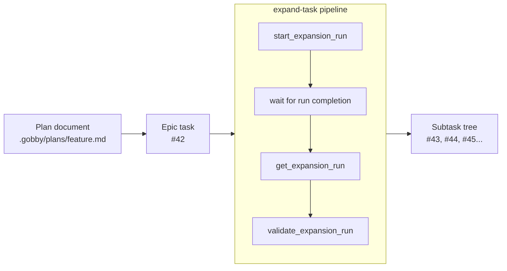
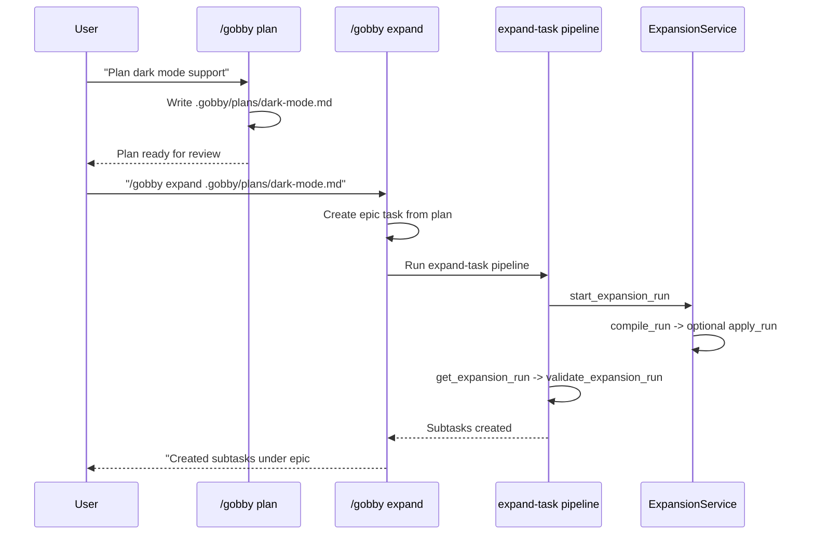

# Task Expansion

Task expansion breaks a high-level epic into concrete, validated subtasks with dependencies, file annotations, and optional TDD structure. The current system is **run-based**: the pipeline starts an expansion run, `ExpansionService` compiles a normalized spec in-process, and that run is then applied and validated.

This guide covers the current flow end-to-end: how plans feed into expansion, what gets stored on the run, how validation works, and how TDD is applied.

For the orchestration flow that invokes expansion, see [Orchestration](./orchestration.md).

---

## Overview



The expansion flow:

1. **Input**: An epic task, optionally with a supporting plan file
2. **Run start**: `start_expansion_run` creates or reuses an expansion run and launches background work
3. **Compile**: `ExpansionService.compile_run()` builds a normalized compiled spec with phases, tasks, dependencies, and execution groups
4. **Apply**: `ExpansionService.apply_run()` creates the task tree, wires dependencies, and attaches affected files
5. **Validate**: `validate_expansion_run` checks both the compiled spec and the applied task tree

---

## The Expand-Task Pipeline

The canonical pipeline is the bundled workflow at `src/gobby/install/shared/workflows/pipelines/expand-task.yaml`.

```yaml
name: expand-task
type: pipeline

steps:
  - id: start_run
    mcp:
      server: gobby-tasks-ops
      tool: start_expansion_run

  - id: wait_run
    wait:
      completion_id: "${{ steps.start_run.output.run_id }}"

  - id: get_run
    mcp:
      server: gobby-tasks-ops
      tool: get_expansion_run

  - id: validate_run
    mcp:
      server: gobby-tasks-ops
      tool: validate_expansion_run
```

If the run does not complete successfully, the pipeline fails. If validation reports an invalid compiled or applied result, the pipeline fails with the validation payload.

---

## Expansion Runs

`start_expansion_run` is the entrypoint for expansion. It:

- Resolves the target task and current session
- Reuses an active run for the same task unless `force_new=True`
- Persists run metadata such as `plan_file`, provider, model, and `auto_apply`
- Launches background execution for compile/apply work

The run is the durable unit of state. Compiled output, apply results, created task IDs, and validation checkpoints are stored on the run rather than being written back to the parent task as a standalone spec blob.

---

## Compiled Spec Shape

`ExpansionService.compile_run()` normalizes the model output into a compiled spec with top-level `phases`, `tasks`, `dependencies`, and `execution_groups`.

Example:

```json
{
  "phases": [
    {
      "id": "phase-1",
      "title": "Phase 1: Foundation",
      "summary": "Build the foundation.",
      "test_intent": {
        "behaviors": ["Writes the new files"],
        "suggested_test_files": ["tests/test_foundation.py"]
      },
      "task_ids": ["task-1"]
    }
  ],
  "tasks": [
    {
      "id": "task-1",
      "phase_id": "phase-1",
      "title": "Implement the foundation",
      "description": "Create the initial implementation.",
      "category": "code",
      "priority": 2,
      "task_type": "task",
      "validation": "Implementation is present.",
      "affected_files": ["src/foundation.py"]
    }
  ],
  "dependencies": [],
  "execution_groups": []
}
```

Important fields:

- `phases[].task_ids`: stable task IDs assigned to that phase
- `tasks[].phase_id`: phase membership
- `tasks[].validation`: validation criteria copied onto the created task
- `tasks[].affected_files`: file annotations attached during apply
- `tasks[].execution_group`: optional concurrency label used to tag created tasks
- `dependencies[]`: edges between stable task IDs

---

## Validation

`validate_expansion_run` performs two checks:

1. **Compiled validation** via `ExpansionService.validate_compiled_spec()`
2. **Applied validation** via `ExpansionService.validate_applied_run()` when tasks have already been created

Compiled validation checks:

- At least one phase and one task
- Unique phase IDs and task IDs
- Every task references a valid phase
- Every phase references valid task IDs
- Dependency edges reference known tasks and do not form cycles

Applied validation checks the created task tree against the run's stored task map after apply.

---

## Applying the Run

`ExpansionService.apply_run()` is the mechanical phase that turns the compiled spec into tasks:

1. Creates phase sub-epics when the spec has multiple phases
2. Creates implementation tasks under the correct parent
3. Copies category, priority, task type, description, and validation text onto created tasks
4. Adds task dependencies based on the compiled dependency graph
5. Attaches affected files through the affected-files manager
6. Stores `task_id_map` and `created_task_ids` back onto the run

If a `plan_file` was provided, created tasks include a short plan reference block so the task description remains authoritative while the plan stays as supporting context.

---

## Plans -> Expansion

The `/gobby plan` skill creates structured plan documents. The `/gobby expand` skill turns those plans into an epic plus an expansion run.



### Plan Document Format

Plans use `## Phase N: Title` headings for phase structure and `### N.N` headings for task-level details.

```markdown
## Phase 1: Foundation

### 1.1 Create user model [category: code]

Target: `src/models/user.py`

Full implementation details here...

### 1.2 Add authentication [category: code] (depends: 1.1)

Target: `src/auth/handler.py`

Full implementation details here...
```

Each `### N.N` section feeds the compiled task descriptions. The implementing agent still receives the concrete task, not the full planning conversation.

### What Plans Should NOT Contain

Plans should not include explicit TDD wrapper tasks. When TDD is enabled, the expansion system inserts those mechanically during apply.

Forbidden patterns:

- `"Write tests for..."` or `"Test..."` as task titles
- `"[TDD]"`, `"[IMPL]"`, `"[REF]"` prefixes
- Separate test tasks alongside implementation tasks

See [TDD Enforcement](./tdd-enforcement.md) for how TDD is applied during expansion.

---

## TDD Integration

When TDD is enabled (`enforce_tdd = true`), `apply_run()` wraps `code` and `config` tasks in a per-phase TDD sandwich:

```text
Epic #42 "User Authentication"
├── Phase 1: Core Infrastructure [subepic]
│   ├── [TEST] Phase 1: Write failing tests
│   ├── Create database schema
│   ├── Implement data access layer
│   └── [REF] Phase 1: Refactor with green tests
├── Phase 2: API Layer [subepic]
│   ├── [TEST] Phase 2: Write failing tests
│   ├── Add API endpoints
│   └── [REF] Phase 2: Refactor with green tests
└── Document the API
```

Rules worth knowing:

- Multi-phase plans create phase sub-epics
- Each TDD-enabled phase gets one `[TEST]` task and one `[REF]` task
- Implementation tasks in that phase depend on the phase's `[TEST]` task
- The phase's `[REF]` task depends on all TDD-eligible implementation tasks in that phase
- Non-TDD categories such as `docs`, `refactor`, `test`, `research`, `planning`, and `manual` are passed through unchanged

See [TDD Enforcement](./tdd-enforcement.md) for the runtime rule layer that reinforces this structure during agent work.

---

## Invoking Expansion

### Via `/gobby expand`

```text
/gobby expand #42
/gobby expand .gobby/plans/dark-mode.md
```

The skill creates or resolves the epic, then invokes `expand-task` and reports the created tasks.

### Via Pipeline Directly

```python
call_tool("gobby-workflows", "run_pipeline", {
    "name": "expand-task",
    "inputs": {
        "task_id": "#42",
        "plan_file": ".gobby/plans/dark-mode.md"
    },
    "wait_for_completion": true,
    "wait_timeout": 600
})
```

### Via Orchestration

Orchestration flows can invoke the same `expand-task` pipeline before dispatching developer and QA agents.

---

## Resume and Reuse

Expansion work survives interruption through the expansion run record. If a run is already active for a task, `start_expansion_run` reuses it by default instead of starting over. That keeps compile/apply state on the run and avoids reviving the old spec-on-task model.

---

## File Locations

| Path | Purpose |
|------|---------|
| `src/gobby/install/shared/workflows/pipelines/expand-task.yaml` | Canonical expansion pipeline |
| `src/gobby/tasks/expansion_service.py` | Compile, apply, and validation logic |
| `src/gobby/mcp_proxy/tools/tasks/_expansion.py` | Expansion MCP tools and run lifecycle |
| `src/gobby/tasks/prompts/expand-task.md` | Expansion prompt |
| `src/gobby/tasks/prompts/expand-task-tdd.md` | TDD-specific expansion guidance |
| `src/gobby/install/shared/skills/expand/SKILL.md` | `/gobby expand` skill |
| `src/gobby/install/shared/skills/plan/SKILL.md` | `/gobby plan` skill |

## See Also

- [Orchestration](./orchestration.md) — How orchestration invokes expansion
- [TDD Enforcement](./tdd-enforcement.md) — TDD sandwich pattern details
- [Pipelines](./pipelines.md) — Pipeline system reference
- [Agents](./agents.md) — Agent definitions and step workflows
