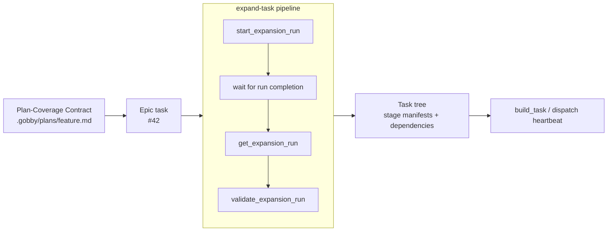
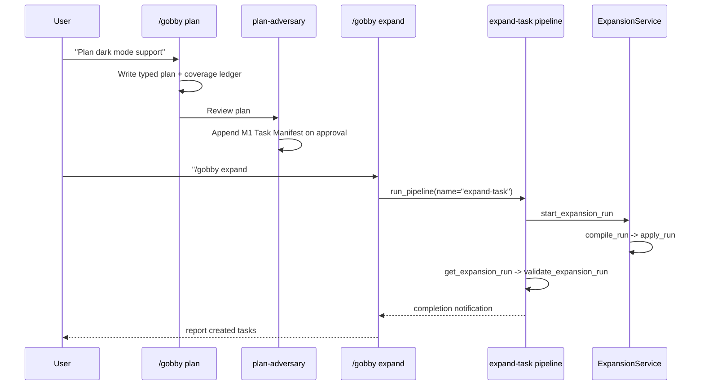

# Task Expansion

Task expansion turns a high-level task or typed plan into a concrete task tree
with dependencies, affected-file annotations, stage manifests, and optional TDD
structure. The current system is **run-based**: `start_expansion_run` creates an
expansion run, `ExpansionService` compiles a normalized spec, and the same run
stores compile, apply, validation, and QA checkpoints.

This guide covers the current 0.4.0 flow: how plans feed expansion, what gets
stored on the run, how validation works, and how lifecycle automation picks up
the expanded tree.

For dispatch after expansion, see [Dispatch](./dispatch.md) and
[Orchestration](./orchestration.md).

---

## Overview



The expansion flow:

1. **Input**: A target task, optionally with a Plan-Coverage Contract plan file.
2. **Run start**: `start_expansion_run` creates or reuses an expansion run and
   launches compile/apply work.
3. **Compile**: `ExpansionService.compile_run()` builds a normalized compiled
   spec with phases, tasks, dependencies, execution groups, and contract
   metadata.
4. **Apply**: `ExpansionService.apply_run()` creates the task tree, initializes
   child stage manifests, wires dependencies, and attaches affected files.
5. **Validate**: `validate_expansion_run` checks the compiled spec and, after
   apply, the created-task map.
6. **Dispatch**: `build_task` or the dispatcher runs the resulting stage rows;
   workflow rules operate on semantic lifecycle events such as `turn_start` and
   `turn_end`.

Rule authors should target those semantic events. Raw provider/runtime hooks
such as `before_agent`, `after_agent`, and `stop` are adapter details below the
main rule-authoring API.

Agent termination is separate from turn-end rule evaluation. Workflow agents
that are instructed to finish must call `gobby-agents:end_agent_run`.

---

## The Expand-Task Pipeline

The canonical pipeline is
`src/gobby/install/shared/workflows/pipelines/expand-task.yaml`.

```yaml
name: expand-task
type: pipeline
version: "2.0"

inputs:
  task_id:
    type: string
    required: true
  plan_file:
    type: string
    required: false
  provider: "claude"
  model: null
  wait_timeout: 600

outputs:
  run_id: "${{ steps.start_run.output.run_id }}"
  status: "${{ steps.wait_run.output.status }}"
  created_task_ids: "${{ steps.get_run.output.run.created_task_ids }}"
  validation: "${{ steps.validate_run.output }}"

steps:
  - id: start_run
    mcp:
      server: gobby-tasks-ops
      tool: start_expansion_run
      arguments:
        task_id: "${{ inputs.task_id }}"
        plan_file: "${{ inputs.plan_file }}"
        provider: "${{ inputs.provider }}"
        model: "${{ inputs.model }}"
        auto_apply: true

  - id: wait_run
    wait:
      completion_id: "${{ steps.start_run.output.run_id }}"
      timeout: "${{ inputs.wait_timeout }}"

  - id: get_run
    mcp:
      server: gobby-tasks-ops
      tool: get_expansion_run
      arguments:
        run_id: "${{ steps.start_run.output.run_id }}"

  - id: validate_run
    mcp:
      server: gobby-tasks-ops
      tool: validate_expansion_run
      arguments:
        run_id: "${{ steps.start_run.output.run_id }}"
```

The bundled pipeline also has explicit `fail_run` and `fail_validation` steps.
If the run does not complete, or if validation reports an invalid compiled or
applied result, the pipeline fails with the validation payload.

`gobby-workflows:run_pipeline` always returns immediately with an
`execution_id`; callers inspect completion with
`gobby-workflows:get_pipeline_status`.

---

## Expansion Runs

`start_expansion_run` is the entrypoint for expansion. Current schema fields:

| Field | Purpose |
| --- | --- |
| `task_id` | Task ref to expand; required |
| `plan_file` | Optional plan path relative to the project root |
| `auto_apply` | Apply the compiled spec after compile; default `true` |
| `force_new` | Create a new run even if another run is active |
| `reset_output` | Delete existing generated output before starting |
| `provider` / `model` | Optional LLM provider/model overrides |
| `project` | Optional project ref for task resolution |

The run is the durable unit of state. Compiled output, apply results,
`task_id_map`, `created_task_ids`, validation checkpoints, logs, and stored QA
results live on the expansion run. The parent task receives task-tree output and
an `expansion_run_id` artifact; it is not the source of truth for a standalone
spec blob.

Reuse behavior:

- If a matching active run exists and `force_new` is false, `start_expansion_run`
  returns that run.
- `resume_expansion_run` restarts failed or interrupted work for an existing
  run ID.
- `get_latest_expansion_run` finds the most recent run for a task.
- `reset_expansion_output` is required before applying over existing expansion
  output for the same parent.

---

## Compiled Spec Shape

`ExpansionService.compile_run()` normalizes either deterministic contract output
or ad-hoc LLM output into a compiled spec.

Minimal shape:

```json
{
  "version": 1,
  "parent_task_id": "task-uuid",
  "plan_file": ".gobby/plans/dark-mode.md",
  "phases": [
    {
      "id": "phase-1",
      "title": "Phase 1: Foundation",
      "summary": "Build the foundation.",
      "test_intent": {
        "summary": "Verify foundation behavior",
        "behaviors": ["Writes the new files"],
        "suggested_test_files": ["tests/test_foundation.py"],
        "entry_criteria": []
      },
      "task_ids": ["task-1"]
    }
  ],
  "tasks": [
    {
      "id": "task-1",
      "phase_id": "phase-1",
      "title": "Implement the foundation",
      "description": "Create the initial implementation.",
      "category": "code",
      "priority": 2,
      "task_type": "task",
      "validation": "Implementation is present.",
      "affected_files": ["src/foundation.py"],
      "execution_group": "foundation",
      "assigned_agent": "backend-developer",
      "additional_skills": []
    }
  ],
  "dependencies": [],
  "execution_groups": [
    {
      "id": "foundation",
      "mode": "parallel",
      "task_ids": ["task-1"]
    }
  ]
}
```

Plan-Coverage Contract compilation adds contract metadata such as
`contract_plan`, `plan_id`, `deliverable_count`, and `deferrals`.

Important fields:

- `phases[].task_ids`: stable task IDs assigned to that phase.
- `tasks[].phase_id`: phase membership.
- `tasks[].validation`: validation criteria copied onto the created task.
- `tasks[].affected_files`: file annotations attached during apply.
- `tasks[].execution_group`: optional concurrency label; apply adds a
  `parallel:<group>` label.
- `tasks[].assigned_agent` and `tasks[].additional_skills`: routing hints from
  agent selection.
- `dependencies[]`: edges between stable task IDs.

---

## Validation

`validate_expansion_run` performs two checks:

1. **Compiled validation** via `ExpansionService.validate_compiled_spec()`.
2. **Applied validation** via `ExpansionService.validate_applied_run()` when the
   run has a `task_id_map`.

Compiled validation checks:

- At least one phase and one task.
- Unique phase IDs and task IDs.
- Every task references a valid phase and has a title.
- Task categories are supported automated leaf categories.
- Every phase references valid task IDs.
- Dependency edges reference known tasks, do not point to themselves, and do not
  form cycles.

Applied validation checks that every compiled task stable ID has a created-task
mapping and that each mapped task still exists.

`validate_plan_file` is separate. It validates a Plan-Coverage Contract plan
file in draft mode: deliverables, canonical phase headings, and semantic lint
must pass; a manifest is tolerated absent at draft time.

---

## Applying the Run

`ExpansionService.apply_run()` turns the compiled spec into tasks:

1. Derives child stage manifests from the parent task manifest.
2. Creates phase sub-epics for multi-phase expansions.
3. Creates implementation tasks under the correct parent.
4. Copies category, priority, task type, description, validation text,
   assigned agent, and additional skills onto created tasks.
5. Adds dependency edges from the compiled graph.
6. Attaches affected files through the affected-files manager.
7. Adds `expansion-run:<run_id>` provenance and `parallel:<group>` labels.
8. Inherits target branch, automation settings, unattended mode, and isolation
   from the parent.
9. Stores `task_id_map`, `created_task_ids`, and apply validation back onto the
   run.
10. Completes the parent expansion stage when that stage is current.

If a `plan_file` was provided, created tasks include a short plan reference
block. The created task description remains authoritative; the plan is
supporting context.

When development is the only enabled stage on the parent, expansion completes as
a dev-only run without creating child tasks.

---

## Plans -> Expansion

Plan-backed expansion consumes the Plan-Coverage Contract, not the older
free-form `## Phase 1` / `### 1.1` outline style. The full contract is
`docs/contracts/plan-coverage.md`; the authoring surface is
`src/gobby/install/shared/skills/plan-draft/SKILL.md`.



### Plan Document Format

Expansion requires canonical section IDs and typed section kinds. Phase headings
use IDs such as `P1`, deliverables use IDs such as `A1`, and implementation
plans carry a final `## M1 Task Manifest` section.

````markdown
## P1: Foundation
`kind: framing`

Scope and sequencing context.

## A1: Create User Model
`kind: deliverable`

Target: `src/models/user.py`

**Acceptance:**

- A1.1 - User model exists. file: `src/models/user.py`.
- A1.2 - Model behavior is covered. test: `tests/models/test_user.py`.

## A2: Add Authentication
`kind: deliverable`

Depends on A1.

**Acceptance:**

- A2.1 - Auth handler exists. file: `src/auth/handler.py`.

## M1 Task Manifest
`kind: manifest`

```yaml
- title: Create user model
  category: code
  task_type: task
  depends_on: []
  validation_criteria: User model exists and tests cover core behavior.
  labels:
    - covers:dark-mode:A1:A1.1
    - covers:dark-mode:A1:A1.2
  assigned_agent: backend-developer
  tdd: true
  source_section: A1
- title: Add authentication
  category: code
  task_type: task
  depends_on: [A1]
  validation_criteria: Auth handler exists.
  labels:
    - covers:dark-mode:A2:A2.1
  assigned_agent: backend-developer
  tdd: true
  source_section: A2
```
````

Manifest rules:

- Every `kind: deliverable` section must have exactly one manifest entry.
- `depends_on` values reference manifest `source_section` IDs, not phase IDs.
- `labels` use structured `covers:<plan-id>:<section-id>:<item-id>` records.
- `tdd: true` is valid only for `code` and `config` categories.
- Plan authors write narrative sections; plan review writes the final manifest
  before expansion.

New epic plans also carry a `.coverage-ledger.yaml` companion file before
expansion.

### What Plans Should Not Contain

Plans should not include explicit TDD wrapper tasks. When TDD is enabled, the
expansion system inserts those mechanically during apply or deterministic
contract compilation.

Forbidden patterns:

- `"Write tests for..."` or `"Test..."` filler tasks that duplicate the TDD
  wrapper.
- `"[TDD]"`, `"[IMPL]"`, or `"[REF]"` prefixes in authored task titles.
- Separate test tasks alongside implementation tasks for the same `code` or
  `config` deliverable.

See [TDD Enforcement](./tdd-enforcement.md) for how TDD is reinforced during
agent work.

---

## TDD Integration

When TDD is enabled for `code` or `config` work, expansion emits a per-phase TDD
sandwich:

```text
Epic #42 "User Authentication"
├── Phase 1: Core Infrastructure [subepic]
│   ├── [TEST] Phase 1: Write failing tests
│   ├── [IMPL] Create database schema
│   ├── [IMPL] Implement data access layer
│   └── [REF] Phase 1: Refactor with green tests
├── Phase 2: API Layer [subepic]
│   ├── [TEST] Phase 2: Write failing tests
│   ├── [IMPL] Add API endpoints
│   └── [REF] Phase 2: Refactor with green tests
└── Document the API
```

Rules worth knowing:

- Multi-phase plans create phase sub-epics.
- Each TDD-enabled phase gets one `[TEST]` task and one `[REF]` task.
- Implementation tasks in that phase depend on the phase's `[TEST]` task.
- The phase's `[REF]` task depends on all TDD-eligible implementation tasks in
  that phase.
- Contract-plan compilation emits `[IMPL]` titles for TDD manifest entries.
- Non-TDD categories such as `docs`, `refactor`, `test`, `research`,
  `planning`, and `manual` expand as single tasks.
- Cross-phase TDD sequencing avoids adding an implicit phase edge when it would
  conflict with explicit manifest dependencies.

See [TDD Enforcement](./tdd-enforcement.md) for the runtime rule layer.

---

## Invoking Expansion

### Via `/gobby expand`

```text
/gobby expand #42
/gobby expand #42 .gobby/plans/dark-mode.md
```

The skill resolves the target task, runs the `expand-task` pipeline, stores the
returned `execution_id`, and reports status after the daemon sends the durable
completion notification.

### Via Pipeline Directly

```python
call_tool("gobby-workflows", "run_pipeline", {
    "name": "expand-task",
    "inputs": {
        "task_id": "#42",
        "plan_file": ".gobby/plans/dark-mode.md",
        "wait_timeout": 600
    }
})
```

Inspect the pipeline later:

```python
call_tool("gobby-workflows", "get_pipeline_status", {
    "execution_id": "<execution_id>"
})
```

### Via Lifecycle Automation

`gobby-tasks-ops:build_task` is the MCP entrypoint for lifecycle automation.
It accepts an `input_ref` pointing at a plan file, epic, or automated leaf, plus
automation options such as `quick`, `stage`, `workspace_backend`,
`target_branch`, `agent`, `reset_expansion_output`, `max_active_agents`, and
`max_retries`.

Build automation can run docs leaf work inside the parent epic's isolation
context. After expansion, dispatch routes stage rows by manifest policy; docs
development rows route to `tech-writer`, and docs review rows route to
`doc-reviewer`.

---

## Resume and Reuse

Expansion work survives interruption through the expansion run record. If a run
is already active for a task, `start_expansion_run` reuses it by default. That
keeps compile/apply state on the run and avoids reviving the old spec-on-task
model.

Use:

- `get_latest_expansion_run` to find the most recent run for a task.
- `get_expansion_run` to inspect status, logs, compiled summaries, created
  task IDs, validation checkpoints, and QA result.
- `resume_expansion_run` to restart an interrupted run.
- `cancel_expansion_run` to cancel active background work.
- `run_expansion_qa_coverage` to run mechanical Plan-Coverage QA against the DB
  task tree.

---

## File Locations

| Path | Purpose |
| --- | --- |
| `src/gobby/install/shared/workflows/pipelines/expand-task.yaml` | Canonical expansion pipeline |
| `src/gobby/tasks/expansion_service.py` | Public expansion facade |
| `src/gobby/tasks/expansion/_compile.py` | Compile path and LLM normalization |
| `src/gobby/tasks/expansion/_contract.py` | Deterministic Plan-Coverage Contract compilation |
| `src/gobby/tasks/expansion/_apply.py` | Task-tree apply logic |
| `src/gobby/tasks/expansion/_validate.py` | Plan and compiled-spec validation |
| `src/gobby/mcp_proxy/tools/tasks/_expansion.py` | Expansion MCP tools and run lifecycle |
| `src/gobby/tasks/prompts/expand-task.md` | Expansion prompt |
| `src/gobby/tasks/prompts/expand-task-tdd.md` | TDD-specific expansion guidance |
| `src/gobby/install/shared/skills/expand/SKILL.md` | `/gobby expand` skill |
| `src/gobby/install/shared/skills/plan-draft/SKILL.md` | Typed plan authoring skill |
| `docs/contracts/plan-coverage.md` | Plan-Coverage Contract reference |

## See Also

- [Dispatch](./dispatch.md) — Stage-manifest dispatch and lifecycle routing
- [Orchestration](./orchestration.md) — Automation model around dispatch
- [Spec Writing](./spec-writing.md) — Plan authoring workflow
- [TDD Enforcement](./tdd-enforcement.md) — TDD sandwich pattern details
- [Pipelines](./pipelines.md) — Pipeline system reference
- [Agents](./agents.md) — Agent definitions and step workflows

_Last verified: 2026-05-07_
