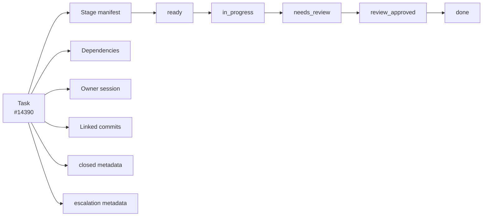

# Task Management Guide

Gobby's task system is the durable work ledger for local-first development. It
tracks task trees, dependency edges, stage manifests, session ownership, review
state, validation, and commit links across restarts and agent handoffs.

Use the MCP tools for agent lifecycle work. Use the CLI for human inspection and
manual operator actions.

## Current Model



The storage row still has task metadata such as title, description, priority,
type, category, parent, labels, and validation criteria. The workflow-facing
state comes from the stage manifest plus close and escalation metadata:

- `ready`: the current stage has not started.
- `in_progress`: a session or agent owns the current stage work.
- `needs_review`: the current stage is waiting for review.
- `review_approved`: the current stage passed review and can be completed.
- `done`: a stage row is complete; the next incomplete row becomes current.
- `closed`: the task has closure metadata.
- `escalated`: the task needs intervention and is excluded from ready work.

The projected task state is not a free-form `status` field. Agent code should
use lifecycle tools such as `claim_task`, `submit_for_review`, and `close_task`
instead of trying to set `status` or `assignee` through `update_task`.

## Agent Workflow

For a known task tool without a current-context lease, agents should fetch its
schema directly before invoking it:

```python
get_tool_schema(server_name="gobby-tasks", tool_name="create_task")
call_tool(server_name="gobby-tasks", tool_name="create_task", arguments={...})
```

The task server resolves the calling session from the Gobby session context. Do
not pass `session_id` inside `gobby-tasks` tool arguments unless that tool's
schema explicitly includes it.

### Create and Claim

```python
call_tool(server_name="gobby-tasks", tool_name="create_task", arguments={
    "title": "Fix stale task guide",
    "description": "Audit docs/guides/tasks.md against current behavior.",
    "category": "docs",
    "priority": 2,
    "task_type": "task",
    "labels": ["docs", "audit"],
    "claim": True,
})
```

`create_task` requires `title` and `category`. Valid categories are:

| Category | Use for |
| :--- | :--- |
| `code` | Implementation work. Requires `validation_criteria` and `implementation_domain` (`backend`, `frontend`, or `fullstack`). |
| `config` | Configuration changes. |
| `docs` | Documentation changes. |
| `manual` | Manual verification. |
| `planning` | Design or architecture planning. |
| `refactor` | Refactoring and test updates emitted by expansion. |
| `research` | Investigation. |
| `test` | Test-writing and test infrastructure. |

Valid task types are `task`, `bug`, `feature`, `epic`, `chore`, `refactor`,
`simple_fix`, `research_spike`, `architecture_doc`, and `prd_doc`. Some legacy
aliases normalize on input, such as `docs` to `chore` and `fix` to `simple_fix`.

To claim existing work:

```python
call_tool(server_name="gobby-tasks", tool_name="claim_task", arguments={
    "task_id": "#14390",
})
```

`claim_task` sets canonical ownership for the current session and detects claim
conflicts. `force=true` overrides another owner and should be reserved for
explicit recovery situations.

### Close

Leaf task closure requires a change summary. If the session edited in-repo files,
the work must be committed and linked before close.

```python
call_tool(server_name="gobby-tasks", tool_name="close_task", arguments={
    "task_id": "#14390",
    "commit_sha": "abc1234",
    "changes_summary": "Refreshed the task guide for stage manifests and MCP-first task flow.",
    "preview": True,
})
```

The conditional call evaluates an ordered checklist: task/session/repository
context, closed children, criteria and summary, linked commits, clean
task-attributed files, transcript-visible validation, then one bounded criteria
review. It returns per-item results, resolved commit SHAs, a transcript evidence
summary, and the verdict. Blocked calls remain read-only and name the first
repair action. A ready `preview=true` call reuses that evaluation, links the
commit, and closes in the same call.

The bounded criteria review runs once per evidence state, not once per attempt.
Its verdict is memoized against the review and evidence fingerprints the
validator already computes, so a blocked attempt followed by an unchanged retry
serves the stored verdict and makes no second provider call. Anything that
changes what the reviewer would see — a new task-attributed edit, a different
commit set, edited criteria, a changed summary — moves a fingerprint and earns
a fresh review. Each review is itself wall-clock bounded across the whole
provider-fallback chain by
`gobby-tasks.validation.close_review_total_timeout_seconds` (120s by default);
expiry fails closed into the same 15–120 second validation backoff as any other
provider outage.
Validation runs when the task has validation criteria. Skip-style reasons such as `duplicate`,
`already_implemented`, `wont_fix`, `obsolete`, and `out_of_repo` are for
no-work or out-of-repo closes; they still require a useful `changes_summary`.

Human operators may disposition an unneeded leaf directly with
`gobby tasks close #14390 --reason already_implemented`. The CLI accepts only
the five canonical no-work reasons for direct leaf closure and still refuses a
task with open children. Completed and custom-reason leaf closures use the MCP
contract above.

An escalated task returns an actionable `task_escalated` blocker instead of
running another bounded review. Either use `de_escalate_task`/`reopen_task`, or
provide a non-empty `override_justification` to close it deliberately. A
deliberate close skips only the criteria review: gates 1-9 still apply, the
justification is stored as `validation_override_reason`, and closure clears
escalation metadata and resets the validation failure count.

Autonomous stage work may require review instead of direct close. Inspect the
stage manifest first:

```python
call_tool(server_name="gobby-tasks", tool_name="get_task_stages", arguments={
    "task_id": "#14390",
})
```

If the current stage has `review_policy="required"`, commit the changes and
submit that stage:

```python
call_tool(server_name="gobby-tasks-ops", tool_name="submit_for_review", arguments={
    "task_id": "#14390",
    "stage_name": "development",
    "review_notes": "Refreshed docs/guides/tasks.md against 0.4.0 task behavior.",
})
```

## Stage Manifests

Every lifecycle-enabled task can have an ordered manifest of stage rows. The
current stage is the first row whose state is not `done`.

Common stage tools:

| Server | Tool | Purpose |
| :--- | :--- | :--- |
| `gobby-tasks` | `get_task_stages` | Read a task's manifest. |
| `gobby-tasks` | `list_stages_registry` | Read installed stage definitions. |
| `gobby-tasks` | `get_task_type_defaults` | Read default stages for a task type. |
| `gobby-tasks-ops` | `initialize_task_manifest` | Initialize defaults or explicit stages. |
| `gobby-tasks-ops` | `start_stage` | Move a ready stage to `in_progress`. |
| `gobby-tasks-ops` | `complete_stage` | Complete a stage according to review policy. |
| `gobby-tasks-ops` | `fail_stage` | Return failed work to ready or escalate after caps. |
| `gobby-tasks-ops` | `submit_for_review` | Move `in_progress` to `needs_review`. |
| `gobby-tasks-ops` | `approve_review` | Move reviewed work to `review_approved`. |
| `gobby-tasks-ops` | `reject_review` | Return reviewed work for another attempt. |

For CLI inspection:

```bash
gobby tasks stages #14390
```

For human stage transitions:

```bash
gobby tasks advance #14390
gobby tasks review #14390 --submit
gobby tasks review #14390 --approve
gobby tasks review #14390 --reject --reason "Missing validation evidence"
```

## Dependencies and Ready Work

A `blocks` dependency means the dependent task cannot become ready until the
blocker is closed. `related` and `discovered-from` are informational links.

```python
call_tool(server_name="gobby-tasks", tool_name="add_dependency", arguments={
    "task_id": "#44",
    "depends_on": "#42",
    "dep_type": "blocks",
})
```

Readiness is hierarchical. A task appears in ready work when:

1. The task is not closed or escalated.
2. Its current stage is `ready` or `in_progress`, or it has no stage manifest.
3. It has no unresolved external `blocks` dependency.
4. Its parent chain is also ready.

```python
call_tool(server_name="gobby-tasks", tool_name="list_ready_tasks", arguments={
    "limit": 10,
})

call_tool(server_name="gobby-tasks", tool_name="list_blocked_tasks", arguments={
    "limit": 10,
})
```

CLI equivalents:

```bash
gobby tasks ready --limit 10
gobby tasks blocked --limit 20
gobby tasks dep add #44 #42
gobby tasks dep tree #44
gobby tasks dep cycles
```

## Search and Listing

Use `list_tasks` for metadata and current-stage filters:

```python
call_tool(server_name="gobby-tasks", tool_name="list_tasks", arguments={
    "current_stage_state": ["ready", "in_progress"],
    "priority": 2,
    "label": "docs",
    "limit": 20,
})
```

Use `search_tasks` for full-text search across task content:

```python
call_tool(server_name="gobby-tasks", tool_name="search_tasks", arguments={
    "query": "stage manifest review",
    "limit": 10,
})
```

Useful CLI views:

```bash
gobby tasks list --active
gobby tasks list --stage development --state in_progress
gobby tasks list --claimed
gobby tasks list --ready
gobby tasks search "stage manifest" --limit 5
gobby tasks show #14390
gobby tasks stats
```

## Task Expansion

Expansion is run-based in 0.4.0. The old saved-spec tools are retired. Use
`gobby-tasks-ops` expansion run tools or the CLI `expand` subcommands.

```python
call_tool(server_name="gobby-tasks-ops", tool_name="start_expansion_run", arguments={
    "task_id": "#42",
})

call_tool(server_name="gobby-tasks-ops", tool_name="get_expansion_run", arguments={
    "run_id": "<run_id>",
})

call_tool(server_name="gobby-tasks-ops", tool_name="validate_expansion_run", arguments={
    "run_id": "<run_id>",
})
```

CLI equivalents:

```bash
gobby tasks expand validate-plan .gobby/plans/feature.md
gobby tasks expand compile #42 --plan-file .gobby/plans/feature.md
gobby tasks expand apply <run_id>
gobby tasks expand status <run_id>
gobby tasks expand resume <run_id>
gobby tasks expand reset #42
```

See [Task Expansion](./task-expansion.md) for the full run model.

## Git and Validation

Task commits are first-class metadata. Use task-linked commit messages and
close with the commit SHA:

```bash
git commit -m "[gobby-#14390] docs: refresh task guide"
```

```python
call_tool(server_name="gobby-tasks", tool_name="close_task", arguments={
    "task_id": "#14390",
    "commit_sha": "abc1234",
    "changes_summary": "Updated the task guide against current MCP and stage behavior.",
    "preview": True,
})
# Blocked calls return repair actions; repeat until closed=true.
```

Related MCP tools:

| Tool | Purpose |
| :--- | :--- |
| `link_commit` | Link a commit while keeping the task open. |
| `unlink_commit` | Remove a linked commit. |
| `auto_link_commits` | Detect commits that mention task refs. |
| `get_task_diff` | Read the combined linked diff. |
| `update_observed_files` | Annotate affected files from linked commits. |

Related CLI commands:

```bash
gobby tasks commit link #14390 abc1234
gobby tasks commit unlink #14390 abc1234
gobby tasks commit auto
gobby tasks diff #14390
gobby tasks validate #14390 --summary "Updated task guide"
gobby tasks validation-history #14390
```

`close_task` validates leaf tasks with `validation_criteria` against the linked
or current diff. Validation commands come from the transcripts of the claiming and
closing sessions and of every earlier session that claimed or worked the task,
each within its own link window (a session that no longer exists or has no
readable transcript is skipped). A task-attributed edit after a clean run makes that run stale; a
commit does not. Code, refactor, and test tasks require a clean test-category
run, config tasks accept any clean validation command, and documentation,
planning, research, manual, and no-edit tasks skip that checklist item. Parent
tasks can close when all children are closed. Epics are organizational
containers and do not require their own commit or criteria review.

The rendered criteria-review prompt has two bounds. The working budget
`gobby-tasks.validation.close_review_prompt_budget_chars` (default 50,000
characters) is what typical prompts are scoped to: when the fully rendered
prompt exceeds it, the diff evidence is truncated per file — every changed
file keeps its complete manifest statistics and a diff section, omitted spans
are declared inline, and lines matching strings named by the criteria
(commands, paths, measured numbers) are always retained. Criteria, changes
summary, acceptance-test bodies, and checklist facts are never truncated. The
hard cap `gobby-tasks.validation.close_review_prompt_max_chars` (default
256,000 characters) still measures the fully rendered prompt; a prompt over
the cap routes to the background task-close validator rather than being
trimmed further.

## CLI Reference

The CLI is optimized for humans and operators. Agents should prefer MCP for
mutating lifecycle actions.

```bash
# Listing and inspection
gobby tasks list [--active] [--ready] [--blocked] [--closed] [--escalated]
gobby tasks list [--stage NAME --state STATE] [--claimed] [--unclaimed]
gobby tasks ready [--limit N] [--priority N] [--type TYPE] [--json]
gobby tasks blocked [--limit N] [--json]
gobby tasks show TASK
gobby tasks stats

# CRUD
gobby tasks create "Title" [-d DESCRIPTION] [-p PRIORITY] [-t TYPE] [-D BLOCKER]
gobby tasks update TASK [--title TITLE] [--priority N] [--parent TASK] [--task-type TYPE] [--isolation MODE]
gobby tasks close TASK [--reason REASON]
gobby tasks reopen TASK [--reason REASON]
gobby tasks delete TASK [--cascade | --unlink] [--yes]

# Dependencies, labels, stages, and review
gobby tasks dep add TASK BLOCKER [--type blocks]
gobby tasks dep remove TASK BLOCKER
gobby tasks dep tree TASK
gobby tasks dep cycles
gobby tasks label add TASK LABEL
gobby tasks label remove TASK LABEL
gobby tasks stages TASK
gobby tasks advance TASK [--stage NAME]
gobby tasks review TASK --submit
gobby tasks review TASK --approve
gobby tasks review TASK --reject --reason REASON

# Expansion, validation, search, backup, and maintenance
gobby tasks expand validate-plan PLAN_FILE
gobby tasks expand compile TASK [--plan-file PLAN_FILE]
gobby tasks expand apply RUN_ID
gobby tasks expand status RUN_ID
gobby tasks expand resume RUN_ID
gobby tasks expand reset TASK
gobby tasks validate TASK --summary SUMMARY
gobby tasks validation-history TASK
gobby tasks search QUERY [--limit N] [--json]
gobby tasks reindex
gobby tasks backup [--output PATH] [--quiet]
gobby tasks restore [--input PATH] [--quiet]
gobby tasks doctor
gobby tasks repair-lifecycle
```

`MODE` for task updates is `none`, `worktree`, or `clone`. Updating isolation
changes future dispatch state only. Gobby rejects `worktree` when clone
artifacts are present and rejects `clone` when worktree artifacts are present;
use the artifact cleanup tools before retargeting when cleanup is intentional.

## Storage and Backups

The canonical task data lives in Gobby's PostgreSQL hub. Gobby writes a
deterministic JSONL backup for recovery and migration:

- Default project task backup: `~/.gobby/backups/<project-uuid>/tasks.jsonl`
- Manual backup: `gobby tasks backup`
- Explicit non-destructive restore: `gobby tasks restore`
- Pre-push backup: installed by `gobby install`

Backups contain only current live database rows, so deleting a task shrinks the
next backup. Restore upserts by stable ID and updated timestamp; it preserves
database-only rows and database versions newer than the backup. Restores are
never run automatically during daemon or session startup.

The human-friendly task reference is `#N` within a project. Hierarchical task
paths are dotted `seq_num` chains such as `14370.14390`. MCP tools accept `#N`,
plain sequence numbers where the project is known, path refs, and UUIDs. The
CLI additionally accepts unambiguous UUID prefixes.

## Automation Notes

Lifecycle automation, build dispatch, and workflow rules operate on semantic
events such as `turn_start` and `turn_end`. Raw provider/runtime hooks such as
`before_agent`, `after_agent`, and `stop` are adapter details below the authoring
API. See [Workflows Overview](./workflows-overview.md) for the event model.

Agent termination is a separate runtime step. A spawned agent that finishes task
work should still call `gobby-agents:end_agent_run` so the run is released.

Docs leaf tasks may run inside the parent epic's isolation context. Do not infer
that shared isolation removes task ownership, commit, review, or validation
requirements.

## Related Guides

- [MCP Tools](./mcp-tools.md) for the full task tool inventory.
- [Task Expansion](./task-expansion.md) for expansion runs and validation.
- [Workflows Overview](./workflows-overview.md) for lifecycle events.
- [Worktrees](./worktrees.md) for isolation behavior.

_Last verified: 2026-06-11_
