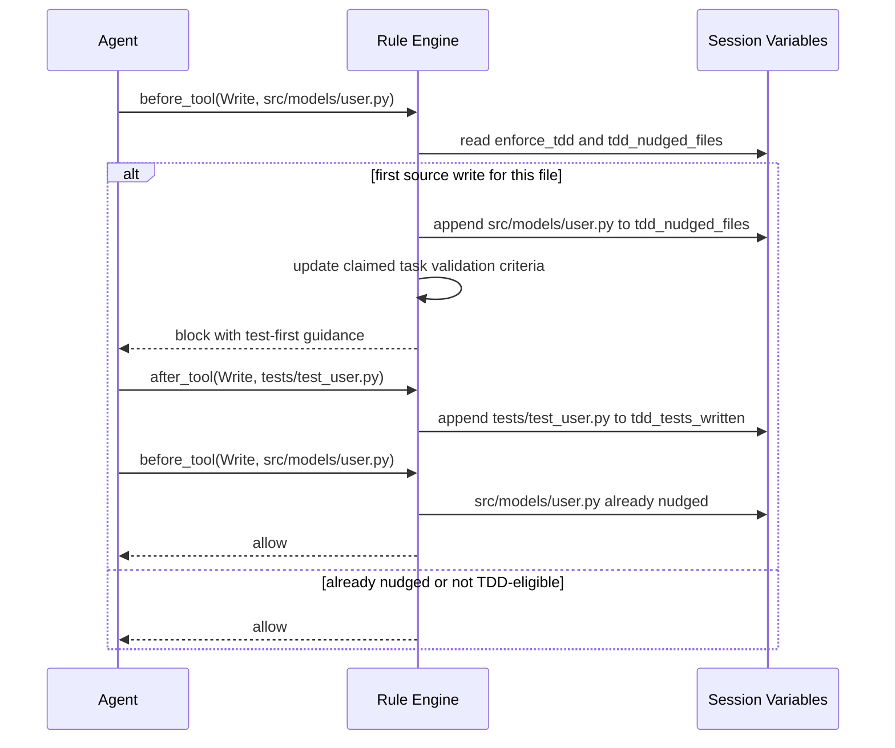

# TDD Enforcement

Gobby reinforces Test-Driven Development in two places:

1. **Expansion structure**: TDD-eligible plan entries are wrapped with phase-level
   test and refactor tasks.
2. **Runtime rules**: write attempts for new Python source files are nudged toward
   writing tests first, and successful test edits are recorded for observability.

The expansion layer owns task graph shape. The rule layer owns agent-session
behavior while the work is being performed.

---

## Expansion Sandwich

The current 0.4.0 expansion path is manifest-driven. Plan sections emit manifest
entries, and entries with `tdd: true` are wrapped per phase:

```
Epic: "User Authentication"
|
+-- P1: Core Infrastructure [subepic]
|   +-- [TEST] Phase 1: Write failing tests
|   +-- [IMPL] Create database schema
|   +-- [IMPL] Implement data access layer
|   +-- Document the API                         # docs, outside the sandwich
|   +-- [REF] Phase 1: Refactor with green tests
|
+-- P2: API Layer [subepic]
    +-- [TEST] Phase 2: Write failing tests
    +-- [IMPL] Add API endpoints
    +-- [REF] Phase 2: Refactor with green tests
```

Source of truth:

- `src/gobby/tasks/expansion/_contract.py`
- `src/gobby/plans/parser.py`
- `src/gobby/tasks/expansion/_apply.py`
- `src/gobby/tasks/categories.py`

### What Gets Wrapped

Only `code` and `config` categories are TDD-eligible:

| Category | TDD sandwich? | Notes |
|----------|---------------|-------|
| `code` | Yes | Source implementation work |
| `config` | Yes | Configuration work |
| `docs` | No | Documentation leaf work stays outside the sandwich |
| `refactor` | No | Refactor tasks can be generated by the sandwich |
| `test` | No | Test infrastructure tasks stay as explicit work |
| `research` | No | Investigation only |
| `planning` | No | Design and planning work |
| `manual` | No | Manual verification |

The canonical category set lives in `src/gobby/storage/tasks/_models.py`; the TDD
eligibility set lives in `src/gobby/tasks/categories.py`.

### Compile-Time Shape

For Plan-Coverage Contract documents, `compile_plan_to_spec` emits the sandwich
directly:

- one `[TEST] Phase N: Write failing tests` task at the start of each phase with
  at least one TDD entry
- one `[IMPL] ...` task for each TDD manifest entry
- one `[REF] Phase N: Refactor with green tests` task at the end
- unprefixed single tasks for non-TDD entries

The phase test task aggregates acceptance behavior and suggested test files from
the phase's TDD entries. The phase refactor task checks that tests remain green.

### Apply-Time Fallback

`apply_run` still protects older compiled specs that contain plain `code` or
`config` tasks without a pre-emitted sandwich. When a phase has TDD-eligible
tasks and does not set `tdd_sandwich_emitted`, apply creates:

- `[TEST] Phase N: Write failing tests`
- the original implementation tasks, using their existing titles
- `[REF] Phase N: Refactor with green tests`

This fallback avoids double-wrapping manifest-driven specs, because the compiler
marks wrapped phases with `tdd_sandwich_emitted: true`.

### Dependencies

Within a TDD phase:

- every TDD implementation task depends on the phase `[TEST]` task
- the phase `[REF]` task depends on every TDD implementation task
- non-TDD entries are emitted as normal tasks and keep their explicit
  dependencies

Across phases, the Plan-Coverage Contract compiler adds an implicit chain from a
later TDD phase's `[TEST]` task to the prior TDD phase's `[REF]` task when that
edge does not conflict with explicit manifest dependencies. The apply fallback
maps explicit cross-phase blockers through the effective TDD task for the source
phase, so downstream test work waits for the appropriate implementation or
refactor blocker.

---

## Planning Rules

Plan authors should describe feature work, not hand-author TDD wrappers.

Do not add these as plan tasks:

- `Write tests for ...`
- `Add tests for ...`
- `Ensure tests pass`
- `[TDD] ...`
- `[IMPL] ...`
- `[REF] ...`

Those patterns duplicate expansion's generated sandwich. Test infrastructure is
still valid when it is real deliverable work, such as adding a shared fixture,
configuring pytest, or creating a test harness.

Source of truth:

- `src/gobby/install/shared/skills/plan/SKILL.md`
- `src/gobby/install/shared/skills/plan-draft/SKILL.md`
- `docs/contracts/plan-coverage.md`

---

## Runtime Rules

Runtime enforcement is implemented as workflow rules under:

| Rule | Event | Priority | Path |
|------|-------|----------|------|
| `enforce-tdd-block` | `before_tool` | 32 | `src/gobby/install/shared/workflows/rules/tdd-enforcement/enforce-tdd-block.yaml` |
| `enforce-tdd-track-tests` | `after_tool` | 30 | `src/gobby/install/shared/workflows/rules/tdd-enforcement/enforce-tdd-track-tests.yaml` |

These are tool events because the rules inspect write/edit calls. Agent-turn
lifecycle rules should be authored against semantic events such as `turn_start`
and `turn_end`; raw `before_agent`, `after_agent`, and `stop` events are provider
or runtime details that the workflow engine normalizes. Agent termination is a
separate action and uses `gobby-agents:end_agent_run`.

### `enforce-tdd-block`

`enforce-tdd-block` fires on the first `Write` attempt for a new Python source
file when all of these are true:

- `enforce_tdd` is true
- the tool is `Write`
- the normalized path ends with `.py`
- the normalized path is not `__init__.py`
- the normalized path is not `conftest.py`
- the normalized path is not under `/tests/`
- the filename does not start with `test_`
- the normalized path does not end with `_test.py`
- the file has not already been recorded in `tdd_nudged_files`

When it fires, the rule:

1. appends the file path to `tdd_nudged_files`
2. updates the claimed task's validation criteria when `task_claimed` is true
3. blocks the write with guidance to create a covering test first

The block is intentionally one-shot per file. After the first nudge, the file is
already in `tdd_nudged_files`, so a later write attempt can proceed.

### `enforce-tdd-track-tests`

`enforce-tdd-track-tests` fires after successful `Write` or `Edit` calls for
test-like Python paths. It appends the file path to `tdd_tests_written` when
`enforce_tdd` is true and the normalized path matches one of these patterns:

- filename starts with `test_`
- path contains `/tests/`
- path ends with `_test.py`

This rule records test activity for validation and audit trails; it does not
block or rewrite the tool call.

---

## Variables

| Variable | Default | Purpose |
|----------|---------|---------|
| `enforce_tdd` | `false` | Enables runtime TDD rules |
| `tdd_nudged_files` | `[]` | Tracks source files that already received the one-shot nudge |
| `tdd_tests_written` | `[]` | Tracks test-like files written or edited while TDD enforcement was enabled |

Defaults live in
`src/gobby/install/shared/workflows/variables/gobby-default-variables.yaml`.

### Enabling TDD For A Session

Via MCP session variable helper:

```python
set_variable(name="enforce_tdd", value=True, session_id="#350")
```

Via CLI:

```bash
gobby workflows set-var enforce_tdd true --session <SESSION_ID>
```

Agent definitions can also pre-seed workflow variables:

```yaml
workflows:
  variables:
    enforce_tdd: true
```

---

## Runtime Flow



---

## Verification Checklist

When auditing this guide, verify:

- `TDD_ELIGIBLE_CATEGORIES` is still `{"code", "config"}`
- `compile_plan_to_spec` still emits `[TEST]`, `[IMPL]`, and `[REF]` for TDD
  manifest entries
- `apply_run` still suppresses fallback wrapping when `tdd_sandwich_emitted` is
  true
- runtime rule paths still live under
  `src/gobby/install/shared/workflows/rules/tdd-enforcement/`
- default variables still live in
  `src/gobby/install/shared/workflows/variables/gobby-default-variables.yaml`
- `set_variable` is still exposed as the top-level MCP helper for live session
  variables
- the CLI command `gobby workflows set-var` still accepts `--session`

## See Also

- [Task Expansion](./task-expansion.md) - How expansion creates task graphs
- [Rules](./rules.md) - Rule system reference
- [Variables](./variables.md) - Session variables and enforcement
- [Orchestration](./orchestration.md) - How automated task stages dispatch work

_Last verified: 2026-05-07_
