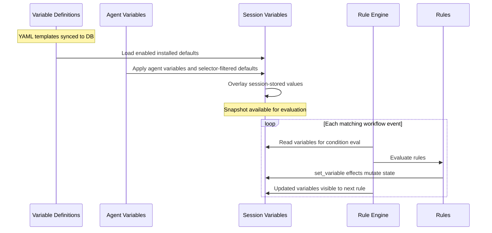

# Variables

Session variables are mutable state scoped to one Gobby session. Rules, agent
definitions, MCP tools, and CLI helpers read and write them to coordinate
enforcement, context injection, and state tracking.

Variables come from enabled variable definitions, are overlaid with
session-stored values, and can be mutated by `set_variable` rule effects or the
top-level `set_variable` MCP tool. Rule `when` conditions read the current
variable snapshot for each evaluated event.

For how variables fit into the broader workflow system, see [Workflows Overview](./workflows-overview.md).

---

## Variable Lifecycle



---

## Initialization

Bundled variables are defined in YAML and synced into
`workflow_definitions` rows where `workflow_type = 'variable'`:

```yaml
# src/gobby/install/shared/workflows/variables/gobby-default-variables.yaml
tags: [session-defaults, initialization]

variables:
  task_claimed:
    value: false
    description: Default task_claimed to false
  stop_attempts:
    value: 0
    description: Default stop_attempts to 0
  max_stop_attempts:
    value: 8
    description: Default max_stop_attempts to 8
```

Each variable entry becomes a `VariableDefinitionBody` in the database:

```yaml
variable: "task_claimed"      # Variable name
value: false                  # Default value
description: "..."            # Optional description
```

### Runtime Resolution

At rule-evaluation time, `SessionVariableManager.get_variables()` returns:

1. enabled installed variable definition defaults
2. values persisted in the session's `session_variables` row

Session values win over defaults. This means newly synced defaults are visible
even when a session row has not materialized them yet.

On session bootstrap, persona application, and spawned-agent setup, agent
definitions can also merge variables into the session row:

1. `_agent_type`, active rule and skill metadata
2. explicit `workflows.variables` overrides from the agent definition
3. defaults selected by the agent's `variable_selectors`
4. task handoff values such as `assigned_task_id` and `session_task`
5. any caller-supplied variables

Rules with `session_start`, `turn_start`, `before_tool`, `after_tool`, or
`turn_end` can then mutate variables via `set_variable`.

### Variable Selectors

Agent definitions control which variables are loaded:

```yaml
# default.yaml - omitted/null means all enabled installed defaults apply
workflows:
  # variable_selectors: null

# A restricted agent might narrow scope:
workflows:
  variable_selectors:
    include: ["tag:session-defaults"]
    exclude: ["name:enforce_tdd"]
```

**Source**: `src/gobby/workflows/definitions.py` — `VariableDefinitionBody`

---

## Mutation

Variables are mutated by `set_variable` rule effects during rule evaluation:

```yaml
# Literal value
effect:
  type: set_variable
  variable: task_claimed
  value: true

# Expression (evaluated by SafeExpressionEvaluator)
effect:
  type: set_variable
  variable: stop_attempts
  value: "variables.get('stop_attempts', 0) + 1"

# List append
effect:
  type: set_variable
  variable: tdd_nudged_files
  value: "variables.get('tdd_nudged_files', []) + [tool_input.get('file_path', '')]"
```

### Expression Detection

The engine detects expressions by looking for these indicators in string values:
- `assistant_response_matches_any(`, `variables.`, `event.`, `tool_input.`
- `.get(`, `len(`
- ` + `, ` - `, ` and `, ` or `, ` not `

If none of these appear, the value is treated as a literal.

Jinja2 templates are rendered before expression evaluation when the value
contains `{{ ... }}`. Rendered booleans and numbers are coerced back to native
types.

### Mutation Visibility

`set_variable` effects are **immediately visible** to later rules in the same evaluation pass. This enables rule chaining:

```yaml
# Rule 1 (priority 10): increment counter
increment-stop:
  priority: 10
  effect:
    type: set_variable
    variable: stop_attempts
    value: "variables.get('stop_attempts', 0) + 1"

# Rule 2 (priority 50): block based on counter (sees updated value)
require-task-close:
  priority: 50
  when: "variables.get('stop_attempts', 0) < variables.get('max_stop_attempts', 8)"
  effect:
    type: block
    reason: "Close your task before stopping."
```

### Auto-Managed Variables

Some variables are managed by the rule engine itself or by built-in observers,
not only by declarative rules:

| Variable | Auto-behavior |
|----------|--------------|
| `stop_attempts` | Incremented on `turn_end`, reset to 0 on `turn_start` |
| `consecutive_tool_blocks` | Incremented when same blocked tool is retried, reset on different tool |
| `tool_block_pending` | Set `true` on tool failure, cleared on tool success |
| `_last_blocked_tool` | Tracks which tool was last blocked |
| `force_allow_stop` | Set `true` on catastrophic failures (rate limit, billing) |
| `baseline_dirty_files` | Initialized from the first rule evaluation's git status |
| `session_edited_files` | Updated by tool observers as the session edits files |

`errors_resolved` is reset by verification observers after failed validation commands.
Fresh successful validation commands set `verification_evidence_recorded` and append
`validation_command` evidence to `verification_evidence`; manual evidence should use
`gobby-sessions:record_verification_evidence` with a snake-case `evidence_type` such as
`manual_diff_review`.

---

## Using Variables in Conditions

Variables are available in rule `when` conditions via two access patterns:

```yaml
# Direct access (flattened to top level)
when: "task_claimed and not plan_mode"

# Dict access (with defaults)
when: "variables.get('stop_attempts', 0) < 3"
```

Both are equivalent — session variables are flattened into the evaluation context for convenience.

### Condition Evaluation

Conditions are evaluated by `SafeExpressionEvaluator`, an AST-based evaluator that provides safe expression evaluation without `eval()`.

**Supported operations**: boolean logic (`and`, `or`, `not`), comparisons
(`==`, `!=`, `<`, `>`, `is`, `is not`, `in`, `not in`), arithmetic (`+`, `-`,
`*`, `//`, `%`), attribute/subscript access, list/dict/tuple literals, list
and generator comprehensions, method calls on safe types, and ternary
expressions.

**Fail behavior**: Block effects fail **closed** (condition error → condition is `true` → block fires). Other effects fail **open** (condition error → condition is `false` → effect skipped). This is conservative: better to block wrongly than to corrupt state.

See [Rule Authoring Guide — Variable Safety In `when`](./workflow-rules.md#variable-safety-in-when) for authoring guidance.

---

## Using Variables in Templates

Variables are available in `inject_context` templates and `block` reason strings via Jinja2 syntax:

```yaml
effect:
  type: inject_context
  template: |
    You are working on task {{ task_ref }}: {{ task_title }}
    Stop attempts: {{ stop_attempts }}/{{ max_stop_attempts }}

effect:
  type: block
  reason: |
    Tasks in progress: {{ claimed_tasks.values() | list | join(', ') }}.
    Commit and close_task().
```

Jinja2 filters work: `| list`, `| join(', ')`, `| first`, `| default('')`, `| length`, `| lower`.

---

## LazyBool Pattern

For expensive computations (git status, DB queries), Gobby uses `LazyBool` — a deferred boolean that computes its value only when accessed:

```python
class LazyBool:
    def __init__(self, thunk: Callable[[], bool]):
        self._thunk = thunk
        self._computed = False
        self._value = False

    def __bool__(self) -> bool:
        if not self._computed:
            self._value = self._thunk()
            self._computed = True
        return self._value
```

LazyBool values are passed in the `eval_context` parameter to the rule engine. They look like regular booleans in `when` conditions but only evaluate when referenced:

```yaml
# This condition won't trigger the expensive git check
# unless the first part (task_claimed) is true
when: "task_claimed and has_uncommitted_changes"
```

If `task_claimed` is `false`, Python's short-circuit evaluation prevents `has_uncommitted_changes` from computing.

**Source**: `src/gobby/workflows/safe_evaluator.py` — `LazyBool`

---

## Built-in Condition Helpers

These functions are available in `when` conditions and provide higher-level checks:

### Task Helpers

| Function | Description |
|----------|-------------|
| `task_tree_complete(task_id)` | Check if a task and all subtasks are recursively complete. A task is complete if `closed` or `needs_review` (without `requires_user_review`). |
| `task_needs_human_review(task_id)` | Check if task is in `needs_review` status AND has the `requires_user_review` flag set. |

```yaml
when: "task_tree_complete(variables.get('session_task'))"
when: "task_needs_human_review(variables.get('auto_task_ref'))"
```

### Stop Signal Helper

| Function | Description |
|----------|-------------|
| `has_stop_signal(session_id)` | Check if a stop signal is pending for the session. |

### MCP Tracking Helpers

| Function | Description |
|----------|-------------|
| `mcp_called(server, tool?)` | Was this MCP tool called successfully? |
| `mcp_result_is_null(server, tool)` | Is the MCP result null/missing? |
| `mcp_failed(server, tool)` | Did the MCP call fail? |
| `mcp_result_has(server, tool, field, value)` | Does the MCP result have a specific field value? |

```yaml
when: "mcp_called('gobby-memory', 'search_memories')"
when: "not mcp_failed('gobby-tasks', 'get_task')"
```

### Progressive Discovery Helpers

| Function | Description |
|----------|-------------|
| `is_server_listed(tool_input)` | Has this server been listed through `list_tools` or internal pre-seeding? |
| `is_tool_unlocked(tool_input)` | Was this tool's schema fetched via `get_tool_schema`? |
| `is_discovery_tool(tool_name)` | Is this a discovery tool (list_servers, list_tools, etc.)? |
| `is_operator_tool(tool_name)` | Is this an out-of-band operator/debug tool? |

### Other Helpers

| Function | Description |
|----------|-------------|
| `task_state_in(task_id, *states)` | Check a task's projected stage-native state |
| `skill_loaded(name)` | Check whether a skill was loaded through `gobby-skills:get_skill` |
| `assistant_response_matches_any(patterns, regex=False)` | Match assistant output for response-quality rules |
| `normalize_path(path)` | Normalize path separators for portable comparisons |
| `is_plan_file(path)` | Check whether a path is a plan artifact |
| `is_current_plan_artifact(file_path, artifact_path)` | Check whether a file is the active plan artifact |
| `get_touched_file_paths(tool_input)` | Extract files affected by a tool call |
| `requires_task_for_any_touched_file(tool_input, source, plan_mode)` | Check whether touched files require a claimed task |
| `is_message_delivery_tool(tool_name)` | Check whether a tool delivers inter-session messages |
| `has_pending_messages(session_id)` | Check whether a session has pending inter-session messages |
| `pending_message_count(session_id)` | Count pending inter-session messages for a session |

**Source**: `src/gobby/workflows/safe_evaluator.py` — `build_condition_helpers`, `src/gobby/workflows/condition_helpers.py`, `src/gobby/workflows/engine/templating.py`, `src/gobby/workflows/enforcement/blocking.py`

---

## Default Variables Reference

These are the bundled default variables (from `gobby-default-variables.yaml`):

| Variable | Default | Type | Purpose |
|----------|---------|------|---------|
| `task_claimed` | `false` | bool | Whether a task is claimed in this session |
| `claimed_tasks` | `{}` | dict | Map of claimed task UUIDs to refs (`{uuid: '#N'}`) |
| `require_task_before_edit` | `true` | bool | Enforce task-before-edit gate |
| `require_commit_before_status` | `true` | bool | Enforce commit-before-status gate |
| `stop_attempts` | `0` | int | Consecutive turn-end attempts (auto-managed) |
| `max_stop_attempts` | `8` | int | Threshold before escape hatch allows stop |
| `max_consecutive_blocked_tool_attempts` | `5` | int | Retry threshold for repeated blocked tool calls |
| `mode_level` | `2` | int | Autonomy level (0=plan, 1=accept_edits, 2=full auto) |
| `chat_mode` | `"bypass"` | string | Chat mode setting |
| `require_uv` | `true` | bool | Enforce `uv` for Python operations |
| `enforce_tdd` | `false` | bool | Enable TDD enforcement |
| `tdd_nudged_files` | `[]` | list | Files TDD-nudged this session (internal) |
| `tdd_tests_written` | `[]` | list | Test files written during TDD (internal) |
| `enforce_tool_schema_check` | `true` | bool | Enforce progressive discovery |
| `auto_inject_handoff` | `true` | bool | Populate session summary template vars |
| `servers_listed` | `true` | bool | Internal MCP servers are pre-seeded at startup |
| `listed_servers` | internal server list | list | Internal servers discovered or pre-seeded for progressive discovery |
| `unlocked_tools` | `[]` | list | Tools unlocked via `get_tool_schema` |
| `errors_resolved` | `false` | bool | Whether all discovered errors have been fixed |
| `error_triage_blocks` | `0` | int | Count of error-triage gate blocks in this session |
| `is_subagent` | `false` | bool | Whether a native subagent is currently active |
| `loaded_skills` | `[]` | list | Skills loaded through `gobby-skills:get_skill` |
| `memory_nudge_fired` | `false` | bool | Whether the memory capture nudge fired this session |
| `skill_discovery_instructions_shown` | `false` | bool | Whether skill discovery instructions were shown |
| `brevity_disabled` | `false` | bool | Whether brevity reinforcement is disabled |
| `brevity_last_violation` | `""` | string | Last response fragment that violated brevity rules |
| `brevity_last_violation_rule` | `""` | string | Brevity rule matched by the last violation |
| `_agent_context_injected` | `false` | bool | Whether agent identity was injected on first pre-turn event |
| `_agent_identity_reinject` | `false` | bool | Whether persona identity should be reinjected |
| `edit_write_pending` | `false` | bool | Whether a write-like tool call is pending |
| `edit_write_stop_blocks` | `0` | int | Circuit breaker for write-pending stop gate |
| `context7_available` | `true` | bool | Whether Context7 is configured and available |

### Internal Variables (Set by Rules/Engine)

These are set during execution, not initialized from definitions:

| Variable | Type | Purpose |
|----------|------|---------|
| `task_ref` | string | Current task reference (e.g., `#1234`) |
| `plan_mode` | bool | Whether the agent is in plan mode |
| `tool_block_pending` | bool | A tool was just blocked/failed |
| `consecutive_tool_blocks` | int | Same-tool retry counter |
| `_last_blocked_tool` | string | Which tool was last blocked |
| `force_allow_stop` | bool | Catastrophic failure bypass |
| `_agent_type` | string | Current agent type (for agent_scope filtering) |
| `_active_rule_names` | list | Rules active for this session (from selectors) |
| `_active_skill_names` | list | Skills active for this session |
| `_observations` | list | Accumulated observe effect entries |
| `_assigned_pipeline` | string | Pipeline to auto-run on start |
| `assigned_task_id` | string | Task ref assigned to a spawned/persona task worker |
| `session_task` | string | Current task ref or UUID used by task-aware rules |
| `baseline_dirty_files` | list | Dirty files captured as the session baseline |
| `session_edited_files` | list | Files edited by this session |
| `full_session_summary` | string | Previous session summary (for handoff) |
| `compact_session_summary` | string | Compact session summary |

---

## Managing Variables

### CLI

```bash
# View all variables for a session
gobby workflows status --session <ID> --json

# Get one variable, or omit the name to print all variables
gobby workflows get-var <name> --session <ID> --json

# Set a variable
gobby workflows set-var <name> <value> --session <ID>
```

### MCP Tools

| Tool | Description |
|------|-------------|
| `set_variable` | Set a session variable (top-level MCP tool) |
| `get_variable` | Get a session variable value |
| `get_workflow_status` | Show workflow instances and live session variables (`gobby-workflows`) |
| `list_variables` | List variable definitions, not live session values (`gobby-workflows`) |
| `get_variable_definition` | Read one variable definition (`gobby-workflows`) |

---

## File Locations

| Path | Purpose |
|------|---------|
| `src/gobby/install/shared/workflows/variables/` | Bundled variable definitions |
| `src/gobby/workflows/state_manager.py` | Session variable persistence |
| `src/gobby/workflows/sync_variables.py` | Sync bundled variable YAML into DB definitions |
| `src/gobby/workflows/safe_evaluator.py` | SafeExpressionEvaluator + LazyBool |
| `src/gobby/workflows/condition_helpers.py` | Built-in condition helper functions |
| `src/gobby/workflows/definitions.py` | VariableDefinitionBody model |
| `src/gobby/mcp_proxy/tools/workflows/_variables.py` | Runtime and definition MCP variable tools |
| `src/gobby/cli/workflows/variables.py` | `gobby workflows get-var` and `set-var` |

## See Also

- [Workflows Overview](./workflows-overview.md) — How variables connect rules, agents, and pipelines
- [Rules](./rules.md) — Rules that read and write variables
- [Agents](./agents.md) — Agent selectors that control variable loading

_Last verified: 2026-05-07_
