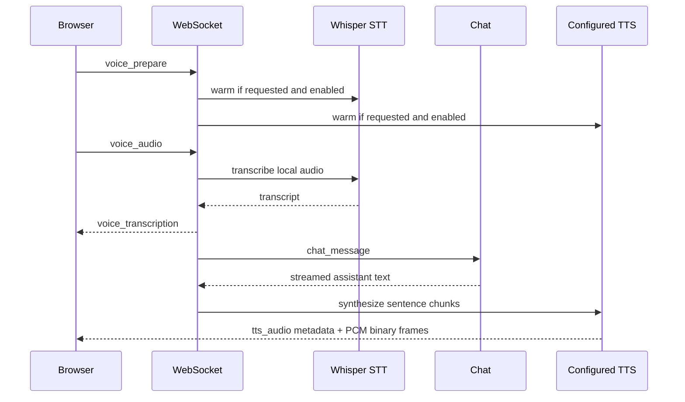

# Voice Chat

Gobby provides speech-to-text (STT) and text-to-speech (TTS) for web chat and
attached CLI conversations. Browser capture uses local Whisper through
`faster-whisper`. TTS defaults to embedded Chatterbox Turbo; the external
[Crane provider](./crane-tts.md) is also registered. The one-shot HTTP audio
endpoint supports transcription and translation through configured audio bindings.

## Overview

The voice path layers on top of the normal chat WebSocket flow:



The browser records audio, sends it to the local daemon over the chat
WebSocket, and receives transcription/status events plus TTS audio frames.
With the current `chatterbox` provider, STT and TTS inference run on your
machine. The browser VAD may fetch its WebAssembly runtime from the configured
asset URL, but it does not send recorded audio to a third-party service.

## Installation

### During `gobby install`

The full installer asks whether to enable voice chat. Say yes, or enable it
later on an existing install with the `voice` component:

```bash
gobby install voice
```

The voice packages are installed by normal project sync. This command sets
`voice.enabled=true` in daemon config when the config store is available.

### Dependency health

```bash
uv sync
```

Voice packages are normal project dependencies. Voice also has a runtime
dependency check. When voice is enabled and a required STT or TTS package is
missing, the daemon reports the broken environment and asks you to run
`uv sync`.

## Configuration

Use `gobby-config:get_config_values` to read desired/active configuration and its
revision, then `patch_config_values(expected_revision=..., values={...})` with
nested values such as `{"voice":{"enabled":true}}`. Re-read after a revision
conflict before retrying. The YAML
below illustrates the configuration shape; it is not a file to install.

Enable the master switch (default false), then keep STT and TTS enabled (both
default true) or disable either browser side independently:

```yaml
voice:
  enabled: true
  stt_enabled: true
  tts_enabled: true
  tts_provider: chatterbox
```

Inspect active/pending values after the patch; follow the
[configuration write contract](./configuration.md). Loaded voice models retain
their configuration until released. Opening another conversation alone does not
replace the cached TTS provider. Voice cleanup unloads models when no web chat
sessions remain. If a restart is needed, coordinate it with active sessions;
new adapter code requires a daemon restart.

Common STT options:

```yaml
voice:
  whisper_model_size: base
  whisper_device: auto
  whisper_compute_type: int8
  whisper_prompt: Gobby
  whisper_vocabulary:
    - Gobby
    - Kubernetes
    - FastAPI
```

The config describes `tiny`, `base`, `small`, and `medium` Whisper sizes; the
field is a string passed to the installed faster-whisper runtime, not a config
enum. The default vocabulary already includes Gobby and common development
terms. `transcription_timeout_seconds` defaults to 120 seconds.

`voice.openai_compatible_audio` adds HTTP audio bindings, each with `provider`,
`url` (including `/v1`), `model`, optional `$secret:NAME` API-key reference,
`transcription_enabled`, `translation_enabled`, and `timeout_seconds`.
Provider IDs must be unique without regard to case and cannot use reserved
built-in IDs. These bindings have their own capability switches; disabling
browser Whisper does not disable them. Recordings sent to a selected compatible
binding go to its configured endpoint. See the audio API below for explicit
provider selection.

## Reference Audio

Chatterbox performs zero-shot voice cloning from a short reference clip:

```yaml
voice:
  tts_reference_audio: ~/.gobby/voice/reference.wav
```

Guidelines:

- Duration: longer than 5 seconds is required; 10-20 seconds works well
- Format: WAV
- Content: clean speech, one speaker, consistent tone
- Quality: quiet room, minimal noise, no overlapping voices

### Optional `tts_reference_text`

Crane requires the exact, nonempty transcript of its reference recording:

```yaml
voice:
  tts_reference_audio: ~/.gobby/voice/reference.wav
  tts_reference_text: "The exact transcript of that reference clip."
```

Chatterbox reports `supports_reference_text: false` and ignores this field.

## TTS Provider

### Chatterbox

Chatterbox Turbo is the default embedded TTS provider.

```yaml
voice:
  enabled: true
  tts_enabled: true
  tts_provider: chatterbox
  tts_reference_audio: ~/.gobby/voice/reference.wav
  tts_temperature: 0.55
  tts_device: auto
  tts_clause_max_chars: 180
  tts_chatterbox_max_generation_tokens: 1000
```

Notes:

- Uses `tts_reference_audio`
- Ignores `tts_reference_text`
- Outputs PCM audio at 24 kHz unless the upstream model reports another rate
- `tts_device` accepts `auto`, `cuda`, `mps`, or `cpu`
- `tts_clause_max_chars` splits assistant text before synthesis
- `tts_chatterbox_max_generation_tokens` caps each Chatterbox generation call

### Crane

Crane is an external provider selected with `tts_provider: crane`. The operator
manages its process; Gobby checks readiness and consumes its streamed PCM.
It requires a readable nonempty WAV plus `tts_reference_text`. Its reference
duration requirement differs from Chatterbox's five-second minimum. See
[Crane setup and recovery](./crane-tts.md).

## Web Chat Usage

1. Open the web chat at `http://localhost:60887`.
2. Use the microphone button in the chat input to enable STT — each click
   cycles off → Push to Talk → VAD → off.
3. In Push to Talk mode with an empty composer, use the primary **Start push to
   talk** button. Hold and release to submit, or tap to keep recording and tap
   again to submit. Escape cancels; focused Enter/Space records until released.
   The toolbar microphone changes modes. In VAD mode, speech start/end is
   detected automatically.
4. Use the speaker button in the chat input to toggle TTS playback for
   assistant responses.

When either STT or TTS is enabled, the browser sends `voice_prepare` to warm the
requested, config-enabled models. `/api/voice/status` accepts optional
`want_stt` and `want_tts` query booleans. `voice_loading` and `voice_ready` are
scoped to those targets; omitted targets use the daemon's enabled sides.
Ready requires at least one requested side and every requested side ready.
Availability checks alone do not load or warm models.

Barge-in is supported. Starting STT capture or pressing the stop control sends
`tts_stop`, cancels the active TTS pipeline for that conversation, and clears
queued local playback.

With an attached CLI target, recognized text is sent to that session through
the existing session-control path. Playback can consume attached-session text.
Select the intended conversation before recording: successful capture submits
the transcript, rather than merely previewing it.

## API and WebSocket Reference

HTTP routes:

| Route | Purpose |
|-------|---------|
| `GET /api/voice/status` | Report voice config, package availability, warmup state, and TTS provider capabilities |
| `POST /api/voice/transcribe` | One-shot audio transcription or translation; does not submit to chat |

The POST accepts multipart `file`, plus optional `capability` (default
`audio_transcribe`; also `audio_translate`), `provider`, `model`, `language`,
and `prompt`. Use `provider=whisper` to select local processing explicitly.
Configured compatible providers can receive uploaded audio even when browser
Whisper is disabled. Compatible adapters forward prompt overrides and forward
language for transcription (translation omits language);
Whisper uses its configured prompt and automatic language detection.

The response includes `text`, `segments`, `language`, `task`, `bytes`,
`content_type`, `capability`, `provider`, and `model`. Uploads obey the server's
attachment size limit (413 when exceeded). Invalid or unavailable capability
selection returns 400; runtime provider unavailability returns 503; timeout
returns 504. Inspect the error instead of silently changing providers.

Important status fields from `/api/voice/status`:

- `enabled`
- `stt_enabled`
- `stt_available`
- `stt_reason`
- `whisper_model`
- `stt_warmup_status`
- `stt_warmup_error`
- `tts_enabled`
- `tts_provider`
- `tts_available`
- `tts_reason`
- `tts_backend_kind`
- `tts_capabilities`
- `tts_warmup_status`
- `tts_warmup_error`
- `voice_ready`
- `voice_loading`
- `transcription_enabled` and `translation_enabled` (HTTP audio capability availability)

Voice WebSocket messages:

| Message | Direction | Purpose |
|---------|-----------|---------|
| `voice_prepare` | Browser -> daemon | Start lazy STT/TTS warmup |
| `voice_mode_toggle` | Browser -> daemon | Enable or disable TTS for a conversation |
| `voice_audio` | Browser -> daemon | Submit recorded WAV audio for STT |
| `voice_status_request` | Browser -> daemon | Read status scoped by optional STT/TTS intent |
| `voice_status` | Daemon -> browser | Report transcribing, empty, error, preparing, or mode status |
| `voice_transcription` | Daemon -> browser | Return STT text and request metadata |
| `tts_audio` | Daemon -> browser | Send metadata before the next PCM binary audio frame |
| `tts_status` | Daemon -> browser | Report TTS idle or error state |
| `tts_stop` | Browser -> daemon | Cancel active TTS for the conversation |

`voice_prepare` uses optional boolean `stt_enabled` and `tts_enabled` fields;
`voice_status_request` uses `want_stt` and `want_tts`. These express request
intent and do not rewrite daemon config.
`voice_audio` carries base64 `audio_data`, `mime_type`, `conversation_id`, and
`request_id`, with optional `project_id` and attached `target_session_id`.
The browser sends WAV; the Whisper decoder also handles supported WebM and other
audio MIME types. A normal `chat_message` can carry per-message `tts_enabled`
intent before its TTS pipeline is created.

## Whisper Vocabulary Tools

The `gobby-voice` MCP server manages the Whisper vocabulary stored in daemon
config:

| Tool | Input | Purpose |
|------|-------|---------|
| `add_vocab` | `terms: string` | Add comma-separated terms, deduplicated case-insensitively |
| `remove_vocab` | `terms: string` | Remove comma-separated terms, matched case-insensitively |
| `list_vocab` | none | List active vocabulary and `whisper_prompt` |
| `clear_vocab` | none | Empty the entire desired vocabulary, including seeded terms |

Example:

```text
add_vocab(terms="Kubernetes, FastAPI")
```

Mutations use desired values and a revision-checked config patch; listing reads
active values. Check `success` and configuration errors, and compare desired with
active values if a write is not visible yet. Blank add/remove input is rejected.
Matching uses lowercase comparisons. Clearing preserves `whisper_prompt` and
does not restore defaults. A cached Whisper instance can retain its earlier
prompt/vocabulary until model cleanup.

## Troubleshooting

| Issue | What to check |
|-------|---------------|
| "Voice not enabled" | Enable through `gobby install voice` or revisioned config; inspect active values |
| Voice controls are hidden | Check `/api/voice/status`; at least one side must be enabled in daemon config |
| STT toggle is disabled | Use HTTPS or localhost and check `stt_enabled`, `stt_available`, and `stt_reason` |
| TTS toggle is disabled | Check `tts_enabled`, `tts_available`, `tts_reason`, and `tts_reference_audio_exists` |
| Warmup never reaches ready | Check `stt_warmup_error` and `tts_warmup_error` |
| Reference audio is rejected | Chatterbox: readable clip longer than 5 seconds. Crane: valid nonempty WAV and transcript |
| Cloning sounds wrong | Use a cleaner 10-20s clip with one speaker |
| Chatterbox is unstable on your machine | Try `tts_device: cpu` |
| Technical terms transcribe poorly | Add them with the `gobby-voice` vocabulary tools |

_Last verified: 2026-09-12_
