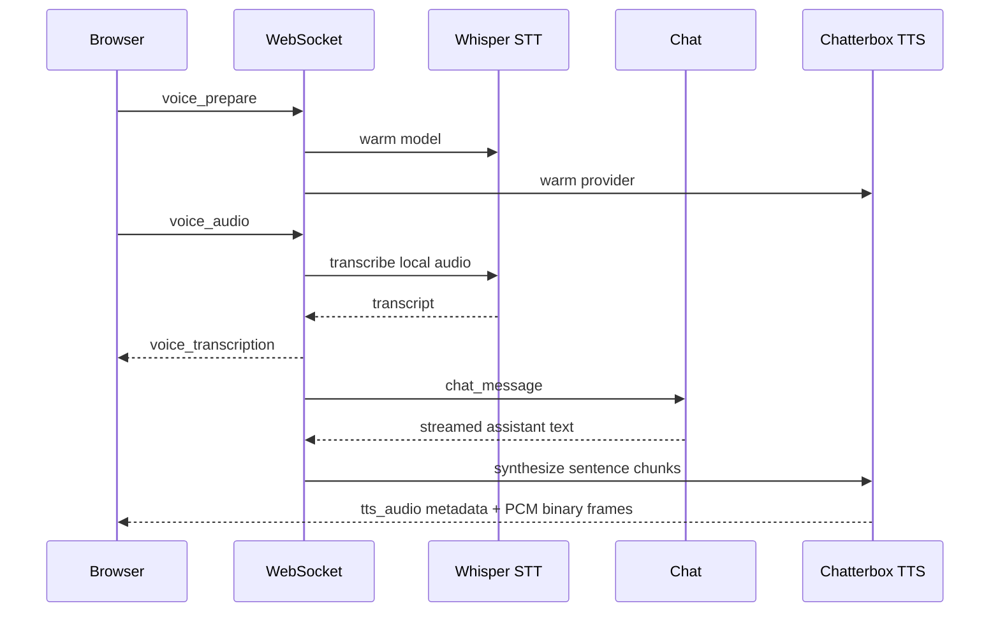

# Voice Chat

Gobby provides local speech-to-text (STT) and local text-to-speech (TTS) for
voice conversations in the web chat. STT uses Whisper through
`faster-whisper`; the shipped TTS provider is Chatterbox Turbo.

## Overview

The voice path layers on top of the normal chat WebSocket flow:



The browser records audio, sends it to the local daemon over the chat
WebSocket, and receives transcription/status events plus TTS audio frames.
With the current `chatterbox` provider, STT and TTS inference run on your
machine. The browser VAD may fetch its WebAssembly runtime from the configured
asset URL, but it does not send recorded audio to a third-party service.

## Installation

### During `gobby install`

The installer asks whether to enable voice chat. Say yes, or pass `--voice`:

```bash
gobby install --voice
```

That installs `faster-whisper` and `chatterbox-tts` into the active environment
and sets `voice.enabled=true` in daemon config when the config store is
available.

### Manual dependency install

```bash
uv sync --extra voice
```

Voice also has a runtime dependency check. When voice is enabled and a required
STT or TTS package is missing, the daemon attempts a bounded `uv pip install`
for the missing package during first voice use or warmup.

## Configuration

Enable the master switch, then keep STT and TTS enabled or disable either side
independently:

```yaml
voice:
  enabled: true
  stt_enabled: true
  tts_enabled: true
  tts_provider: chatterbox
```

Restart the daemon after config changes:

```bash
gobby restart
```

Common STT options:

```yaml
voice:
  whisper_model_size: base
  whisper_device: auto
  whisper_compute_type: int8
  whisper_prompt: Gobby
  whisper_vocabulary:
    - Gobby
    - Kubernetes
    - FastAPI
```

`whisper_model_size` accepts `tiny`, `base`, `small`, or `medium`. The default
vocabulary already includes Gobby and common development terms.

## Reference Audio

Chatterbox performs zero-shot voice cloning from a short reference clip:

```yaml
voice:
  tts_reference_audio: ~/.gobby/voice/reference.wav
```

Guidelines:

- Duration: longer than 5 seconds is required; 10-20 seconds works well
- Format: WAV
- Content: clean speech, one speaker, consistent tone
- Quality: quiet room, minimal noise, no overlapping voices

### Optional `tts_reference_text`

The config model preserves a transcript field for providers that may use
reference text in the future:

```yaml
voice:
  tts_reference_audio: ~/.gobby/voice/reference.wav
  tts_reference_text: "The exact transcript of that reference clip."
```

Chatterbox currently reports `supports_reference_text: false`, so this field is
ignored by the shipped provider.

## TTS Provider

### Chatterbox

Chatterbox Turbo is the only registered TTS provider in 0.4.0.

```yaml
voice:
  enabled: true
  tts_enabled: true
  tts_provider: chatterbox
  tts_reference_audio: ~/.gobby/voice/reference.wav
  tts_temperature: 0.55
  tts_device: auto
  tts_clause_max_chars: 180
  tts_chatterbox_max_generation_tokens: 1000
```

Notes:

- Uses `tts_reference_audio`
- Ignores `tts_reference_text`
- Outputs PCM audio at 24 kHz unless the upstream model reports another rate
- `tts_device` accepts `auto`, `cuda`, `mps`, or `cpu`
- `tts_clause_max_chars` splits assistant text before synthesis
- `tts_chatterbox_max_generation_tokens` caps each Chatterbox generation call

## Web Chat Usage

1. Open the web chat at `http://localhost:60887`.
2. Open Settings and enable Speech to Text, Text to Speech, or both.
3. For STT, choose Push to Talk or VAD.
4. Use the microphone button for push-to-talk recording, or let VAD detect
   speech start/end automatically.
5. Use the speaker button to enable TTS playback for assistant responses.

When either STT or TTS is enabled, the browser sends `voice_prepare` to warm the
models. `/api/voice/status` reports `voice_loading=true` while warmup is in
progress and `voice_ready=true` after all enabled voice models are ready.

Barge-in is supported. Starting STT capture or pressing the stop control sends
`tts_stop`, cancels the active TTS pipeline for that conversation, and clears
queued local playback.

## API and WebSocket Reference

HTTP routes:

| Route | Purpose |
|-------|---------|
| `GET /api/voice/status` | Report voice config, package availability, warmup state, and TTS provider capabilities |
| `POST /api/voice/transcribe` | Test-only one-shot audio transcription endpoint |

Important status fields from `/api/voice/status`:

- `enabled`
- `stt_enabled`
- `stt_available`
- `stt_reason`
- `whisper_model`
- `stt_warmup_status`
- `stt_warmup_error`
- `tts_enabled`
- `tts_provider`
- `tts_available`
- `tts_reason`
- `tts_backend_kind`
- `tts_capabilities`
- `tts_warmup_status`
- `tts_warmup_error`
- `voice_ready`
- `voice_loading`

Voice WebSocket messages:

| Message | Direction | Purpose |
|---------|-----------|---------|
| `voice_prepare` | Browser -> daemon | Start lazy STT/TTS warmup |
| `voice_mode_toggle` | Browser -> daemon | Enable or disable TTS for a conversation |
| `voice_audio` | Browser -> daemon | Submit recorded WAV audio for STT |
| `voice_status` | Daemon -> browser | Report transcribing, empty, error, preparing, or mode status |
| `voice_transcription` | Daemon -> browser | Return STT text and request metadata |
| `tts_audio` | Daemon -> browser | Send metadata before the next PCM binary audio frame |
| `tts_status` | Daemon -> browser | Report TTS idle or error state |
| `tts_stop` | Browser -> daemon | Cancel active TTS for the conversation |

## Whisper Vocabulary Tools

The `gobby-voice` MCP server manages the Whisper vocabulary stored in daemon
config:

| Tool | Input | Purpose |
|------|-------|---------|
| `add_vocab` | `terms: string` | Add comma-separated terms, deduplicated case-insensitively |
| `remove_vocab` | `terms: string` | Remove comma-separated terms, matched case-insensitively |
| `list_vocab` | none | List current vocabulary and `whisper_prompt` |
| `clear_vocab` | none | Clear all custom vocabulary terms |

Example:

```text
add_vocab(terms="Kubernetes, FastAPI")
```

## Troubleshooting

| Issue | What to check |
|-------|---------------|
| "Voice not enabled" | Set `voice.enabled: true` and restart the daemon |
| Voice controls are hidden | Check `/api/voice/status`; at least one side must be enabled in daemon config |
| STT toggle is disabled | Use HTTPS or localhost and check `stt_enabled`, `stt_available`, and `stt_reason` |
| TTS toggle is disabled | Check `tts_enabled`, `tts_available`, `tts_reason`, and `tts_reference_audio_exists` |
| Warmup never reaches ready | Check `stt_warmup_error` and `tts_warmup_error` |
| Reference audio is rejected | Use a readable WAV file longer than 5 seconds |
| Cloning sounds wrong | Use a cleaner 10-20s clip with one speaker |
| Chatterbox is unstable on your machine | Try `tts_device: cpu` |
| Technical terms transcribe poorly | Add them with the `gobby-voice` vocabulary tools |

_Last verified: 2026-05-07_
