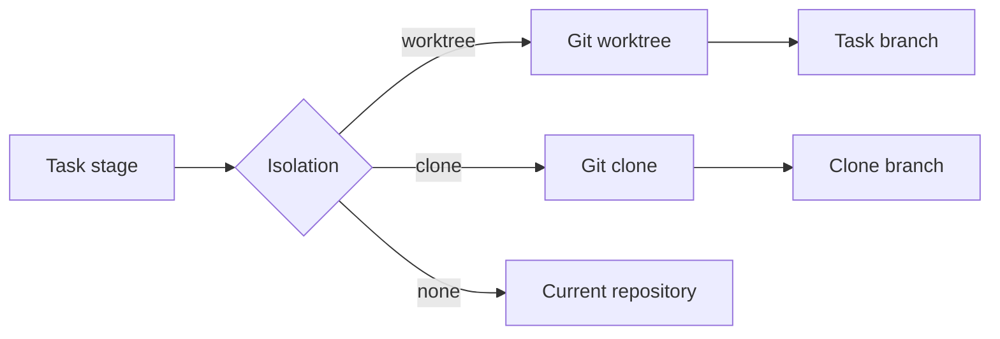
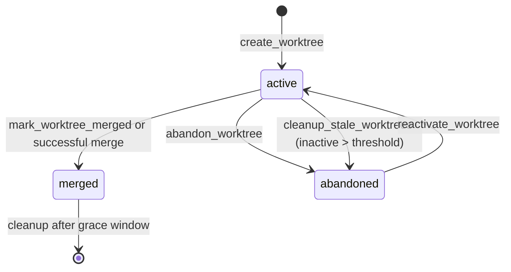

# Worktree Management Guide

Gobby uses git worktrees as its default isolation backend for parallel task and
agent work. A worktree gives each task its own directory, index, and branch while
sharing the repository's git object store and remotes.

## Quick Start

Use the CLI when you are operating from a shell:

```bash
# Create a worktree for a task branch
gobby worktrees create feature/auth --task '#123' --json

# Inspect and filter worktrees
gobby worktrees list --status active
gobby worktrees show 6f1d2b3a-9c4e-4f5a-8b6c-7d8e9f0a1b2c --json

# Attach or clear session ownership
gobby worktrees claim 6f1d2b3a-9c4e-4f5a-8b6c-7d8e9f0a1b2c '#4817'
gobby worktrees release 6f1d2b3a-9c4e-4f5a-8b6c-7d8e9f0a1b2c

# Sync, detect stale worktrees, and clean them up
gobby worktrees sync 6f1d2b3a-9c4e-4f5a-8b6c-7d8e9f0a1b2c --json
gobby worktrees stale --days 7
gobby worktrees cleanup --days 7 --dry-run
```

Use MCP tools when automation needs structured results:

```python
call_tool(
    server_name="gobby-worktrees",
    tool_name="create_worktree",
    arguments={
        "branch_name": "feature/auth",
        "base_branch": "main",
        "task_id": "#123",
        "project_path": "/path/to/repo",
    },
)

call_tool(
    server_name="gobby-worktrees",
    tool_name="claim_worktree",
    arguments={
        "worktree_id": "6f1d2b3a-9c4e-4f5a-8b6c-7d8e9f0a1b2c",
        "session_id": "#4817",
    },
)
```

## Mental Model



A git worktree shares repository history and remote configuration with the main
checkout. It has its own working directory, index, and `HEAD`, so agents can
commit on separate branches without constantly switching the main checkout.

Default worktree paths are generated under:

```text
~/.gobby/worktrees/<project-name>/<safe-branch-name>
```

`create_worktree` accepts `worktree_path` when automation needs a custom path.
On creation, Gobby copies `.gobby/project.json` into the worktree and records the
parent project path so the isolated checkout can still resolve project context.

Worktree metadata is stored in Gobby's PostgreSQL hub, reached through the
`database_url` in `~/.gobby/bootstrap.yaml`.

## Status And Ownership

Worktrees have four persisted status values:

| Status | Meaning |
|--------|---------|
| `active` | Created and available for work. |
| `stale` | Reserved status; current stale detection reports inactive active worktrees without changing status. |
| `merged` | Branch was merged and a cleanup window was scheduled. |
| `abandoned` | Stale or intentionally abandoned work. |

Ownership is separate from status. `claim_worktree` sets `agent_session_id`;
`release_worktree` clears it. Claiming a worktree does not change its status.



Merged worktrees receive a `cleanup_after` timestamp. Maintenance can later
consider them for deletion, subject to current dirt and ancestry checks. A
metadata label or elapsed cleanup window alone does not prove disposable content.

## CLI Reference

Worktree CLI commands live under `gobby worktrees`. Commands that take a worktree
reference accept a full ID or an unambiguous ID prefix.

| Command | Purpose | Key options |
|---------|---------|-------------|
| `gobby worktrees create BRANCH_NAME` | Create a worktree and branch. | `--base BRANCH`, `--task TASK`, `--json` |
| `gobby worktrees list` | List recorded worktrees. | `--status STATUS`, `--project PROJECT`, `--json` |
| `gobby worktrees show WORKTREE` | Show one worktree. | `--json` |
| `gobby worktrees delete WORKTREE` | Delete git worktree and record through MCP. | `--force`, `--yes`, `--merged-into BRANCH` |
| `gobby worktrees claim WORKTREE SESSION` | Assign worktree ownership to a session. | none |
| `gobby worktrees release WORKTREE` | Clear worktree ownership. | none |
| `gobby worktrees sync WORKTREE` | Sync with the worktree's base branch or an explicit source. | `--source SOURCE`, `--json` |
| `gobby worktrees stale` | Detect inactive worktrees. | `--days N`, `--json` |
| `gobby worktrees cleanup` | Mark stale worktrees abandoned after confirmation. | `--days N`, `--dry-run`, `--yes` |
| `gobby worktrees stats` | Count worktrees by status. | `--json` |

`create`, `delete`, `sync`, `stale`, `cleanup`, and `stats` call
`gobby-worktrees` MCP tools through the daemon. If the daemon is not running,
those commands report a connection error.

The CLI passes `--source` as the supported MCP `source_branch` argument.
Omitting it uses the worktree's stored base branch. MCP also accepts
`strategy="merge"` or `"rebase"`; the CLI uses the default merge strategy.

## MCP Reference

`gobby-worktrees` exposes 17 tools. Fetch live schemas with
`get_tool_schema(server_name="gobby-worktrees", tool_name="<name>")` before
automating against them.

| Tool | Required arguments | Important optional arguments |
|------|--------------------|------------------------------|
| `create_worktree` | `branch_name` | `base_branch`, `task_id`, `worktree_path`, `create_branch`, `use_local`, `project_path`, `provider` |
| `get_worktree` | `worktree_id` | none |
| `list_worktrees` | none | `status`, `agent_session_id`, `limit` |
| `get_worktree_stats` | none | `project_path` |
| `get_worktree_by_task` | `task_id` | none |
| `claim_worktree` | `worktree_id`, `session_id` | none |
| `release_worktree` | `worktree_id` | none |
| `delete_worktree` | `worktree_id` or `worktree_path` | `force`, `force_delete_branch`, `merged_into`, `project_path` |
| `mark_worktree_merged` | `worktree_id` | none |
| `abandon_worktree` | `worktree_id` | none |
| `reactivate_worktree` | `worktree_id` | none |
| `link_task_to_worktree` | `worktree_id`, `task_id` | none |
| `sync_worktree` | `worktree_id` | `strategy`, `source_branch`, `project_path` |
| `merge_worktree` | `worktree_id` | `source_branch`, `target_branch`, `project_path` (`push`/`prefer_remote` are rejected if true — local-only) |
| `push_branch` | `worktree_id` | `branch`, `remote`, `target_branch`, `force_with_lease`, `project_path` |
| `detect_stale_worktrees` | none | `project_path`, `hours`, `limit` |
| `cleanup_stale_worktrees` | none | `project_path`, `hours`, `dry_run`, `delete_git`, `force_delete_branch` |

### Deleting After Final Landing

Ordinary deletion verifies that the worktree branch is fully merged into its
stored base branch. If an intermediate base branch has already been deleted,
name the actual local landing branch explicitly:

```bash
gobby worktrees delete WORKTREE --merged-into 0.5.0 --yes
```

MCP accepts `merged_into="0.5.0"` on `delete_worktree`; HTTP accepts the same
query parameter on `DELETE /api/source-control/worktrees/{worktree_id}`.
The target must be an existing local branch containing the entire source tip.
Remote refs, tags, revision expressions and the source branch itself cannot
authorize deletion. Failed proof preserves the branch and Gobby record.
`merged_into` cannot be combined with `force_delete_branch`; `force` continues
to control only removal of dirty files. Omitting `merged_into` retains the
stored-base check without guessing another target.

### Creation

```python
call_tool(
    server_name="gobby-worktrees",
    tool_name="create_worktree",
    arguments={
        "branch_name": "feature/auth",
        "base_branch": "main",
        "task_id": "#123",
        "create_branch": True,
        "use_local": True,
        "provider": "codex",
        "project_path": "/path/to/repo",
    },
)
```

When `use_local` is omitted, Gobby auto-detects unpushed commits on the base
branch and uses the local branch ref when needed.
The base must name a local branch; `origin/...` and `refs/remotes/...` are
rejected. Inspect existing task-linked worktrees before creating another.

### Sync And Merge

`sync_worktree` updates a worktree from its base branch, or the explicit
`source_branch`. Its `strategy` is `merge` by default and also accepts `rebase`.

```python
call_tool(
    server_name="gobby-worktrees",
    tool_name="sync_worktree",
    arguments={
        "worktree_id": "6f1d2b3a-9c4e-4f5a-8b6c-7d8e9f0a1b2c",
        "strategy": "merge",
        "project_path": "/path/to/repo",
    },
)
```

`merge_worktree` is local-only delivery. It merges the worktree's source
branch into the local target branch (defaulting to the worktree's base
branch), operating in the target branch's checkout — the main repository or
the target's own worktree. It temporarily checks out the target branch in
that checkout and restores the original branch afterward. It never fetches
or pushes; `push=True` and `prefer_remote=True` return errors, and remote
`origin/` target refs are rejected. The operation temporarily stashes dirty
`.gobby/` files by exact stash identity. It reports merge conflicts and cleans
up the active merge before releasing its checkout lock. Remote publication goes
through `push_branch` or the PR delivery flow.

Check `merged` and the final target SHA as well as `success`. Unrelated staged
target changes use a fast-forward landing path; overlapping dirt is refused.
After timeout or cleanup faults, Git reconciliation can report
`landing_state="landed"`, `"not-landed"` or `"unknown"`. A verified landing
retains success and target SHA with `cleanup_warnings`; preserve its exact
`retained_stash_oid` for recovery. Unknown state requires inspection before any
retry or deletion. A schema identity change adds a cutover advisory; the merge
does not execute that cutover or restart the daemon.

```python
call_tool(
    server_name="gobby-worktrees",
    tool_name="merge_worktree",
    arguments={
        "worktree_id": "6f1d2b3a-9c4e-4f5a-8b6c-7d8e9f0a1b2c",
        "target_branch": "main",
        "project_path": "/path/to/repo",
    },
)
```

Use `push_branch` when the worktree branch is already prepared and only needs to
be pushed. Omitting `target_branch` publishes under the source branch's name;
setting it to `main` instead publishes the source into remote `main` and needs
that delivery authority:

```python
call_tool(
    server_name="gobby-worktrees",
    tool_name="push_branch",
    arguments={
        "worktree_id": "6f1d2b3a-9c4e-4f5a-8b6c-7d8e9f0a1b2c",
        "remote": "origin",
        "force_with_lease": False,
    },
)
```

`push_branch` invokes Git with `--no-verify`. Run the repository's required
prepublication checks explicitly; a successful push is not evidence that its
pre-push hook ran. `force_with_lease` is for an authorized history rewrite.

### Stale Cleanup

MCP cleanup thresholds are expressed in hours. The CLI converts `--days` to
hours before calling the tools.

```python
call_tool(
    server_name="gobby-worktrees",
    tool_name="cleanup_stale_worktrees",
    arguments={
        "project_path": "/path/to/repo",
        "hours": 168,
        "dry_run": True,
        "delete_git": False,
    },
)
```

With `dry_run=False`, stale active worktrees are marked `abandoned`. With
`delete_git=True`, Gobby also attempts safe Git deletion. Expired merged
worktrees are considered for Git and database removal whenever `dry_run=False`,
even without `delete_git=True`. Dirty or insufficiently merged workspaces can
be skipped; inspect per-item errors and skips despite top-level `success=True`.
`force_delete_branch` explicitly abandons unmerged branch content and is not a
normal cleanup option.

## Worktrees And Task Automation

Task and build automation can select `none`, `worktree`, or `clone` isolation.
When a stage runs in worktree isolation, the stage manifest and task artifacts
are the source of truth for the worktree ID, clone ID, and target branch.

Docs leaf work may run inside a parent epic's isolation context instead of
creating a separate worktree. That is expected: file edits still happen in the
current checkout, while delivery tooling uses the recorded artifacts and target
branch when it merges the parent workspace.

For spawned agents, `gobby-agents.spawn_agent` accepts `isolation`, `worktree_id`,
`clone_id`, `branch_name`, `base_branch`, `provider`, `task_id`, and
`project_path`. Pass an existing `worktree_id` when a prepared worktree should be
reused; otherwise automation can create one from the requested branch settings.

## Clones

Use clone isolation when the shared git object store or shared remote state of a
worktree is not enough isolation.

| Feature | Worktree | Clone |
|---------|----------|-------|
| Storage | Shared git object store | Separate repository copy |
| Creation speed | Fast | Slower |
| Remote state | Shared with main checkout | Separate clone remote state |
| Best fit | Parallel branches in one repo | Stronger filesystem and git isolation |

Clone CLI examples:

Remote creation clones the requested existing source branch (shallow depth 1
by default); it does not create `feature/auth` from `main`. The following create
example therefore assumes that feature branch already exists at the remote.
For a new local branch with unpushed base commits, use MCP `use_local=True`.

```bash
gobby clones create feature/auth ~/.gobby/clones/feature-auth --task '#123' --json
gobby clones list --status active
gobby clones sync clone-123 --direction pull
gobby clones merge clone-123 --target main
gobby clones delete clone-123 --yes
```

Core clone MCP signatures:

```python
call_tool(
    server_name="gobby-clones",
    tool_name="create_clone",
    arguments={
        "branch_name": "feature/auth",
        "clone_path": "~/.gobby/clones/feature-auth",
        "base_branch": "main",
        "task_id": "#123",
        "use_local": False,
    },
)

call_tool(
    server_name="gobby-clones",
    tool_name="merge_clone",
    arguments={
        "clone_id": "clone-123",
        "target_branch": "main",
    },
)
```

`gobby-clones` currently exposes 13 tools: create, get, list, delete, sync,
merge, claim, release, task lookup/linking, stats, stale detection, and cleanup.

Local creation makes a full clone from the base and creates the requested branch.
Managed clone paths must resolve below `~/.gobby/clones`; arbitrary `/tmp` paths
and paths escaping that root are rejected for creation and deletion.
Claim/release and task linking change ownership metadata. Sync accepts pull,
push or both and restores active status even on failure; inspect its result.
Clone CLI mutations return nonzero for `success=False`, including JSON mode.

`merge_clone` fetches directly from the local clone into a temporary branch in
the main repository, then lands locally; it does not push to origin. Overlapping
target dirt is rejected. Unrelated staged target changes use a fast-forward
landing path that preserves the staged index. Record the returned target SHA.
Stash restoration warnings after verified landing retain success and identify
the stash object for recovery. An unreadable target SHA returns
`landing_state="unknown"`; inspect the target before retrying or deleting.

Stale clone cleanup defaults to a preview. `delete_files=True` uses forced file
deletion, so authorize disposal of those selected contents first. Ordinary
`delete_clone` checks dirt unless forced. File and metadata deletion can fail
separately; inspect the row and path after errors.

## Merge Resolution Tools

`gobby merge` is the CLI surface for merge-resolution records:

```bash
gobby merge start feature/auth --target main --strategy auto
gobby merge status --verbose
gobby merge resolve src/auth.py --strategy ai
gobby merge apply
gobby merge abort
```

The MCP merge server uses explicit IDs:

```python
call_tool(
    server_name="gobby-merge",
    tool_name="merge_start",
    arguments={
        "worktree_id": "6f1d2b3a-9c4e-4f5a-8b6c-7d8e9f0a1b2c",
        "source_branch": "feature/auth",
        "target_branch": "main",
        "strategy": "auto",
    },
)

call_tool(
    server_name="gobby-merge",
    tool_name="merge_status",
    arguments={"resolution_id": "merge-123"},
)
```

`merge_status`, `merge_apply`, and `merge_abort` require `resolution_id`.
`merge_resolve` requires `conflict_id` and accepts either `resolved_content` or
`use_ai=True`.

These carriers are not interchangeable. CLI `merge start` creates/selects a
resolution record, while MCP `merge_start` executes the resolver. CLI human
resolution leaves pending work; JSON reports the actual conflict status without
progress prose. Apply and abort use the MCP registry handlers. Abort first
aborts an active Git merge and only then deletes its record; a failed Git abort
preserves that record.

`merge_apply` validates resolved contents, rejects remaining conflict markers,
and completes the source worktree's merge. Its SHA is not final target delivery;
use `merge_worktree` or `merge_clone` for that landing.

Campaign tools include `analyze_merge_landscape`, `predict_conflicts`,
`inspect_merge_state`, `cherry_pick_into_worktree`, `merge_subset`,
`verify_in_worktree` and `probe_branch_protection`. The landscape lists at most
200 active/merged worktrees, not clones or every branch. Inspect missing-path
errors and unknown divergence counts. Merge-state inspection can hydrate missing
conflict records; `state="clean"` only means no active Git operation marker.
Subset merging copies selected source paths and commits the current index:
ensure there are no unrelated staged entries. Cherry-pick conflicts retain
`CHERRY_PICK_HEAD` and need an allowed continuation/recovery path.

Verification runs an allowlisted command without a shell in the selected
worktree, with scoped test requirements and timeout handling. `final=True` adds
a clean-tree check; it does not satisfy transcript-derived task-close gates.
Branch protection probing uses GitHub protection/fallback evidence; uncertain
policy never authorizes bypassing required reviews or publication authority.

## Operational Guidance

- Link worktrees to tasks with `task_id` so commits and diffs are traceable.
- Prefer `list_worktrees(status="active")` or `get_worktree_by_task` before
  creating a new branch for an existing task.
- Use `claim_worktree` while a session owns the checkout, and release it when
  the session no longer needs exclusive ownership.
- Run `sync_worktree` before long-lived work or before handing changes to merge.
- Use `merge_worktree(push=False)` to prepare a branch and inspect the result
  before pushing to a protected target.
- Use `cleanup_stale_worktrees(dry_run=True)` first when auditing old worktrees.

## Troubleshooting

| Symptom | Check |
|---------|-------|
| CLI says it cannot connect to the daemon | Start or inspect the daemon with `gobby status` / `gobby start`. |
| `create_worktree` cannot resolve project context | Pass `project_path` or run from a checkout with `.gobby/project.json`. |
| Worktree reference is ambiguous | Use the full worktree ID instead of a prefix. |
| Stale cleanup finds nothing | The MCP default threshold is 24 hours; CLI `--days` is converted to hours. |
| Merge reports conflicts | Use `gobby-merge` tools or resolve conflicts in the worktree, then retry delivery. |

## See Also

- [agents.md](./agents.md) - Agent spawning and isolation options
- [tasks.md](./tasks.md) - Task lifecycle and task-linked commits
- [mcp-tools.md](./mcp-tools.md) - MCP server and tool reference
- [dispatch.md](./dispatch.md) - Stage manifests, automation, and workspace delivery

_Last verified: 2026-09-12_
