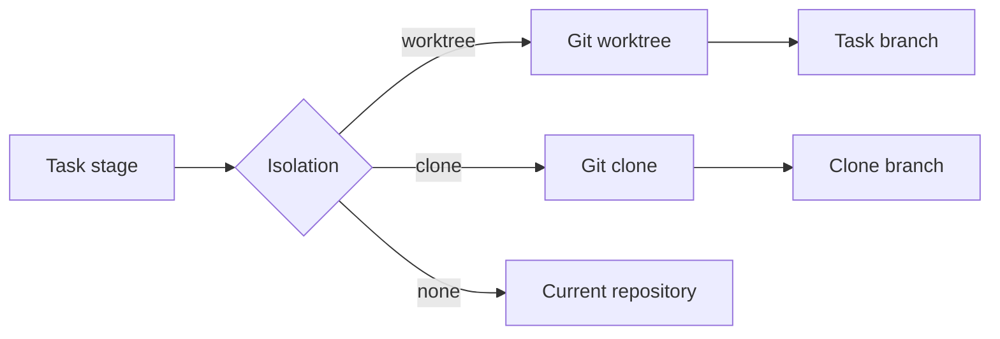
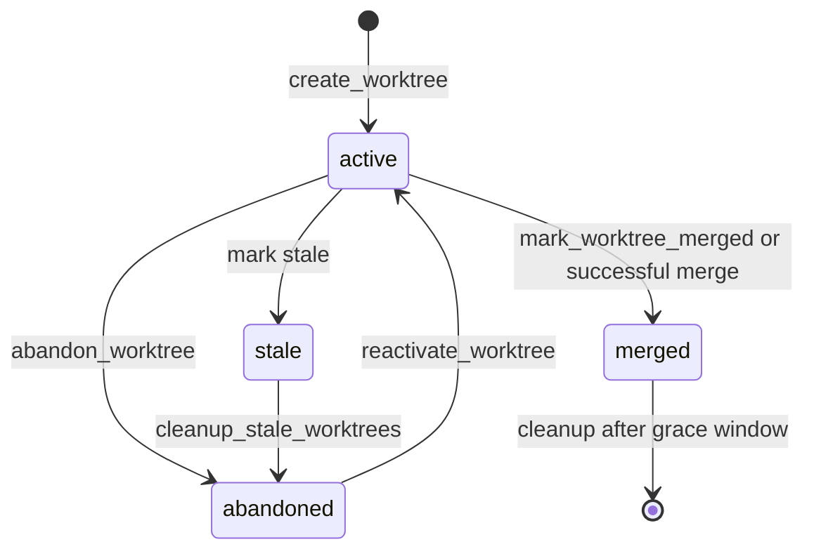

# Worktree Management Guide

Gobby uses git worktrees as its default isolation backend for parallel task and
agent work. A worktree gives each task its own directory, index, and branch while
sharing the repository's git object store and remotes.

## Quick Start

Use the CLI when you are operating from a shell:

```bash
# Create a worktree for a task branch
gobby worktrees create feature/auth --task #123 --json

# Inspect and filter worktrees
gobby worktrees list --status active
gobby worktrees show wt-abc123 --json

# Attach or clear session ownership
gobby worktrees claim wt-abc123 #4817
gobby worktrees release wt-abc123

# Sync, detect stale worktrees, and clean them up
gobby worktrees sync wt-abc123 --json
gobby worktrees stale --days 7
gobby worktrees cleanup --days 7 --dry-run
```

Use MCP tools when automation needs structured results:

```python
call_tool(
    server_name="gobby-worktrees",
    tool_name="create_worktree",
    arguments={
        "branch_name": "feature/auth",
        "base_branch": "main",
        "task_id": "#123",
        "project_path": "/path/to/repo",
    },
)

call_tool(
    server_name="gobby-worktrees",
    tool_name="claim_worktree",
    arguments={
        "worktree_id": "wt-abc123",
        "session_id": "#4817",
    },
)
```

## Mental Model



A git worktree shares repository history and remote configuration with the main
checkout. It has its own working directory, index, and `HEAD`, so agents can
commit on separate branches without constantly switching the main checkout.

Default worktree paths are generated under:

```text
~/.gobby/worktrees/<project-name>/<safe-branch-name>
```

`create_worktree` accepts `worktree_path` when automation needs a custom path.
On creation, Gobby copies `.gobby/project.json` into the worktree and records the
parent project path so the isolated checkout can still resolve project context.

Worktree metadata is stored in Gobby's PostgreSQL hub, reached through the
bootstrap/keyring `database_url` configuration.

## Status And Ownership

Worktrees have four persisted status values:

| Status | Meaning |
|--------|---------|
| `active` | Created and available for work. |
| `stale` | Marked inactive by maintenance or stale detection. |
| `merged` | Branch was merged and a cleanup window was scheduled. |
| `abandoned` | Stale or intentionally abandoned work. |

Ownership is separate from status. `claim_worktree` sets `agent_session_id`;
`release_worktree` clears it. Claiming a worktree does not change its status.



Merged worktrees receive a `cleanup_after` timestamp. Maintenance can later
delete expired merged worktrees because their work is already in the target
branch.

## CLI Reference

Worktree CLI commands live under `gobby worktrees`. Commands that take a worktree
reference accept a full ID or an unambiguous ID prefix.

| Command | Purpose | Key options |
|---------|---------|-------------|
| `gobby worktrees create BRANCH_NAME` | Create a worktree and branch. | `--base BRANCH`, `--task TASK`, `--json` |
| `gobby worktrees list` | List recorded worktrees. | `--status STATUS`, `--project PROJECT`, `--json` |
| `gobby worktrees show WORKTREE` | Show one worktree. | `--json` |
| `gobby worktrees delete WORKTREE` | Delete git worktree and record through MCP. | `--force`, `--yes` |
| `gobby worktrees claim WORKTREE SESSION` | Assign worktree ownership to a session. | none |
| `gobby worktrees release WORKTREE` | Clear worktree ownership. | none |
| `gobby worktrees sync WORKTREE` | Sync with the worktree's base branch. | `--source SOURCE`, `--json` |
| `gobby worktrees stale` | Detect inactive worktrees. | `--days N`, `--json` |
| `gobby worktrees cleanup` | Mark stale worktrees abandoned after confirmation. | `--days N`, `--dry-run`, `--yes` |
| `gobby worktrees stats` | Count worktrees by status. | `--json` |

`create`, `delete`, `sync`, `stale`, `cleanup`, and `stats` call
`gobby-worktrees` MCP tools through the daemon. If the daemon is not running,
those commands report a connection error.

The CLI exposes `gobby worktrees sync --source`, while the current MCP
`sync_worktree` schema exposes `strategy` and `project_path`; automation should
prefer the MCP schema when calling the tool directly.

## MCP Reference

`gobby-worktrees` exposes 17 tools. Fetch live schemas with
`get_tool_schema(server="gobby-worktrees", tool="<name>")` before automating
against them.

| Tool | Required arguments | Important optional arguments |
|------|--------------------|------------------------------|
| `create_worktree` | `branch_name` | `base_branch`, `task_id`, `worktree_path`, `create_branch`, `use_local`, `project_path`, `provider` |
| `get_worktree` | `worktree_id` | none |
| `list_worktrees` | none | `status`, `agent_session_id`, `limit` |
| `get_worktree_stats` | none | `project_path` |
| `get_worktree_by_task` | `task_id` | none |
| `claim_worktree` | `worktree_id`, `session_id` | none |
| `release_worktree` | `worktree_id` | none |
| `delete_worktree` | `worktree_id` | `force`, `project_path` |
| `mark_worktree_merged` | `worktree_id` | none |
| `abandon_worktree` | `worktree_id` | none |
| `reactivate_worktree` | `worktree_id` | none |
| `link_task_to_worktree` | `worktree_id`, `task_id` | none |
| `sync_worktree` | `worktree_id` | `strategy`, `project_path` |
| `merge_worktree` | `worktree_id` | `source_branch`, `target_branch`, `push`, `prefer_remote`, `project_path` |
| `push_branch` | `worktree_id` | `branch`, `remote`, `target_branch`, `force_with_lease`, `project_path` |
| `detect_stale_worktrees` | none | `project_path`, `hours`, `limit` |
| `cleanup_stale_worktrees` | none | `project_path`, `hours`, `dry_run`, `delete_git` |

### Creation

```python
call_tool(
    server_name="gobby-worktrees",
    tool_name="create_worktree",
    arguments={
        "branch_name": "feature/auth",
        "base_branch": "main",
        "task_id": "#123",
        "create_branch": True,
        "use_local": True,
        "provider": "codex",
        "project_path": "/path/to/repo",
    },
)
```

When `use_local` is omitted, Gobby auto-detects unpushed commits on the base
branch and uses the local branch ref when needed.

### Sync And Merge

`sync_worktree` updates a worktree from its base branch. Its `strategy` is
`merge` by default and also accepts `rebase`.

```python
call_tool(
    server_name="gobby-worktrees",
    tool_name="sync_worktree",
    arguments={
        "worktree_id": "wt-abc123",
        "strategy": "merge",
        "project_path": "/path/to/repo",
    },
)
```

`merge_worktree` performs the merge inside the isolated worktree. It fetches
latest refs, merges the target into the source branch, auto-resolves trivial
`.gobby/` conflicts when possible, and can push the source branch to the target
branch. It does not check out or mutate the main repository.

```python
call_tool(
    server_name="gobby-worktrees",
    tool_name="merge_worktree",
    arguments={
        "worktree_id": "wt-abc123",
        "target_branch": "main",
        "push": True,
        "project_path": "/path/to/repo",
    },
)
```

Use `push_branch` when the worktree branch is already prepared and only needs to
be pushed:

```python
call_tool(
    server_name="gobby-worktrees",
    tool_name="push_branch",
    arguments={
        "worktree_id": "wt-abc123",
        "remote": "origin",
        "target_branch": "main",
        "force_with_lease": False,
    },
)
```

### Stale Cleanup

MCP cleanup thresholds are expressed in hours. The CLI converts `--days` to
hours before calling the tools.

```python
call_tool(
    server_name="gobby-worktrees",
    tool_name="cleanup_stale_worktrees",
    arguments={
        "project_path": "/path/to/repo",
        "hours": 168,
        "dry_run": True,
        "delete_git": False,
    },
)
```

With `dry_run=False`, stale active worktrees are marked `abandoned`. With
`delete_git=True`, Gobby also deletes their git worktree directories. Expired
merged worktrees are deleted from git and removed from the database when cleanup
runs with `dry_run=False`.

## Worktrees And Task Automation

Task and build automation can select `none`, `worktree`, or `clone` isolation.
When a stage runs in worktree isolation, the stage manifest and task artifacts
are the source of truth for the worktree ID, clone ID, and target branch.

Docs leaf work may run inside a parent epic's isolation context instead of
creating a separate worktree. That is expected: file edits still happen in the
current checkout, while delivery tooling uses the recorded artifacts and target
branch when it merges the parent workspace.

For spawned agents, `gobby-agents.spawn_agent` accepts `isolation`, `worktree_id`,
`clone_id`, `branch_name`, `base_branch`, `provider`, `task_id`, and
`project_path`. Pass an existing `worktree_id` when a prepared worktree should be
reused; otherwise automation can create one from the requested branch settings.

## Clones

Use clone isolation when the shared git object store or shared remote state of a
worktree is not enough isolation.

| Feature | Worktree | Clone |
|---------|----------|-------|
| Storage | Shared git object store | Separate repository copy |
| Creation speed | Fast | Slower |
| Remote state | Shared with main checkout | Separate clone remote state |
| Best fit | Parallel branches in one repo | Stronger filesystem and git isolation |

Clone CLI examples:

```bash
gobby clones create feature/auth /tmp/gobby-auth --task #123 --json
gobby clones list --status active
gobby clones sync clone-123 --direction pull
gobby clones merge clone-123 --target main
gobby clones delete clone-123 --yes
```

Core clone MCP signatures:

```python
call_tool(
    server_name="gobby-clones",
    tool_name="create_clone",
    arguments={
        "branch_name": "feature/auth",
        "clone_path": "/tmp/gobby-auth",
        "base_branch": "main",
        "task_id": "#123",
        "use_local": False,
    },
)

call_tool(
    server_name="gobby-clones",
    tool_name="merge_clone",
    arguments={
        "clone_id": "clone-123",
        "target_branch": "main",
    },
)
```

`gobby-clones` currently exposes 13 tools: create, get, list, delete, sync,
merge, claim, release, task lookup/linking, stats, stale detection, and cleanup.

## Merge Resolution Tools

`gobby merge` is the CLI surface for merge-resolution records:

```bash
gobby merge start feature/auth --target main --strategy auto
gobby merge status --verbose
gobby merge resolve src/auth.py --strategy ai
gobby merge apply
gobby merge abort
```

The MCP merge server uses explicit IDs:

```python
call_tool(
    server_name="gobby-merge",
    tool_name="merge_start",
    arguments={
        "worktree_id": "wt-abc123",
        "source_branch": "feature/auth",
        "target_branch": "main",
        "strategy": "auto",
    },
)

call_tool(
    server_name="gobby-merge",
    tool_name="merge_status",
    arguments={"resolution_id": "merge-123"},
)
```

`merge_status`, `merge_apply`, and `merge_abort` require `resolution_id`.
`merge_resolve` requires `conflict_id` and accepts either `resolved_content` or
`use_ai=True`.

## Operational Guidance

- Link worktrees to tasks with `task_id` so commits and diffs are traceable.
- Prefer `list_worktrees(status="active")` or `get_worktree_by_task` before
  creating a new branch for an existing task.
- Use `claim_worktree` while a session owns the checkout, and release it when
  the session no longer needs exclusive ownership.
- Run `sync_worktree` before long-lived work or before handing changes to merge.
- Use `merge_worktree(push=False)` to prepare a branch and inspect the result
  before pushing to a protected target.
- Use `cleanup_stale_worktrees(dry_run=True)` first when auditing old worktrees.

## Troubleshooting

| Symptom | Check |
|---------|-------|
| CLI says it cannot connect to the daemon | Start or inspect the daemon with `gobby status` / `gobby start`. |
| `create_worktree` cannot resolve project context | Pass `project_path` or run from a checkout with `.gobby/project.json`. |
| Worktree reference is ambiguous | Use the full worktree ID instead of a prefix. |
| Stale cleanup finds nothing | The MCP default threshold is 24 hours; CLI `--days` is converted to hours. |
| Merge reports conflicts | Use `gobby-merge` tools or resolve conflicts in the worktree, then retry delivery. |

## See Also

- [agents.md](./agents.md) - Agent spawning and isolation options
- [tasks.md](./tasks.md) - Task lifecycle and task-linked commits
- [mcp-tools.md](./mcp-tools.md) - MCP server and tool reference
- [dispatch.md](./dispatch.md) - Stage manifests, automation, and workspace delivery

_Last verified: 2026-05-07_
