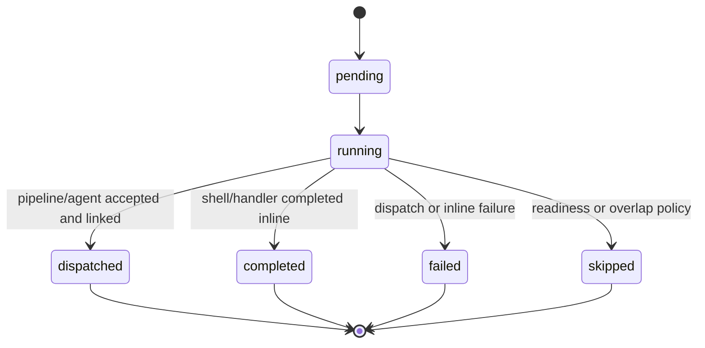

# Durable Cron Dispatch Semantics

## Context

Cron should be a durable trigger and dispatch layer. A cron run records whether
the scheduled action was accepted, linked, skipped, or failed. Long-running child
systems own their own lifecycle after launch.

This design applies to `pipeline` and `agent_spawn` actions. `shell` and
`handler` actions remain inline until Gobby has explicit child-run records for
processes and handlers, including status, logs, restart reconciliation, and
UI/API reporting.

## Target State

| Status | Meaning | Terminal |
|--------|---------|----------|
| `pending` | Run row was created. | No |
| `running` | Cron executor is dispatching or executing inline work. | No |
| `dispatched` | Durable child work was accepted and linked. | Yes |
| `completed` | Inline `shell` or `handler` work completed. | Yes |
| `failed` | Dispatch or inline execution failed. | Yes |
| `skipped` | No work launched because readiness or overlap policy blocked it. | Yes |

`dispatched` is a cron terminal state. It means "cron did its job and handed the
work to a durable subsystem." It does not claim the pipeline or agent completed.



## Action Semantics

### Pipeline

- Cron creates the run as `pending`, marks it `running`, starts the pipeline, and
  persists `pipeline_execution_id`.
- After the execution ID is stored, cron marks the run `dispatched` and returns.
- Pipeline status remains owned by the pipeline subsystem, including approval
  gates, interruptions, failures, completion, and `resume_on_restart`.
- A failed launch or failed link is a cron `failed` run because durable ownership
  was not established.

### Agent Spawn

- Cron creates the run as `pending`, marks it `running`, spawns the agent, and
  persists `agent_run_id`.
- After the run ID is stored, cron marks the run `dispatched` and returns.
- Readiness blockers produce `skipped`.
- Spawn failures produce `failed`.
- Agent status remains owned by the agent subsystem.

### Shell And Handler

- `shell` and `handler` actions keep the current wait-to-completion behavior.
- Success maps to `completed`; failure maps to `failed`.
- No fire-and-forget mode should be added until process and handler actions have
  durable child-run records with status, logs, restart reconciliation, and
  UI/API reporting.

## Overlap Policy

`pipeline` and `agent_spawn` may accept `action_config.overlap_policy`:

| Policy | Meaning |
|--------|---------|
| `skip_if_active` | Default. If an active child exists for the same cron job, record `skipped`. |
| `allow` | Dispatch even when another child from the same cron job is active. |

Active child checks:

- Agent active statuses: `pending`, `running`.
- Pipeline active statuses: `pending`, `running`, `waiting_approval`,
  `interrupted`.

Overlap checks happen before durable launch. A default-policy overlap records a
terminal cron run with `status="skipped"` and an explanatory `output` or `error`
field. It does not mutate the active child.

## Concurrency Accounting

Scheduler concurrency counts only cron-owned work in `pending` or `running`.
Downstream child work is reported through child projections and child subsystem
views, but it does not hold cron scheduler slots after the cron run reaches
`dispatched`.

This keeps cron available to trigger other due jobs while pipeline and agent
systems enforce their own concurrency limits.

## Restart Reconciliation

Startup reconciliation handles interrupted cron rows without charging job
backoff counters:

| Found row | Target result |
|-----------|---------------|
| `running` with valid `pipeline_execution_id` | Mark `dispatched`. |
| `running` with valid `agent_run_id` | Mark `dispatched`. |
| `running` without a child link | Mark `failed` with `interrupted before durable dispatch`. |
| `dispatched` | Leave terminal; child subsystem owns recovery. |
| `completed`, `failed`, `skipped` | Leave terminal. |

Valid child link means the referenced child row exists. If the ID is present but
the child row is missing, treat the cron run as `failed` because durable
ownership cannot be proven.

## API And UI Projection

Existing `gobby-cron` tools and HTTP routes remain. Output changes are additive:

- Add `dispatched` to `CronRun.status` types and frontend status handling.
- Preserve `agent_run_id` and `pipeline_execution_id`.
- Add `child` when a linked child exists:

```json
{
  "id": "cron-run-1",
  "cron_job_id": "cron-job-1",
  "status": "dispatched",
  "agent_run_id": null,
  "pipeline_execution_id": "pipe-exec-1",
  "child": {
    "type": "pipeline",
    "id": "pipe-exec-1",
    "status": "waiting_approval",
    "terminal": false
  },
  "started_at": "2026-06-01T15:00:00Z",
  "completed_at": "2026-06-01T15:00:01Z",
  "output": "Pipeline dispatched: pipe-exec-1",
  "error": null
}
```

```json
{
  "id": "cron-run-2",
  "cron_job_id": "cron-job-2",
  "status": "skipped",
  "agent_run_id": null,
  "pipeline_execution_id": null,
  "child": null,
  "output": "Skipped: active agent run agent-run-7",
  "error": null
}
```

Cron WebSocket and HTTP reporting should emit cron lifecycle events when dispatch
finishes. Pipeline and agent systems continue to emit their own child lifecycle
events. The UI can show "dispatched" beside the current child status without
claiming cron is waiting for child completion.

## Implementation Notes

- `CronRun` already has `agent_run_id` and `pipeline_execution_id`; the schema
  change is the `dispatched` status plus any payload projection needed for
  `child`.
- `CronExecutor.execute` should not overwrite a child dispatch result with
  `completed`.
- Pipeline dispatch must fail the cron run if it cannot persist the execution
  ID.
- Agent dispatch must receive the durable agent run ID as structured data; string
  output parsing should not be the durable link contract.
- `skip_if_active` checks should use indexed child lookup by cron job and child
  statuses. The cron run itself should record the skipped attempt for audit.

## Test Plan

Future implementation should cover:

- Pipeline cron returns `dispatched` quickly and links
  `pipeline_execution_id`.
- Agent cron returns `dispatched` quickly and links `agent_run_id`.
- Readiness blocker produces `skipped`.
- Active child with default overlap policy records `skipped`.
- `overlap_policy="allow"` launches another child.
- Startup reconciles linked `running` rows to `dispatched`.
- Startup reconciles unlinked `running` rows to `failed` without incrementing
  job backoff.
- MCP, HTTP, WebSocket, and UI show cron dispatch status plus child status
  without claiming child completion.

Focused validation for the implementation follow-up:

```bash
GOBBY_TEST_PROTECT=1 uv run pytest tests/scheduler/test_cron_executor.py tests/scheduler/test_cron_scheduler.py tests/scheduler/test_cron_storage.py tests/mcp_proxy/test_cron_tools.py tests/servers/test_http_cron.py -q
```
